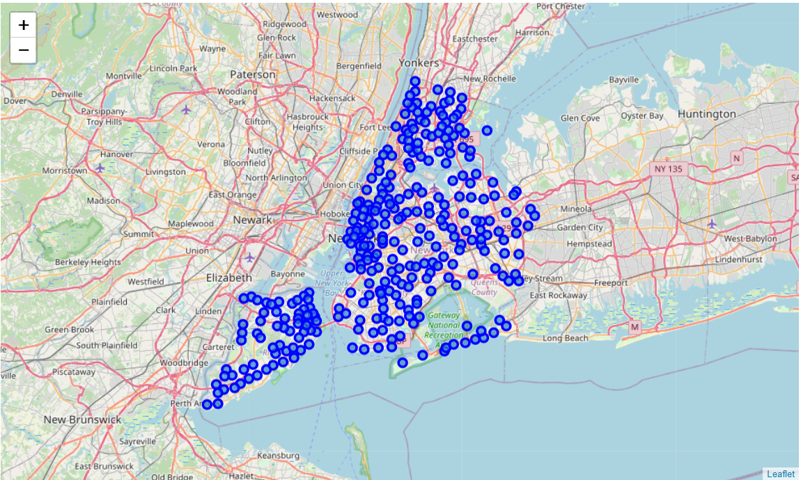
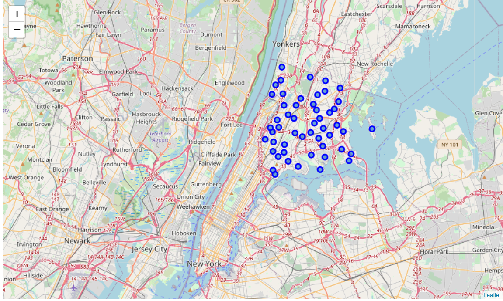
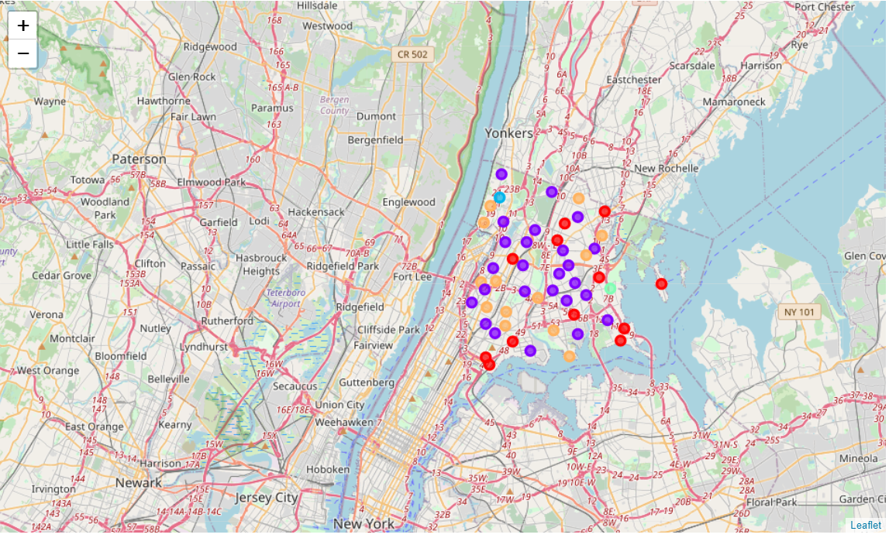

# IBM Data Science Capstone Project

**The project focuses on the neighbourhoods and boroughs in New York City and aims to solve the problem of selecting an appropriate neighbourhood for opening a Chinese restaurant.**

I've utilized word clouds on the cuisine data of NYC obtained from wikipedia to understand the spread of cuisines. I utilized the results of the word cloud to select a location in NYC and implemented K-means clustering in that region.  


```python
#Importing the required libraries

import numpy as np # library to handle data in a vectorized manner
import pandas as pd # library for data analsysis
from PIL import Image # converting images into arrays

pd.set_option('display.max_columns', None)
pd.set_option('display.max_rows', None)

import json # library to handle JSON files

#!conda install -c conda-forge geopy --yes 
#!conda install -c conda-forge geopy --yes # uncomment this line if you haven't completed the Foursquare API lab
from geopy.geocoders import Nominatim # convert an address into latitude and longitude values

import requests # library to handle requests
from pandas.io.json import json_normalize # tranform JSON file into a pandas dataframe

# Matplotlib and associated plotting modules
import matplotlib.cm as cm
import matplotlib.colors as colors

# import k-means from clustering stage
from sklearn.cluster import KMeans

#!conda install -c conda-forge folium=0.5.0 --yes # uncomment this line if you haven't completed the Foursquare API lab
import folium # map rendering library

print('Libraries imported.')
%matplotlib inline

import matplotlib as mpl
import matplotlib.pyplot as plt

mpl.style.use('ggplot') # optional: for ggplot-like style

# check for latest version of Matplotlib
print ('Matplotlib version: ', mpl.__version__) # >= 2.0.0
```

    Libraries imported.
    Matplotlib version:  3.0.2
    


```python
#Importing the word cloud library

from wordcloud import WordCloud, STOPWORDS
```

## Exploring the cuisine dataset


```python
cuisine=pd.read_csv('C:\\Users\\simaa\\Desktop\\Projects\\IBM_Coursera_Data_Science_Capstone\\data\\Restaurant_Grades.csv')
```


```python
cuisine.head()
```


<div>
<style scoped>
    .dataframe tbody tr th:only-of-type {
        vertical-align: middle;
    }

    .dataframe tbody tr th {
        vertical-align: top;
    }

    .dataframe thead th {
        text-align: right;
    }
</style>
<table border="1" class="dataframe">
  <thead>
    <tr style="text-align: right;">
      <th></th>
      <th>DBA</th>
      <th>BORO</th>
      <th>BUILDING</th>
      <th>STREET</th>
      <th>ZIPCODE</th>
      <th>CUISINE DESCRIPTION</th>
      <th>VIOLATION DESCRIPTION</th>
      <th>CRITICAL FLAG</th>
      <th>SCORE</th>
      <th>GRADE</th>
      <th>GRADE DATE</th>
      <th>RECORD DATE</th>
    </tr>
  </thead>
  <tbody>
    <tr>
      <th>0</th>
      <td>MORRIS PARK BAKE SHOP</td>
      <td>Bronx</td>
      <td>1007</td>
      <td>MORRIS PARK AVE</td>
      <td>10462.0</td>
      <td>Bakery</td>
      <td>Pesticide use not in accordance with label or ...</td>
      <td>N</td>
      <td>6</td>
      <td>A</td>
      <td>06/11/2019</td>
      <td>08/13/2019</td>
    </tr>
    <tr>
      <th>1</th>
      <td>MORRIS PARK BAKE SHOP</td>
      <td>Bronx</td>
      <td>1007</td>
      <td>MORRIS PARK AVE</td>
      <td>10462.0</td>
      <td>Bakery</td>
      <td>Plumbing not properly installed or maintained;...</td>
      <td>N</td>
      <td>6</td>
      <td>A</td>
      <td>06/11/2019</td>
      <td>08/13/2019</td>
    </tr>
    <tr>
      <th>2</th>
      <td>MORRIS PARK BAKE SHOP</td>
      <td>Bronx</td>
      <td>1007</td>
      <td>MORRIS PARK AVE</td>
      <td>10462.0</td>
      <td>Bakery</td>
      <td>Non-food contact surface improperly constructe...</td>
      <td>N</td>
      <td>6</td>
      <td>A</td>
      <td>06/11/2019</td>
      <td>08/13/2019</td>
    </tr>
    <tr>
      <th>3</th>
      <td>MORRIS PARK BAKE SHOP</td>
      <td>Bronx</td>
      <td>1007</td>
      <td>MORRIS PARK AVE</td>
      <td>10462.0</td>
      <td>Bakery</td>
      <td>Pesticide use not in accordance with label or ...</td>
      <td>N</td>
      <td>5</td>
      <td>A</td>
      <td>05/11/2018</td>
      <td>08/13/2019</td>
    </tr>
    <tr>
      <th>4</th>
      <td>MORRIS PARK BAKE SHOP</td>
      <td>Bronx</td>
      <td>1007</td>
      <td>MORRIS PARK AVE</td>
      <td>10462.0</td>
      <td>Bakery</td>
      <td>Non-food contact surface improperly constructe...</td>
      <td>N</td>
      <td>5</td>
      <td>A</td>
      <td>05/11/2018</td>
      <td>08/13/2019</td>
    </tr>
  </tbody>
</table>
</div>


```python
bor_cuisine=cuisine[['BORO', 'CUISINE DESCRIPTION']]
```


```python
type(bor_cuisine)
```


    pandas.core.frame.DataFrame


```python
bor_cuisine.head()
```


<div>
<style scoped>
    .dataframe tbody tr th:only-of-type {
        vertical-align: middle;
    }

    .dataframe tbody tr th {
        vertical-align: top;
    }

    .dataframe thead th {
        text-align: right;
    }
</style>
<table border="1" class="dataframe">
  <thead>
    <tr style="text-align: right;">
      <th></th>
      <th>BORO</th>
      <th>CUISINE DESCRIPTION</th>
    </tr>
  </thead>
  <tbody>
    <tr>
      <th>0</th>
      <td>Bronx</td>
      <td>Bakery</td>
    </tr>
    <tr>
      <th>1</th>
      <td>Bronx</td>
      <td>Bakery</td>
    </tr>
    <tr>
      <th>2</th>
      <td>Bronx</td>
      <td>Bakery</td>
    </tr>
    <tr>
      <th>3</th>
      <td>Bronx</td>
      <td>Bakery</td>
    </tr>
    <tr>
      <th>4</th>
      <td>Bronx</td>
      <td>Bakery</td>
    </tr>
  </tbody>
</table>
</div>


```python
bor_cuisine['BORO'].value_counts()
```


    Manhattan        76389
    Brooklyn         48689
    Queens           44702
    Bronx            18154
    Staten Island     6675
    0                   54
    Name: BORO, dtype: int64


```python
bor_cuisine['CUISINE DESCRIPTION'].value_counts()
```


    American                                                            43124
    Chinese                                                             19892
    Café/Coffee/Tea                                                     10510
    Pizza                                                                8712
    Italian                                                              7787
    Latin (Cuban, Dominican, Puerto Rican, South & Central American)     7687
    Mexican                                                              7540
    Japanese                                                             6637
    Bakery                                                               6199
    Caribbean                                                            6180
    Spanish                                                              5493
    Pizza/Italian                                                        4081
    Chicken                                                              3704
    Donuts                                                               3471
    Delicatessen                                                         2981
    Indian                                                               2957
    Asian                                                                2942
    Hamburgers                                                           2746
    Jewish/Kosher                                                        2721
    Thai                                                                 2440
    Sandwiches                                                           2434
    Juice, Smoothies, Fruit Salads                                       2419
    Korean                                                               2391
    French                                                               2298
    Mediterranean                                                        2033
    Ice Cream, Gelato, Yogurt, Ices                                      1811
    Irish                                                                1738
    Sandwiches/Salads/Mixed Buffet                                       1612
    Middle Eastern                                                       1419
    Seafood                                                              1417
    Bagels/Pretzels                                                      1370
    Greek                                                                1122
    Tex-Mex                                                               999
    Vegetarian                                                            888
    Vietnamese/Cambodian/Malaysia                                         853
    Peruvian                                                              815
    Other                                                                 743
    African                                                               689
    Steak                                                                 640
    Bottled beverages, including water, sodas, juices, etc.               616
    Eastern European                                                      577
    Salads                                                                546
    Russian                                                               541
    Turkish                                                               540
    Soul Food                                                             495
    Bangladeshi                                                           494
    Chinese/Japanese                                                      428
    Continental                                                           374
    Barbecue                                                              370
    Soups & Sandwiches                                                    300
    Pakistani                                                             293
    Filipino                                                              279
    Polish                                                                240
    Tapas                                                                 234
    Brazilian                                                             229
    Hawaiian                                                              224
    Creole                                                                217
    German                                                                216
    Armenian                                                              178
    Australian                                                            172
    Chinese/Cuban                                                         171
    Hotdogs/Pretzels                                                      146
    Hotdogs                                                               127
    Ethiopian                                                             124
    Pancakes/Waffles                                                      124
    English                                                               109
    Afghan                                                                 98
    Egyptian                                                               81
    Portuguese                                                             79
    Moroccan                                                               69
    Not Listed/Not Applicable                                              67
    Creole/Cajun                                                           47
    Indonesian                                                             47
    Cajun                                                                  44
    Californian                                                            44
    Scandinavian                                                           43
    Fruits/Vegetables                                                      39
    Soups                                                                  33
    Iranian                                                                29
    Southwestern                                                           26
    Nuts/Confectionary                                                     21
    Czech                                                                  20
    Chilean                                                                13
    Basque                                                                  4
    Name: CUISINE DESCRIPTION, dtype: int64


#### Exploring cuisines in Manhattan


```python
Man_cuisine=bor_cuisine[bor_cuisine['BORO'] == 'Manhattan']
Cuisine_M=Man_cuisine[['CUISINE DESCRIPTION']]
Cuisine_M.head()
```


<div>
<style scoped>
    .dataframe tbody tr th:only-of-type {
        vertical-align: middle;
    }

    .dataframe tbody tr th {
        vertical-align: top;
    }

    .dataframe thead th {
        text-align: right;
    }
</style>
<table border="1" class="dataframe">
  <thead>
    <tr style="text-align: right;">
      <th></th>
      <th>CUISINE DESCRIPTION</th>
    </tr>
  </thead>
  <tbody>
    <tr>
      <th>21</th>
      <td>Irish</td>
    </tr>
    <tr>
      <th>22</th>
      <td>Irish</td>
    </tr>
    <tr>
      <th>23</th>
      <td>Irish</td>
    </tr>
    <tr>
      <th>24</th>
      <td>Irish</td>
    </tr>
    <tr>
      <th>25</th>
      <td>Irish</td>
    </tr>
  </tbody>
</table>
</div>


```python
Cuisine_M.to_csv('CUISINE_Manhattan.txt', sep=',', index=False)
```


```python
Cuisine_M1 = open('C:\\Users\\simaa\\Desktop\\Projects\\IBM_Coursera_Data_Science_Capstone\\results\\CUISINE_Manhattan.txt', 'r').read()
```


```python
stopwords = set(STOPWORDS)
```


```python
NYC_CUISINE_Man = WordCloud(
    background_color='white',
    max_words=2000,
    stopwords=stopwords
)

# generate the word cloud
NYC_CUISINE_Man.generate(Cuisine_M1)
```


    <wordcloud.wordcloud.WordCloud at 0x1d58d72dba8>


```python
plt.imshow(NYC_CUISINE_Man, interpolation='bilinear')
plt.axis('off')

fig = plt.figure()
fig.set_figwidth(45)
fig.set_figheight(55)

plt.show()
```


    <Figure size 3240x3960 with 0 Axes>


#### Exploring cuisines in Brooklyn 


```python
Brook_cuisine=bor_cuisine[bor_cuisine['BORO'] == 'Brooklyn']
Cuisine_B=Brook_cuisine[['CUISINE DESCRIPTION']]
Cuisine_B.head()
```


<div>
<style scoped>
    .dataframe tbody tr th:only-of-type {
        vertical-align: middle;
    }

    .dataframe tbody tr th {
        vertical-align: top;
    }

    .dataframe thead th {
        text-align: right;
    }
</style>
<table border="1" class="dataframe">
  <thead>
    <tr style="text-align: right;">
      <th></th>
      <th>CUISINE DESCRIPTION</th>
    </tr>
  </thead>
  <tbody>
    <tr>
      <th>7</th>
      <td>Hamburgers</td>
    </tr>
    <tr>
      <th>8</th>
      <td>Hamburgers</td>
    </tr>
    <tr>
      <th>9</th>
      <td>Hamburgers</td>
    </tr>
    <tr>
      <th>10</th>
      <td>Hamburgers</td>
    </tr>
    <tr>
      <th>11</th>
      <td>Hamburgers</td>
    </tr>
  </tbody>
</table>
</div>


```python
Cuisine_B.to_csv('CUISINE_Brooklyn.txt', sep=',', index=False)
```


```python
Cuisine_B1 = open('C:\\Users\\simaa\\Desktop\\Projects\\IBM_Coursera_Data_Science_Capstone\\results\\CUISINE_Brooklyn.txt', 'r').read()
```


```python
NYC_CUISINE_B = WordCloud(
    background_color='white',
    max_words=2000,
    stopwords=stopwords
)

# generate the word cloud
NYC_CUISINE_B.generate(Cuisine_B1)
```


    <wordcloud.wordcloud.WordCloud at 0x1d58e50d780>


```python
plt.imshow(NYC_CUISINE_B, interpolation='bilinear')
plt.axis('off')

fig = plt.figure()
fig.set_figwidth(45)
fig.set_figheight(55)

plt.show()
```


    <Figure size 3240x3960 with 0 Axes>


#### Exploring cuisines in Bronx


```python
Bronx_cuisine=bor_cuisine[bor_cuisine['BORO'] == 'Bronx']
Cuisine_Br=Bronx_cuisine[['CUISINE DESCRIPTION']]
Cuisine_Br.head()
```


<div>
<style scoped>
    .dataframe tbody tr th:only-of-type {
        vertical-align: middle;
    }

    .dataframe tbody tr th {
        vertical-align: top;
    }

    .dataframe thead th {
        text-align: right;
    }
</style>
<table border="1" class="dataframe">
  <thead>
    <tr style="text-align: right;">
      <th></th>
      <th>CUISINE DESCRIPTION</th>
    </tr>
  </thead>
  <tbody>
    <tr>
      <th>0</th>
      <td>Bakery</td>
    </tr>
    <tr>
      <th>1</th>
      <td>Bakery</td>
    </tr>
    <tr>
      <th>2</th>
      <td>Bakery</td>
    </tr>
    <tr>
      <th>3</th>
      <td>Bakery</td>
    </tr>
    <tr>
      <th>4</th>
      <td>Bakery</td>
    </tr>
  </tbody>
</table>
</div>


```python
Cuisine_Br.to_csv('CUISINE_Bronx.txt', sep=',', index=False)
```


```python
Cuisine_Br1 = open('C:\\Users\\simaa\\Desktop\\Projects\\IBM_Coursera_Data_Science_Capstone\\results\\CUISINE_Bronx.txt', 'r').read()

NYC_CUISINE_Br = WordCloud(
    background_color='white',
    max_words=2000,
    stopwords=stopwords
)

# generate the word cloud
NYC_CUISINE_Br.generate(Cuisine_Br1)
```


    <wordcloud.wordcloud.WordCloud at 0x1d58d749240>


```python
plt.imshow(NYC_CUISINE_Br, interpolation='bilinear')
plt.axis('off')

fig = plt.figure()
fig.set_figwidth(45)
fig.set_figheight(55)

plt.show()
```


    <Figure size 3240x3960 with 0 Axes>


#### Exploring cuisines on Staten Island


```python
staten_island_cuisine=bor_cuisine[bor_cuisine['BORO'] == 'Staten Island']
Cuisine_stat=staten_island_cuisine[['CUISINE DESCRIPTION']]
Cuisine_stat.head()
```


<div>
<style scoped>
    .dataframe tbody tr th:only-of-type {
        vertical-align: middle;
    }

    .dataframe tbody tr th {
        vertical-align: top;
    }

    .dataframe thead th {
        text-align: right;
    }
</style>
<table border="1" class="dataframe">
  <thead>
    <tr style="text-align: right;">
      <th></th>
      <th>CUISINE DESCRIPTION</th>
    </tr>
  </thead>
  <tbody>
    <tr>
      <th>201</th>
      <td>Delicatessen</td>
    </tr>
    <tr>
      <th>202</th>
      <td>Delicatessen</td>
    </tr>
    <tr>
      <th>203</th>
      <td>Delicatessen</td>
    </tr>
    <tr>
      <th>204</th>
      <td>Delicatessen</td>
    </tr>
    <tr>
      <th>205</th>
      <td>Delicatessen</td>
    </tr>
  </tbody>
</table>
</div>


```python
Cuisine_stat.to_csv('CUISINE_StatenIsland.txt', sep=',', index=False)
```


```python
Cuisine_stat1 = open('C:\\Users\\simaa\\Desktop\\Projects\\IBM_Coursera_Data_Science_Capstone\\results\\CUISINE_StatenIsland.txt', 'r').read()

NYC_CUISINE_stat = WordCloud(
    background_color='white',
    max_words=2000,
    stopwords=stopwords
)

# generate the word cloud
NYC_CUISINE_stat.generate(Cuisine_stat1)
```


    <wordcloud.wordcloud.WordCloud at 0x1d594d753c8>


```python
plt.imshow(NYC_CUISINE_stat, interpolation='bilinear')
plt.axis('off')

fig = plt.figure()
fig.set_figwidth(45)
fig.set_figheight(55)

plt.show()
```


    <Figure size 3240x3960 with 0 Axes>


**The above word clouds show that the most popular cuisine in New York in American. In case of Chinese cuisine, Bronx has more chinese restaurants than any other city in the NYC region. Thus, exploring Bronx makes sense.**


```python
with open('C:\\Users\\simaa\\Desktop\\Projects\\IBM_Coursera_Data_Science_Capstone\\data\\newyork_data.json') as json_data:
    newyork_data = json.load(json_data)
```


```python
#newyork_data
```


```python
neighborhoods_data = newyork_data['features']
```


```python
#neighborhoods_data[0]
```


```python
#Creating an empty dataframe for NYC
column_names = ['Borough', 'Neighborhood', 'Latitude', 'Longitude'] 

# instantiating the dataframe
neighborhoods = pd.DataFrame(columns=column_names)
```


```python
neighborhoods
```


<div>
<style scoped>
    .dataframe tbody tr th:only-of-type {
        vertical-align: middle;
    }

    .dataframe tbody tr th {
        vertical-align: top;
    }

    .dataframe thead th {
        text-align: right;
    }
</style>
<table border="1" class="dataframe">
  <thead>
    <tr style="text-align: right;">
      <th></th>
      <th>Borough</th>
      <th>Neighborhood</th>
      <th>Latitude</th>
      <th>Longitude</th>
    </tr>
  </thead>
  <tbody>
  </tbody>
</table>
</div>


```python
for data in neighborhoods_data:
    borough = neighborhood_name = data['properties']['borough'] 
    neighborhood_name = data['properties']['name']
        
    neighborhood_latlon = data['geometry']['coordinates']
    neighborhood_lat = neighborhood_latlon[1]
    neighborhood_lon = neighborhood_latlon[0]
    
    neighborhoods = neighborhoods.append({'Borough': borough,
                                          'Neighborhood': neighborhood_name,
                                          'Latitude': neighborhood_lat,
                                          'Longitude': neighborhood_lon}, ignore_index=True)
```


```python
neighborhoods.head()
```


<div>
<style scoped>
    .dataframe tbody tr th:only-of-type {
        vertical-align: middle;
    }

    .dataframe tbody tr th {
        vertical-align: top;
    }

    .dataframe thead th {
        text-align: right;
    }
</style>
<table border="1" class="dataframe">
  <thead>
    <tr style="text-align: right;">
      <th></th>
      <th>Borough</th>
      <th>Neighborhood</th>
      <th>Latitude</th>
      <th>Longitude</th>
    </tr>
  </thead>
  <tbody>
    <tr>
      <th>0</th>
      <td>Bronx</td>
      <td>Wakefield</td>
      <td>40.894705</td>
      <td>-73.847201</td>
    </tr>
    <tr>
      <th>1</th>
      <td>Bronx</td>
      <td>Co-op City</td>
      <td>40.874294</td>
      <td>-73.829939</td>
    </tr>
    <tr>
      <th>2</th>
      <td>Bronx</td>
      <td>Eastchester</td>
      <td>40.887556</td>
      <td>-73.827806</td>
    </tr>
    <tr>
      <th>3</th>
      <td>Bronx</td>
      <td>Fieldston</td>
      <td>40.895437</td>
      <td>-73.905643</td>
    </tr>
    <tr>
      <th>4</th>
      <td>Bronx</td>
      <td>Riverdale</td>
      <td>40.890834</td>
      <td>-73.912585</td>
    </tr>
  </tbody>
</table>
</div>


```python
print('The dataframe has {} boroughs and {} neighborhoods.'.format(
        len(neighborhoods['Borough'].unique()),
        neighborhoods.shape[0]
    )
)
```

    The dataframe has 5 boroughs and 306 neighborhoods.
    


```python
address = 'New York City, NY'

geolocator = Nominatim(user_agent="ny_explorer")
location = geolocator.geocode(address)
latitude = location.latitude
longitude = location.longitude
print('The geograpical coordinate of New York City are {}, {}.'.format(latitude, longitude))
```

    The geograpical coordinate of New York City are 40.7127281, -74.0060152.
    


```python
# creating map of New York using latitude and longitude values
map_newyork = folium.Map(location=[latitude, longitude], zoom_start=10)

# adding markers to map
for lat, lng, borough, neighborhood in zip(neighborhoods['Latitude'], neighborhoods['Longitude'], neighborhoods['Borough'], neighborhoods['Neighborhood']):
    label = '{}, {}'.format(neighborhood, borough)
    label = folium.Popup(label, parse_html=True)
    folium.CircleMarker(
        [lat, lng],
        radius=5,
        popup=label,
        color='blue',
        fill=True,
        fill_color='#3186cc',
        fill_opacity=0.7,
        parse_html=False).add_to(map_newyork)  
    
map_newyork
```





```python
CLIENT_ID = 'JIA5BTQ3NTZCVG2L30RUSA4PIZ1GN5YAVWA2ZJF352ZEOKWL' # your Foursquare ID
CLIENT_SECRET = 'GROWMUMSLS4WSUPAQX1SAMFZFUQPL3YHGG0UYX4IB1Z13SLA' # your Foursquare Secret
VERSION = '20180605' # Foursquare API version

print('Your credentails:')
print('CLIENT_ID: ' + CLIENT_ID)
print('CLIENT_SECRET:' + CLIENT_SECRET)
```

    Your credentails:
    CLIENT_ID: JIA5BTQ3NTZCVG2L30RUSA4PIZ1GN5YAVWA2ZJF352ZEOKWL
    CLIENT_SECRET:GROWMUMSLS4WSUPAQX1SAMFZFUQPL3YHGG0UYX4IB1Z13SLA
    

### Exploring Bronx borough for clustering 


```python
bronx_data = neighborhoods[neighborhoods['Borough'] == 'Bronx'].reset_index(drop=True)
bronx_data.head()
```


<div>
<style scoped>
    .dataframe tbody tr th:only-of-type {
        vertical-align: middle;
    }

    .dataframe tbody tr th {
        vertical-align: top;
    }

    .dataframe thead th {
        text-align: right;
    }
</style>
<table border="1" class="dataframe">
  <thead>
    <tr style="text-align: right;">
      <th></th>
      <th>Borough</th>
      <th>Neighborhood</th>
      <th>Latitude</th>
      <th>Longitude</th>
    </tr>
  </thead>
  <tbody>
    <tr>
      <th>0</th>
      <td>Bronx</td>
      <td>Wakefield</td>
      <td>40.894705</td>
      <td>-73.847201</td>
    </tr>
    <tr>
      <th>1</th>
      <td>Bronx</td>
      <td>Co-op City</td>
      <td>40.874294</td>
      <td>-73.829939</td>
    </tr>
    <tr>
      <th>2</th>
      <td>Bronx</td>
      <td>Eastchester</td>
      <td>40.887556</td>
      <td>-73.827806</td>
    </tr>
    <tr>
      <th>3</th>
      <td>Bronx</td>
      <td>Fieldston</td>
      <td>40.895437</td>
      <td>-73.905643</td>
    </tr>
    <tr>
      <th>4</th>
      <td>Bronx</td>
      <td>Riverdale</td>
      <td>40.890834</td>
      <td>-73.912585</td>
    </tr>
  </tbody>
</table>
</div>


```python
dress = 'Bronx, NY'

geolocator = Nominatim(user_agent="ny_explorer")
location = geolocator.geocode(address)
latitude = location.latitude
longitude = location.longitude
print('The geograpical coordinate of Bronx are {}, {}.'.format(latitude, longitude))
```

    The geograpical coordinate of Bronx are 40.7127281, -74.0060152.
    


```python
# creating map of Bronx using latitude and longitude values
map_bronx = folium.Map(location=[latitude, longitude], zoom_start=11)

# adding markers to map
for lat, lng, label in zip(bronx_data['Latitude'], bronx_data['Longitude'], bronx_data['Neighborhood']):
    label = folium.Popup(label, parse_html=True)
    folium.CircleMarker(
        [lat, lng],
        radius=5,
        popup=label,
        color='blue',
        fill=True,
        fill_color='#3186cc',
        fill_opacity=0.7,
        parse_html=False).add_to(map_bronx)  
    
map_bronx
```





```python
bronx_data.loc[0, 'Neighborhood']
```


    'Wakefield'


```python
neighborhood_latitude = bronx_data.loc[0, 'Latitude'] # neighborhood latitude value
neighborhood_longitude = bronx_data.loc[0, 'Longitude'] # neighborhood longitude value

neighborhood_name = bronx_data.loc[0, 'Neighborhood'] # neighborhood name

print('Latitude and longitude values of {} are {}, {}.'.format(neighborhood_name, 
                                                               neighborhood_latitude, 
                                                               neighborhood_longitude))
```

    Latitude and longitude values of Wakefield are 40.89470517661, -73.84720052054902.
    


```python
LIMIT=100 # limit of number of venues returned by Foursquare API

radius = 500 # define radius

# create URL
url = 'https://api.foursquare.com/v2/venues/explore?&client_id={}&client_secret={}&v={}&ll={},{}&radius={}&limit={}'.format(
    CLIENT_ID, 
    CLIENT_SECRET, 
    VERSION, 
    neighborhood_latitude, 
    neighborhood_longitude, 
    radius, 
    LIMIT)
url # display URL

```


    'https://api.foursquare.com/v2/venues/explore?&client_id=JIA5BTQ3NTZCVG2L30RUSA4PIZ1GN5YAVWA2ZJF352ZEOKWL&client_secret=GROWMUMSLS4WSUPAQX1SAMFZFUQPL3YHGG0UYX4IB1Z13SLA&v=20180605&ll=40.89470517661,-73.84720052054902&radius=500&limit=100'


```python
results = requests.get(url).json()
#results
```


```python
def get_category_type(row):
    try:
        categories_list = row['categories']
    except:
        categories_list = row['venue.categories']
        
    if len(categories_list) == 0:
        return None
    else:
        return categories_list[0]['name']
```


```python
venues = results['response']['groups'][0]['items']
    
nearby_venues = json_normalize(venues) # flatten JSON

# filtering columns
filtered_columns = ['venue.name', 'venue.categories', 'venue.location.lat', 'venue.location.lng']
nearby_venues =nearby_venues.loc[:, filtered_columns]

# filtering the category for each row
nearby_venues['venue.categories'] = nearby_venues.apply(get_category_type, axis=1)

# cleaning columns
nearby_venues.columns = [col.split(".")[-1] for col in nearby_venues.columns]

nearby_venues.head()
```


<div>
<style scoped>
    .dataframe tbody tr th:only-of-type {
        vertical-align: middle;
    }

    .dataframe tbody tr th {
        vertical-align: top;
    }

    .dataframe thead th {
        text-align: right;
    }
</style>
<table border="1" class="dataframe">
  <thead>
    <tr style="text-align: right;">
      <th></th>
      <th>name</th>
      <th>categories</th>
      <th>lat</th>
      <th>lng</th>
    </tr>
  </thead>
  <tbody>
    <tr>
      <th>0</th>
      <td>Lollipops Gelato</td>
      <td>Dessert Shop</td>
      <td>40.894123</td>
      <td>-73.845892</td>
    </tr>
    <tr>
      <th>1</th>
      <td>Carvel Ice Cream</td>
      <td>Ice Cream Shop</td>
      <td>40.890487</td>
      <td>-73.848568</td>
    </tr>
    <tr>
      <th>2</th>
      <td>Walgreens</td>
      <td>Pharmacy</td>
      <td>40.896528</td>
      <td>-73.844700</td>
    </tr>
    <tr>
      <th>3</th>
      <td>Rite Aid</td>
      <td>Pharmacy</td>
      <td>40.896649</td>
      <td>-73.844846</td>
    </tr>
    <tr>
      <th>4</th>
      <td>Dunkin'</td>
      <td>Donut Shop</td>
      <td>40.890459</td>
      <td>-73.849089</td>
    </tr>
  </tbody>
</table>
</div>


```python
print('{} venues were returned by Foursquare.'.format(nearby_venues.shape[0]))
```

    8 venues were returned by Foursquare.
    


```python
def getNearbyVenues(names, latitudes, longitudes, radius=500):
    
    venues_list=[]
    for name, lat, lng in zip(names, latitudes, longitudes):
        print(name)
            
        # creating the API request URL
        url = 'https://api.foursquare.com/v2/venues/explore?&client_id={}&client_secret={}&v={}&ll={},{}&radius={}&limit={}'.format(
            CLIENT_ID, 
            CLIENT_SECRET, 
            VERSION, 
            lat, 
            lng, 
            radius, 
            LIMIT)
            
        # making the GET request
        results = requests.get(url).json()["response"]['groups'][0]['items']
        
        # returning only relevant information for each nearby venue
        venues_list.append([(
            name, 
            lat, 
            lng, 
            v['venue']['name'], 
            v['venue']['location']['lat'], 
            v['venue']['location']['lng'],  
            v['venue']['categories'][0]['name']) for v in results])

    nearby_venues = pd.DataFrame([item for venue_list in venues_list for item in venue_list])
    nearby_venues.columns = ['Neighborhood', 
                  'Neighborhood Latitude', 
                  'Neighborhood Longitude', 
                  'Venue', 
                  'Venue Latitude', 
                  'Venue Longitude', 
                  'Venue Category']
    
    return(nearby_venues)
```


```python
bronx_venues=getNearbyVenues(names=bronx_data['Neighborhood'],
                                    latitudes=bronx_data['Latitude'],
                                    longitudes=bronx_data['Longitude']
                                  )
```

    Wakefield
    Co-op City
    Eastchester
    Fieldston
    Riverdale
    Kingsbridge
    Woodlawn
    Norwood
    Williamsbridge
    Baychester
    Pelham Parkway
    City Island
    Bedford Park
    University Heights
    Morris Heights
    Fordham
    East Tremont
    West Farms
    High  Bridge
    Melrose
    Mott Haven
    Port Morris
    Longwood
    Hunts Point
    Morrisania
    Soundview
    Clason Point
    Throgs Neck
    Country Club
    Parkchester
    Westchester Square
    Van Nest
    Morris Park
    Belmont
    Spuyten Duyvil
    North Riverdale
    Pelham Bay
    Schuylerville
    Edgewater Park
    Castle Hill
    Olinville
    Pelham Gardens
    Concourse
    Unionport
    Edenwald
    Claremont Village
    Concourse Village
    Mount Eden
    Mount Hope
    Bronxdale
    Allerton
    Kingsbridge Heights
    


```python
print(bronx_venues.shape)
bronx_venues.head()
```

    (1200, 7)
    


<div>
<style scoped>
    .dataframe tbody tr th:only-of-type {
        vertical-align: middle;
    }

    .dataframe tbody tr th {
        vertical-align: top;
    }

    .dataframe thead th {
        text-align: right;
    }
</style>
<table border="1" class="dataframe">
  <thead>
    <tr style="text-align: right;">
      <th></th>
      <th>Neighborhood</th>
      <th>Neighborhood Latitude</th>
      <th>Neighborhood Longitude</th>
      <th>Venue</th>
      <th>Venue Latitude</th>
      <th>Venue Longitude</th>
      <th>Venue Category</th>
    </tr>
  </thead>
  <tbody>
    <tr>
      <th>0</th>
      <td>Wakefield</td>
      <td>40.894705</td>
      <td>-73.847201</td>
      <td>Lollipops Gelato</td>
      <td>40.894123</td>
      <td>-73.845892</td>
      <td>Dessert Shop</td>
    </tr>
    <tr>
      <th>1</th>
      <td>Wakefield</td>
      <td>40.894705</td>
      <td>-73.847201</td>
      <td>Carvel Ice Cream</td>
      <td>40.890487</td>
      <td>-73.848568</td>
      <td>Ice Cream Shop</td>
    </tr>
    <tr>
      <th>2</th>
      <td>Wakefield</td>
      <td>40.894705</td>
      <td>-73.847201</td>
      <td>Walgreens</td>
      <td>40.896528</td>
      <td>-73.844700</td>
      <td>Pharmacy</td>
    </tr>
    <tr>
      <th>3</th>
      <td>Wakefield</td>
      <td>40.894705</td>
      <td>-73.847201</td>
      <td>Rite Aid</td>
      <td>40.896649</td>
      <td>-73.844846</td>
      <td>Pharmacy</td>
    </tr>
    <tr>
      <th>4</th>
      <td>Wakefield</td>
      <td>40.894705</td>
      <td>-73.847201</td>
      <td>Dunkin'</td>
      <td>40.890459</td>
      <td>-73.849089</td>
      <td>Donut Shop</td>
    </tr>
  </tbody>
</table>
</div>


```python
bronx_venues.groupby('Neighborhood').count()
```


<div>
<style scoped>
    .dataframe tbody tr th:only-of-type {
        vertical-align: middle;
    }

    .dataframe tbody tr th {
        vertical-align: top;
    }

    .dataframe thead th {
        text-align: right;
    }
</style>
<table border="1" class="dataframe">
  <thead>
    <tr style="text-align: right;">
      <th></th>
      <th>Neighborhood Latitude</th>
      <th>Neighborhood Longitude</th>
      <th>Venue</th>
      <th>Venue Latitude</th>
      <th>Venue Longitude</th>
      <th>Venue Category</th>
    </tr>
    <tr>
      <th>Neighborhood</th>
      <th></th>
      <th></th>
      <th></th>
      <th></th>
      <th></th>
      <th></th>
    </tr>
  </thead>
  <tbody>
    <tr>
      <th>Allerton</th>
      <td>31</td>
      <td>31</td>
      <td>31</td>
      <td>31</td>
      <td>31</td>
      <td>31</td>
    </tr>
    <tr>
      <th>Baychester</th>
      <td>20</td>
      <td>20</td>
      <td>20</td>
      <td>20</td>
      <td>20</td>
      <td>20</td>
    </tr>
    <tr>
      <th>Bedford Park</th>
      <td>37</td>
      <td>37</td>
      <td>37</td>
      <td>37</td>
      <td>37</td>
      <td>37</td>
    </tr>
    <tr>
      <th>Belmont</th>
      <td>98</td>
      <td>98</td>
      <td>98</td>
      <td>98</td>
      <td>98</td>
      <td>98</td>
    </tr>
    <tr>
      <th>Bronxdale</th>
      <td>14</td>
      <td>14</td>
      <td>14</td>
      <td>14</td>
      <td>14</td>
      <td>14</td>
    </tr>
    <tr>
      <th>Castle Hill</th>
      <td>7</td>
      <td>7</td>
      <td>7</td>
      <td>7</td>
      <td>7</td>
      <td>7</td>
    </tr>
    <tr>
      <th>City Island</th>
      <td>28</td>
      <td>28</td>
      <td>28</td>
      <td>28</td>
      <td>28</td>
      <td>28</td>
    </tr>
    <tr>
      <th>Claremont Village</th>
      <td>18</td>
      <td>18</td>
      <td>18</td>
      <td>18</td>
      <td>18</td>
      <td>18</td>
    </tr>
    <tr>
      <th>Clason Point</th>
      <td>9</td>
      <td>9</td>
      <td>9</td>
      <td>9</td>
      <td>9</td>
      <td>9</td>
    </tr>
    <tr>
      <th>Co-op City</th>
      <td>14</td>
      <td>14</td>
      <td>14</td>
      <td>14</td>
      <td>14</td>
      <td>14</td>
    </tr>
    <tr>
      <th>Concourse</th>
      <td>20</td>
      <td>20</td>
      <td>20</td>
      <td>20</td>
      <td>20</td>
      <td>20</td>
    </tr>
    <tr>
      <th>Concourse Village</th>
      <td>36</td>
      <td>36</td>
      <td>36</td>
      <td>36</td>
      <td>36</td>
      <td>36</td>
    </tr>
    <tr>
      <th>Country Club</th>
      <td>5</td>
      <td>5</td>
      <td>5</td>
      <td>5</td>
      <td>5</td>
      <td>5</td>
    </tr>
    <tr>
      <th>East Tremont</th>
      <td>18</td>
      <td>18</td>
      <td>18</td>
      <td>18</td>
      <td>18</td>
      <td>18</td>
    </tr>
    <tr>
      <th>Eastchester</th>
      <td>21</td>
      <td>21</td>
      <td>21</td>
      <td>21</td>
      <td>21</td>
      <td>21</td>
    </tr>
    <tr>
      <th>Edenwald</th>
      <td>6</td>
      <td>6</td>
      <td>6</td>
      <td>6</td>
      <td>6</td>
      <td>6</td>
    </tr>
    <tr>
      <th>Edgewater Park</th>
      <td>24</td>
      <td>24</td>
      <td>24</td>
      <td>24</td>
      <td>24</td>
      <td>24</td>
    </tr>
    <tr>
      <th>Fieldston</th>
      <td>2</td>
      <td>2</td>
      <td>2</td>
      <td>2</td>
      <td>2</td>
      <td>2</td>
    </tr>
    <tr>
      <th>Fordham</th>
      <td>82</td>
      <td>82</td>
      <td>82</td>
      <td>82</td>
      <td>82</td>
      <td>82</td>
    </tr>
    <tr>
      <th>High  Bridge</th>
      <td>26</td>
      <td>26</td>
      <td>26</td>
      <td>26</td>
      <td>26</td>
      <td>26</td>
    </tr>
    <tr>
      <th>Hunts Point</th>
      <td>12</td>
      <td>12</td>
      <td>12</td>
      <td>12</td>
      <td>12</td>
      <td>12</td>
    </tr>
    <tr>
      <th>Kingsbridge</th>
      <td>68</td>
      <td>68</td>
      <td>68</td>
      <td>68</td>
      <td>68</td>
      <td>68</td>
    </tr>
    <tr>
      <th>Kingsbridge Heights</th>
      <td>35</td>
      <td>35</td>
      <td>35</td>
      <td>35</td>
      <td>35</td>
      <td>35</td>
    </tr>
    <tr>
      <th>Longwood</th>
      <td>7</td>
      <td>7</td>
      <td>7</td>
      <td>7</td>
      <td>7</td>
      <td>7</td>
    </tr>
    <tr>
      <th>Melrose</th>
      <td>28</td>
      <td>28</td>
      <td>28</td>
      <td>28</td>
      <td>28</td>
      <td>28</td>
    </tr>
    <tr>
      <th>Morris Heights</th>
      <td>11</td>
      <td>11</td>
      <td>11</td>
      <td>11</td>
      <td>11</td>
      <td>11</td>
    </tr>
    <tr>
      <th>Morris Park</th>
      <td>25</td>
      <td>25</td>
      <td>25</td>
      <td>25</td>
      <td>25</td>
      <td>25</td>
    </tr>
    <tr>
      <th>Morrisania</th>
      <td>25</td>
      <td>25</td>
      <td>25</td>
      <td>25</td>
      <td>25</td>
      <td>25</td>
    </tr>
    <tr>
      <th>Mott Haven</th>
      <td>22</td>
      <td>22</td>
      <td>22</td>
      <td>22</td>
      <td>22</td>
      <td>22</td>
    </tr>
    <tr>
      <th>Mount Eden</th>
      <td>29</td>
      <td>29</td>
      <td>29</td>
      <td>29</td>
      <td>29</td>
      <td>29</td>
    </tr>
    <tr>
      <th>Mount Hope</th>
      <td>10</td>
      <td>10</td>
      <td>10</td>
      <td>10</td>
      <td>10</td>
      <td>10</td>
    </tr>
    <tr>
      <th>North Riverdale</th>
      <td>21</td>
      <td>21</td>
      <td>21</td>
      <td>21</td>
      <td>21</td>
      <td>21</td>
    </tr>
    <tr>
      <th>Norwood</th>
      <td>30</td>
      <td>30</td>
      <td>30</td>
      <td>30</td>
      <td>30</td>
      <td>30</td>
    </tr>
    <tr>
      <th>Olinville</th>
      <td>10</td>
      <td>10</td>
      <td>10</td>
      <td>10</td>
      <td>10</td>
      <td>10</td>
    </tr>
    <tr>
      <th>Parkchester</th>
      <td>33</td>
      <td>33</td>
      <td>33</td>
      <td>33</td>
      <td>33</td>
      <td>33</td>
    </tr>
    <tr>
      <th>Pelham Bay</th>
      <td>38</td>
      <td>38</td>
      <td>38</td>
      <td>38</td>
      <td>38</td>
      <td>38</td>
    </tr>
    <tr>
      <th>Pelham Gardens</th>
      <td>20</td>
      <td>20</td>
      <td>20</td>
      <td>20</td>
      <td>20</td>
      <td>20</td>
    </tr>
    <tr>
      <th>Pelham Parkway</th>
      <td>23</td>
      <td>23</td>
      <td>23</td>
      <td>23</td>
      <td>23</td>
      <td>23</td>
    </tr>
    <tr>
      <th>Port Morris</th>
      <td>16</td>
      <td>16</td>
      <td>16</td>
      <td>16</td>
      <td>16</td>
      <td>16</td>
    </tr>
    <tr>
      <th>Riverdale</th>
      <td>10</td>
      <td>10</td>
      <td>10</td>
      <td>10</td>
      <td>10</td>
      <td>10</td>
    </tr>
    <tr>
      <th>Schuylerville</th>
      <td>20</td>
      <td>20</td>
      <td>20</td>
      <td>20</td>
      <td>20</td>
      <td>20</td>
    </tr>
    <tr>
      <th>Soundview</th>
      <td>15</td>
      <td>15</td>
      <td>15</td>
      <td>15</td>
      <td>15</td>
      <td>15</td>
    </tr>
    <tr>
      <th>Spuyten Duyvil</th>
      <td>10</td>
      <td>10</td>
      <td>10</td>
      <td>10</td>
      <td>10</td>
      <td>10</td>
    </tr>
    <tr>
      <th>Throgs Neck</th>
      <td>11</td>
      <td>11</td>
      <td>11</td>
      <td>11</td>
      <td>11</td>
      <td>11</td>
    </tr>
    <tr>
      <th>Unionport</th>
      <td>24</td>
      <td>24</td>
      <td>24</td>
      <td>24</td>
      <td>24</td>
      <td>24</td>
    </tr>
    <tr>
      <th>University Heights</th>
      <td>20</td>
      <td>20</td>
      <td>20</td>
      <td>20</td>
      <td>20</td>
      <td>20</td>
    </tr>
    <tr>
      <th>Van Nest</th>
      <td>18</td>
      <td>18</td>
      <td>18</td>
      <td>18</td>
      <td>18</td>
      <td>18</td>
    </tr>
    <tr>
      <th>Wakefield</th>
      <td>8</td>
      <td>8</td>
      <td>8</td>
      <td>8</td>
      <td>8</td>
      <td>8</td>
    </tr>
    <tr>
      <th>West Farms</th>
      <td>22</td>
      <td>22</td>
      <td>22</td>
      <td>22</td>
      <td>22</td>
      <td>22</td>
    </tr>
    <tr>
      <th>Westchester Square</th>
      <td>32</td>
      <td>32</td>
      <td>32</td>
      <td>32</td>
      <td>32</td>
      <td>32</td>
    </tr>
    <tr>
      <th>Williamsbridge</th>
      <td>4</td>
      <td>4</td>
      <td>4</td>
      <td>4</td>
      <td>4</td>
      <td>4</td>
    </tr>
    <tr>
      <th>Woodlawn</th>
      <td>27</td>
      <td>27</td>
      <td>27</td>
      <td>27</td>
      <td>27</td>
      <td>27</td>
    </tr>
  </tbody>
</table>
</div>


```python
print('There are {} uniques categories.'.format(len(bronx_venues['Venue Category'].unique())))
```

    There are 163 uniques categories.
    


```python
# one hot encoding
bronx_onehot = pd.get_dummies(bronx_venues[['Venue Category']], prefix="", prefix_sep="")

# adding neighborhood column back to dataframe
bronx_onehot['Neighborhood'] = bronx_venues['Neighborhood'] 

# moving neighborhood column to the first column
fixed_columns = [bronx_onehot.columns[-1]] + list(bronx_onehot.columns[:-1])
bronx_onehot = bronx_onehot[fixed_columns]

bronx_onehot.head()
```


<div>
<style scoped>
    .dataframe tbody tr th:only-of-type {
        vertical-align: middle;
    }

    .dataframe tbody tr th {
        vertical-align: top;
    }

    .dataframe thead th {
        text-align: right;
    }
</style>
<table border="1" class="dataframe">
  <thead>
    <tr style="text-align: right;">
      <th></th>
      <th>Neighborhood</th>
      <th>Accessories Store</th>
      <th>African Restaurant</th>
      <th>American Restaurant</th>
      <th>Antique Shop</th>
      <th>Arcade</th>
      <th>Arepa Restaurant</th>
      <th>Art Gallery</th>
      <th>Art Museum</th>
      <th>Asian Restaurant</th>
      <th>Auto Workshop</th>
      <th>BBQ Joint</th>
      <th>Bagel Shop</th>
      <th>Bakery</th>
      <th>Bank</th>
      <th>Bar</th>
      <th>Baseball Field</th>
      <th>Basketball Court</th>
      <th>Beer Bar</th>
      <th>Board Shop</th>
      <th>Boat or Ferry</th>
      <th>Bookstore</th>
      <th>Bowling Alley</th>
      <th>Breakfast Spot</th>
      <th>Brewery</th>
      <th>Buffet</th>
      <th>Building</th>
      <th>Burger Joint</th>
      <th>Bus Line</th>
      <th>Bus Station</th>
      <th>Bus Stop</th>
      <th>Café</th>
      <th>Candy Store</th>
      <th>Caribbean Restaurant</th>
      <th>Check Cashing Service</th>
      <th>Cheese Shop</th>
      <th>Chinese Restaurant</th>
      <th>Clothing Store</th>
      <th>Coffee Shop</th>
      <th>Comfort Food Restaurant</th>
      <th>Construction &amp; Landscaping</th>
      <th>Convenience Store</th>
      <th>Cosmetics Shop</th>
      <th>Cupcake Shop</th>
      <th>Dance Studio</th>
      <th>Deli / Bodega</th>
      <th>Department Store</th>
      <th>Dessert Shop</th>
      <th>Diner</th>
      <th>Discount Store</th>
      <th>Distillery</th>
      <th>Dive Bar</th>
      <th>Doctor's Office</th>
      <th>Donut Shop</th>
      <th>Eastern European Restaurant</th>
      <th>Electronics Store</th>
      <th>Event Space</th>
      <th>Farmers Market</th>
      <th>Fast Food Restaurant</th>
      <th>Film Studio</th>
      <th>Fish &amp; Chips Shop</th>
      <th>Fish Market</th>
      <th>Flea Market</th>
      <th>Food</th>
      <th>Food &amp; Drink Shop</th>
      <th>Food Truck</th>
      <th>French Restaurant</th>
      <th>Fried Chicken Joint</th>
      <th>Frozen Yogurt Shop</th>
      <th>Fruit &amp; Vegetable Store</th>
      <th>Furniture / Home Store</th>
      <th>Gas Station</th>
      <th>Gift Shop</th>
      <th>Gourmet Shop</th>
      <th>Greek Restaurant</th>
      <th>Grocery Store</th>
      <th>Gym</th>
      <th>Gym / Fitness Center</th>
      <th>Harbor / Marina</th>
      <th>Health &amp; Beauty Service</th>
      <th>Historic Site</th>
      <th>History Museum</th>
      <th>Hobby Shop</th>
      <th>Home Service</th>
      <th>Hookah Bar</th>
      <th>Hotel</th>
      <th>Ice Cream Shop</th>
      <th>Indian Restaurant</th>
      <th>Indie Theater</th>
      <th>Intersection</th>
      <th>Italian Restaurant</th>
      <th>Japanese Restaurant</th>
      <th>Jewelry Store</th>
      <th>Juice Bar</th>
      <th>Kids Store</th>
      <th>Lake</th>
      <th>Latin American Restaurant</th>
      <th>Laundromat</th>
      <th>Lawyer</th>
      <th>Liquor Store</th>
      <th>Locksmith</th>
      <th>Lounge</th>
      <th>Market</th>
      <th>Martial Arts Dojo</th>
      <th>Mattress Store</th>
      <th>Mediterranean Restaurant</th>
      <th>Men's Store</th>
      <th>Metro Station</th>
      <th>Mexican Restaurant</th>
      <th>Middle Eastern Restaurant</th>
      <th>Miscellaneous Shop</th>
      <th>Mobile Phone Shop</th>
      <th>Music Venue</th>
      <th>Nightclub</th>
      <th>Outlet Store</th>
      <th>Paella Restaurant</th>
      <th>Paper / Office Supplies Store</th>
      <th>Park</th>
      <th>Performing Arts Venue</th>
      <th>Peruvian Restaurant</th>
      <th>Pet Store</th>
      <th>Pharmacy</th>
      <th>Piano Bar</th>
      <th>Pizza Place</th>
      <th>Platform</th>
      <th>Playground</th>
      <th>Plaza</th>
      <th>Pool</th>
      <th>Pub</th>
      <th>Recreation Center</th>
      <th>Rental Car Location</th>
      <th>Restaurant</th>
      <th>Salon / Barbershop</th>
      <th>Sandwich Place</th>
      <th>Seafood Restaurant</th>
      <th>Shipping Store</th>
      <th>Shoe Store</th>
      <th>Shopping Mall</th>
      <th>Smoke Shop</th>
      <th>Social Club</th>
      <th>Soup Place</th>
      <th>South American Restaurant</th>
      <th>Spa</th>
      <th>Spanish Restaurant</th>
      <th>Sporting Goods Shop</th>
      <th>Sports Bar</th>
      <th>Storage Facility</th>
      <th>Supermarket</th>
      <th>Supplement Shop</th>
      <th>Sushi Restaurant</th>
      <th>Tattoo Parlor</th>
      <th>Tennis Court</th>
      <th>Tennis Stadium</th>
      <th>Thai Restaurant</th>
      <th>Thrift / Vintage Store</th>
      <th>Trail</th>
      <th>Train Station</th>
      <th>Video Game Store</th>
      <th>Video Store</th>
      <th>Vietnamese Restaurant</th>
      <th>Warehouse Store</th>
      <th>Waste Facility</th>
      <th>Wings Joint</th>
      <th>Women's Store</th>
    </tr>
  </thead>
  <tbody>
    <tr>
      <th>0</th>
      <td>Wakefield</td>
      <td>0</td>
      <td>0</td>
      <td>0</td>
      <td>0</td>
      <td>0</td>
      <td>0</td>
      <td>0</td>
      <td>0</td>
      <td>0</td>
      <td>0</td>
      <td>0</td>
      <td>0</td>
      <td>0</td>
      <td>0</td>
      <td>0</td>
      <td>0</td>
      <td>0</td>
      <td>0</td>
      <td>0</td>
      <td>0</td>
      <td>0</td>
      <td>0</td>
      <td>0</td>
      <td>0</td>
      <td>0</td>
      <td>0</td>
      <td>0</td>
      <td>0</td>
      <td>0</td>
      <td>0</td>
      <td>0</td>
      <td>0</td>
      <td>0</td>
      <td>0</td>
      <td>0</td>
      <td>0</td>
      <td>0</td>
      <td>0</td>
      <td>0</td>
      <td>0</td>
      <td>0</td>
      <td>0</td>
      <td>0</td>
      <td>0</td>
      <td>0</td>
      <td>0</td>
      <td>1</td>
      <td>0</td>
      <td>0</td>
      <td>0</td>
      <td>0</td>
      <td>0</td>
      <td>0</td>
      <td>0</td>
      <td>0</td>
      <td>0</td>
      <td>0</td>
      <td>0</td>
      <td>0</td>
      <td>0</td>
      <td>0</td>
      <td>0</td>
      <td>0</td>
      <td>0</td>
      <td>0</td>
      <td>0</td>
      <td>0</td>
      <td>0</td>
      <td>0</td>
      <td>0</td>
      <td>0</td>
      <td>0</td>
      <td>0</td>
      <td>0</td>
      <td>0</td>
      <td>0</td>
      <td>0</td>
      <td>0</td>
      <td>0</td>
      <td>0</td>
      <td>0</td>
      <td>0</td>
      <td>0</td>
      <td>0</td>
      <td>0</td>
      <td>0</td>
      <td>0</td>
      <td>0</td>
      <td>0</td>
      <td>0</td>
      <td>0</td>
      <td>0</td>
      <td>0</td>
      <td>0</td>
      <td>0</td>
      <td>0</td>
      <td>0</td>
      <td>0</td>
      <td>0</td>
      <td>0</td>
      <td>0</td>
      <td>0</td>
      <td>0</td>
      <td>0</td>
      <td>0</td>
      <td>0</td>
      <td>0</td>
      <td>0</td>
      <td>0</td>
      <td>0</td>
      <td>0</td>
      <td>0</td>
      <td>0</td>
      <td>0</td>
      <td>0</td>
      <td>0</td>
      <td>0</td>
      <td>0</td>
      <td>0</td>
      <td>0</td>
      <td>0</td>
      <td>0</td>
      <td>0</td>
      <td>0</td>
      <td>0</td>
      <td>0</td>
      <td>0</td>
      <td>0</td>
      <td>0</td>
      <td>0</td>
      <td>0</td>
      <td>0</td>
      <td>0</td>
      <td>0</td>
      <td>0</td>
      <td>0</td>
      <td>0</td>
      <td>0</td>
      <td>0</td>
      <td>0</td>
      <td>0</td>
      <td>0</td>
      <td>0</td>
      <td>0</td>
      <td>0</td>
      <td>0</td>
      <td>0</td>
      <td>0</td>
      <td>0</td>
      <td>0</td>
      <td>0</td>
      <td>0</td>
      <td>0</td>
      <td>0</td>
      <td>0</td>
      <td>0</td>
      <td>0</td>
      <td>0</td>
      <td>0</td>
      <td>0</td>
      <td>0</td>
      <td>0</td>
      <td>0</td>
    </tr>
    <tr>
      <th>1</th>
      <td>Wakefield</td>
      <td>0</td>
      <td>0</td>
      <td>0</td>
      <td>0</td>
      <td>0</td>
      <td>0</td>
      <td>0</td>
      <td>0</td>
      <td>0</td>
      <td>0</td>
      <td>0</td>
      <td>0</td>
      <td>0</td>
      <td>0</td>
      <td>0</td>
      <td>0</td>
      <td>0</td>
      <td>0</td>
      <td>0</td>
      <td>0</td>
      <td>0</td>
      <td>0</td>
      <td>0</td>
      <td>0</td>
      <td>0</td>
      <td>0</td>
      <td>0</td>
      <td>0</td>
      <td>0</td>
      <td>0</td>
      <td>0</td>
      <td>0</td>
      <td>0</td>
      <td>0</td>
      <td>0</td>
      <td>0</td>
      <td>0</td>
      <td>0</td>
      <td>0</td>
      <td>0</td>
      <td>0</td>
      <td>0</td>
      <td>0</td>
      <td>0</td>
      <td>0</td>
      <td>0</td>
      <td>0</td>
      <td>0</td>
      <td>0</td>
      <td>0</td>
      <td>0</td>
      <td>0</td>
      <td>0</td>
      <td>0</td>
      <td>0</td>
      <td>0</td>
      <td>0</td>
      <td>0</td>
      <td>0</td>
      <td>0</td>
      <td>0</td>
      <td>0</td>
      <td>0</td>
      <td>0</td>
      <td>0</td>
      <td>0</td>
      <td>0</td>
      <td>0</td>
      <td>0</td>
      <td>0</td>
      <td>0</td>
      <td>0</td>
      <td>0</td>
      <td>0</td>
      <td>0</td>
      <td>0</td>
      <td>0</td>
      <td>0</td>
      <td>0</td>
      <td>0</td>
      <td>0</td>
      <td>0</td>
      <td>0</td>
      <td>0</td>
      <td>0</td>
      <td>1</td>
      <td>0</td>
      <td>0</td>
      <td>0</td>
      <td>0</td>
      <td>0</td>
      <td>0</td>
      <td>0</td>
      <td>0</td>
      <td>0</td>
      <td>0</td>
      <td>0</td>
      <td>0</td>
      <td>0</td>
      <td>0</td>
      <td>0</td>
      <td>0</td>
      <td>0</td>
      <td>0</td>
      <td>0</td>
      <td>0</td>
      <td>0</td>
      <td>0</td>
      <td>0</td>
      <td>0</td>
      <td>0</td>
      <td>0</td>
      <td>0</td>
      <td>0</td>
      <td>0</td>
      <td>0</td>
      <td>0</td>
      <td>0</td>
      <td>0</td>
      <td>0</td>
      <td>0</td>
      <td>0</td>
      <td>0</td>
      <td>0</td>
      <td>0</td>
      <td>0</td>
      <td>0</td>
      <td>0</td>
      <td>0</td>
      <td>0</td>
      <td>0</td>
      <td>0</td>
      <td>0</td>
      <td>0</td>
      <td>0</td>
      <td>0</td>
      <td>0</td>
      <td>0</td>
      <td>0</td>
      <td>0</td>
      <td>0</td>
      <td>0</td>
      <td>0</td>
      <td>0</td>
      <td>0</td>
      <td>0</td>
      <td>0</td>
      <td>0</td>
      <td>0</td>
      <td>0</td>
      <td>0</td>
      <td>0</td>
      <td>0</td>
      <td>0</td>
      <td>0</td>
      <td>0</td>
      <td>0</td>
      <td>0</td>
      <td>0</td>
      <td>0</td>
      <td>0</td>
      <td>0</td>
      <td>0</td>
    </tr>
    <tr>
      <th>2</th>
      <td>Wakefield</td>
      <td>0</td>
      <td>0</td>
      <td>0</td>
      <td>0</td>
      <td>0</td>
      <td>0</td>
      <td>0</td>
      <td>0</td>
      <td>0</td>
      <td>0</td>
      <td>0</td>
      <td>0</td>
      <td>0</td>
      <td>0</td>
      <td>0</td>
      <td>0</td>
      <td>0</td>
      <td>0</td>
      <td>0</td>
      <td>0</td>
      <td>0</td>
      <td>0</td>
      <td>0</td>
      <td>0</td>
      <td>0</td>
      <td>0</td>
      <td>0</td>
      <td>0</td>
      <td>0</td>
      <td>0</td>
      <td>0</td>
      <td>0</td>
      <td>0</td>
      <td>0</td>
      <td>0</td>
      <td>0</td>
      <td>0</td>
      <td>0</td>
      <td>0</td>
      <td>0</td>
      <td>0</td>
      <td>0</td>
      <td>0</td>
      <td>0</td>
      <td>0</td>
      <td>0</td>
      <td>0</td>
      <td>0</td>
      <td>0</td>
      <td>0</td>
      <td>0</td>
      <td>0</td>
      <td>0</td>
      <td>0</td>
      <td>0</td>
      <td>0</td>
      <td>0</td>
      <td>0</td>
      <td>0</td>
      <td>0</td>
      <td>0</td>
      <td>0</td>
      <td>0</td>
      <td>0</td>
      <td>0</td>
      <td>0</td>
      <td>0</td>
      <td>0</td>
      <td>0</td>
      <td>0</td>
      <td>0</td>
      <td>0</td>
      <td>0</td>
      <td>0</td>
      <td>0</td>
      <td>0</td>
      <td>0</td>
      <td>0</td>
      <td>0</td>
      <td>0</td>
      <td>0</td>
      <td>0</td>
      <td>0</td>
      <td>0</td>
      <td>0</td>
      <td>0</td>
      <td>0</td>
      <td>0</td>
      <td>0</td>
      <td>0</td>
      <td>0</td>
      <td>0</td>
      <td>0</td>
      <td>0</td>
      <td>0</td>
      <td>0</td>
      <td>0</td>
      <td>0</td>
      <td>0</td>
      <td>0</td>
      <td>0</td>
      <td>0</td>
      <td>0</td>
      <td>0</td>
      <td>0</td>
      <td>0</td>
      <td>0</td>
      <td>0</td>
      <td>0</td>
      <td>0</td>
      <td>0</td>
      <td>0</td>
      <td>0</td>
      <td>0</td>
      <td>0</td>
      <td>0</td>
      <td>0</td>
      <td>0</td>
      <td>0</td>
      <td>0</td>
      <td>1</td>
      <td>0</td>
      <td>0</td>
      <td>0</td>
      <td>0</td>
      <td>0</td>
      <td>0</td>
      <td>0</td>
      <td>0</td>
      <td>0</td>
      <td>0</td>
      <td>0</td>
      <td>0</td>
      <td>0</td>
      <td>0</td>
      <td>0</td>
      <td>0</td>
      <td>0</td>
      <td>0</td>
      <td>0</td>
      <td>0</td>
      <td>0</td>
      <td>0</td>
      <td>0</td>
      <td>0</td>
      <td>0</td>
      <td>0</td>
      <td>0</td>
      <td>0</td>
      <td>0</td>
      <td>0</td>
      <td>0</td>
      <td>0</td>
      <td>0</td>
      <td>0</td>
      <td>0</td>
      <td>0</td>
      <td>0</td>
      <td>0</td>
      <td>0</td>
      <td>0</td>
      <td>0</td>
      <td>0</td>
    </tr>
    <tr>
      <th>3</th>
      <td>Wakefield</td>
      <td>0</td>
      <td>0</td>
      <td>0</td>
      <td>0</td>
      <td>0</td>
      <td>0</td>
      <td>0</td>
      <td>0</td>
      <td>0</td>
      <td>0</td>
      <td>0</td>
      <td>0</td>
      <td>0</td>
      <td>0</td>
      <td>0</td>
      <td>0</td>
      <td>0</td>
      <td>0</td>
      <td>0</td>
      <td>0</td>
      <td>0</td>
      <td>0</td>
      <td>0</td>
      <td>0</td>
      <td>0</td>
      <td>0</td>
      <td>0</td>
      <td>0</td>
      <td>0</td>
      <td>0</td>
      <td>0</td>
      <td>0</td>
      <td>0</td>
      <td>0</td>
      <td>0</td>
      <td>0</td>
      <td>0</td>
      <td>0</td>
      <td>0</td>
      <td>0</td>
      <td>0</td>
      <td>0</td>
      <td>0</td>
      <td>0</td>
      <td>0</td>
      <td>0</td>
      <td>0</td>
      <td>0</td>
      <td>0</td>
      <td>0</td>
      <td>0</td>
      <td>0</td>
      <td>0</td>
      <td>0</td>
      <td>0</td>
      <td>0</td>
      <td>0</td>
      <td>0</td>
      <td>0</td>
      <td>0</td>
      <td>0</td>
      <td>0</td>
      <td>0</td>
      <td>0</td>
      <td>0</td>
      <td>0</td>
      <td>0</td>
      <td>0</td>
      <td>0</td>
      <td>0</td>
      <td>0</td>
      <td>0</td>
      <td>0</td>
      <td>0</td>
      <td>0</td>
      <td>0</td>
      <td>0</td>
      <td>0</td>
      <td>0</td>
      <td>0</td>
      <td>0</td>
      <td>0</td>
      <td>0</td>
      <td>0</td>
      <td>0</td>
      <td>0</td>
      <td>0</td>
      <td>0</td>
      <td>0</td>
      <td>0</td>
      <td>0</td>
      <td>0</td>
      <td>0</td>
      <td>0</td>
      <td>0</td>
      <td>0</td>
      <td>0</td>
      <td>0</td>
      <td>0</td>
      <td>0</td>
      <td>0</td>
      <td>0</td>
      <td>0</td>
      <td>0</td>
      <td>0</td>
      <td>0</td>
      <td>0</td>
      <td>0</td>
      <td>0</td>
      <td>0</td>
      <td>0</td>
      <td>0</td>
      <td>0</td>
      <td>0</td>
      <td>0</td>
      <td>0</td>
      <td>0</td>
      <td>0</td>
      <td>0</td>
      <td>0</td>
      <td>1</td>
      <td>0</td>
      <td>0</td>
      <td>0</td>
      <td>0</td>
      <td>0</td>
      <td>0</td>
      <td>0</td>
      <td>0</td>
      <td>0</td>
      <td>0</td>
      <td>0</td>
      <td>0</td>
      <td>0</td>
      <td>0</td>
      <td>0</td>
      <td>0</td>
      <td>0</td>
      <td>0</td>
      <td>0</td>
      <td>0</td>
      <td>0</td>
      <td>0</td>
      <td>0</td>
      <td>0</td>
      <td>0</td>
      <td>0</td>
      <td>0</td>
      <td>0</td>
      <td>0</td>
      <td>0</td>
      <td>0</td>
      <td>0</td>
      <td>0</td>
      <td>0</td>
      <td>0</td>
      <td>0</td>
      <td>0</td>
      <td>0</td>
      <td>0</td>
      <td>0</td>
      <td>0</td>
      <td>0</td>
    </tr>
    <tr>
      <th>4</th>
      <td>Wakefield</td>
      <td>0</td>
      <td>0</td>
      <td>0</td>
      <td>0</td>
      <td>0</td>
      <td>0</td>
      <td>0</td>
      <td>0</td>
      <td>0</td>
      <td>0</td>
      <td>0</td>
      <td>0</td>
      <td>0</td>
      <td>0</td>
      <td>0</td>
      <td>0</td>
      <td>0</td>
      <td>0</td>
      <td>0</td>
      <td>0</td>
      <td>0</td>
      <td>0</td>
      <td>0</td>
      <td>0</td>
      <td>0</td>
      <td>0</td>
      <td>0</td>
      <td>0</td>
      <td>0</td>
      <td>0</td>
      <td>0</td>
      <td>0</td>
      <td>0</td>
      <td>0</td>
      <td>0</td>
      <td>0</td>
      <td>0</td>
      <td>0</td>
      <td>0</td>
      <td>0</td>
      <td>0</td>
      <td>0</td>
      <td>0</td>
      <td>0</td>
      <td>0</td>
      <td>0</td>
      <td>0</td>
      <td>0</td>
      <td>0</td>
      <td>0</td>
      <td>0</td>
      <td>0</td>
      <td>1</td>
      <td>0</td>
      <td>0</td>
      <td>0</td>
      <td>0</td>
      <td>0</td>
      <td>0</td>
      <td>0</td>
      <td>0</td>
      <td>0</td>
      <td>0</td>
      <td>0</td>
      <td>0</td>
      <td>0</td>
      <td>0</td>
      <td>0</td>
      <td>0</td>
      <td>0</td>
      <td>0</td>
      <td>0</td>
      <td>0</td>
      <td>0</td>
      <td>0</td>
      <td>0</td>
      <td>0</td>
      <td>0</td>
      <td>0</td>
      <td>0</td>
      <td>0</td>
      <td>0</td>
      <td>0</td>
      <td>0</td>
      <td>0</td>
      <td>0</td>
      <td>0</td>
      <td>0</td>
      <td>0</td>
      <td>0</td>
      <td>0</td>
      <td>0</td>
      <td>0</td>
      <td>0</td>
      <td>0</td>
      <td>0</td>
      <td>0</td>
      <td>0</td>
      <td>0</td>
      <td>0</td>
      <td>0</td>
      <td>0</td>
      <td>0</td>
      <td>0</td>
      <td>0</td>
      <td>0</td>
      <td>0</td>
      <td>0</td>
      <td>0</td>
      <td>0</td>
      <td>0</td>
      <td>0</td>
      <td>0</td>
      <td>0</td>
      <td>0</td>
      <td>0</td>
      <td>0</td>
      <td>0</td>
      <td>0</td>
      <td>0</td>
      <td>0</td>
      <td>0</td>
      <td>0</td>
      <td>0</td>
      <td>0</td>
      <td>0</td>
      <td>0</td>
      <td>0</td>
      <td>0</td>
      <td>0</td>
      <td>0</td>
      <td>0</td>
      <td>0</td>
      <td>0</td>
      <td>0</td>
      <td>0</td>
      <td>0</td>
      <td>0</td>
      <td>0</td>
      <td>0</td>
      <td>0</td>
      <td>0</td>
      <td>0</td>
      <td>0</td>
      <td>0</td>
      <td>0</td>
      <td>0</td>
      <td>0</td>
      <td>0</td>
      <td>0</td>
      <td>0</td>
      <td>0</td>
      <td>0</td>
      <td>0</td>
      <td>0</td>
      <td>0</td>
      <td>0</td>
      <td>0</td>
      <td>0</td>
      <td>0</td>
      <td>0</td>
      <td>0</td>
      <td>0</td>
    </tr>
  </tbody>
</table>
</div>


```python
bronx_onehot.shape
```


    (1200, 164)


```python
bronx_grouped = bronx_onehot.groupby('Neighborhood').mean().reset_index()
bronx_grouped
```


<div>
<style scoped>
    .dataframe tbody tr th:only-of-type {
        vertical-align: middle;
    }

    .dataframe tbody tr th {
        vertical-align: top;
    }

    .dataframe thead th {
        text-align: right;
    }
</style>
<table border="1" class="dataframe">
  <thead>
    <tr style="text-align: right;">
      <th></th>
      <th>Neighborhood</th>
      <th>Accessories Store</th>
      <th>African Restaurant</th>
      <th>American Restaurant</th>
      <th>Antique Shop</th>
      <th>Arcade</th>
      <th>Arepa Restaurant</th>
      <th>Art Gallery</th>
      <th>Art Museum</th>
      <th>Asian Restaurant</th>
      <th>Auto Workshop</th>
      <th>BBQ Joint</th>
      <th>Bagel Shop</th>
      <th>Bakery</th>
      <th>Bank</th>
      <th>Bar</th>
      <th>Baseball Field</th>
      <th>Basketball Court</th>
      <th>Beer Bar</th>
      <th>Board Shop</th>
      <th>Boat or Ferry</th>
      <th>Bookstore</th>
      <th>Bowling Alley</th>
      <th>Breakfast Spot</th>
      <th>Brewery</th>
      <th>Buffet</th>
      <th>Building</th>
      <th>Burger Joint</th>
      <th>Bus Line</th>
      <th>Bus Station</th>
      <th>Bus Stop</th>
      <th>Café</th>
      <th>Candy Store</th>
      <th>Caribbean Restaurant</th>
      <th>Check Cashing Service</th>
      <th>Cheese Shop</th>
      <th>Chinese Restaurant</th>
      <th>Clothing Store</th>
      <th>Coffee Shop</th>
      <th>Comfort Food Restaurant</th>
      <th>Construction &amp; Landscaping</th>
      <th>Convenience Store</th>
      <th>Cosmetics Shop</th>
      <th>Cupcake Shop</th>
      <th>Dance Studio</th>
      <th>Deli / Bodega</th>
      <th>Department Store</th>
      <th>Dessert Shop</th>
      <th>Diner</th>
      <th>Discount Store</th>
      <th>Distillery</th>
      <th>Dive Bar</th>
      <th>Doctor's Office</th>
      <th>Donut Shop</th>
      <th>Eastern European Restaurant</th>
      <th>Electronics Store</th>
      <th>Event Space</th>
      <th>Farmers Market</th>
      <th>Fast Food Restaurant</th>
      <th>Film Studio</th>
      <th>Fish &amp; Chips Shop</th>
      <th>Fish Market</th>
      <th>Flea Market</th>
      <th>Food</th>
      <th>Food &amp; Drink Shop</th>
      <th>Food Truck</th>
      <th>French Restaurant</th>
      <th>Fried Chicken Joint</th>
      <th>Frozen Yogurt Shop</th>
      <th>Fruit &amp; Vegetable Store</th>
      <th>Furniture / Home Store</th>
      <th>Gas Station</th>
      <th>Gift Shop</th>
      <th>Gourmet Shop</th>
      <th>Greek Restaurant</th>
      <th>Grocery Store</th>
      <th>Gym</th>
      <th>Gym / Fitness Center</th>
      <th>Harbor / Marina</th>
      <th>Health &amp; Beauty Service</th>
      <th>Historic Site</th>
      <th>History Museum</th>
      <th>Hobby Shop</th>
      <th>Home Service</th>
      <th>Hookah Bar</th>
      <th>Hotel</th>
      <th>Ice Cream Shop</th>
      <th>Indian Restaurant</th>
      <th>Indie Theater</th>
      <th>Intersection</th>
      <th>Italian Restaurant</th>
      <th>Japanese Restaurant</th>
      <th>Jewelry Store</th>
      <th>Juice Bar</th>
      <th>Kids Store</th>
      <th>Lake</th>
      <th>Latin American Restaurant</th>
      <th>Laundromat</th>
      <th>Lawyer</th>
      <th>Liquor Store</th>
      <th>Locksmith</th>
      <th>Lounge</th>
      <th>Market</th>
      <th>Martial Arts Dojo</th>
      <th>Mattress Store</th>
      <th>Mediterranean Restaurant</th>
      <th>Men's Store</th>
      <th>Metro Station</th>
      <th>Mexican Restaurant</th>
      <th>Middle Eastern Restaurant</th>
      <th>Miscellaneous Shop</th>
      <th>Mobile Phone Shop</th>
      <th>Music Venue</th>
      <th>Nightclub</th>
      <th>Outlet Store</th>
      <th>Paella Restaurant</th>
      <th>Paper / Office Supplies Store</th>
      <th>Park</th>
      <th>Performing Arts Venue</th>
      <th>Peruvian Restaurant</th>
      <th>Pet Store</th>
      <th>Pharmacy</th>
      <th>Piano Bar</th>
      <th>Pizza Place</th>
      <th>Platform</th>
      <th>Playground</th>
      <th>Plaza</th>
      <th>Pool</th>
      <th>Pub</th>
      <th>Recreation Center</th>
      <th>Rental Car Location</th>
      <th>Restaurant</th>
      <th>Salon / Barbershop</th>
      <th>Sandwich Place</th>
      <th>Seafood Restaurant</th>
      <th>Shipping Store</th>
      <th>Shoe Store</th>
      <th>Shopping Mall</th>
      <th>Smoke Shop</th>
      <th>Social Club</th>
      <th>Soup Place</th>
      <th>South American Restaurant</th>
      <th>Spa</th>
      <th>Spanish Restaurant</th>
      <th>Sporting Goods Shop</th>
      <th>Sports Bar</th>
      <th>Storage Facility</th>
      <th>Supermarket</th>
      <th>Supplement Shop</th>
      <th>Sushi Restaurant</th>
      <th>Tattoo Parlor</th>
      <th>Tennis Court</th>
      <th>Tennis Stadium</th>
      <th>Thai Restaurant</th>
      <th>Thrift / Vintage Store</th>
      <th>Trail</th>
      <th>Train Station</th>
      <th>Video Game Store</th>
      <th>Video Store</th>
      <th>Vietnamese Restaurant</th>
      <th>Warehouse Store</th>
      <th>Waste Facility</th>
      <th>Wings Joint</th>
      <th>Women's Store</th>
    </tr>
  </thead>
  <tbody>
    <tr>
      <th>0</th>
      <td>Allerton</td>
      <td>0.000000</td>
      <td>0.000000</td>
      <td>0.000000</td>
      <td>0.00</td>
      <td>0.00</td>
      <td>0.00</td>
      <td>0.000000</td>
      <td>0.00</td>
      <td>0.000000</td>
      <td>0.000000</td>
      <td>0.000000</td>
      <td>0.000000</td>
      <td>0.032258</td>
      <td>0.000000</td>
      <td>0.000000</td>
      <td>0.000000</td>
      <td>0.000000</td>
      <td>0.000000</td>
      <td>0.000000</td>
      <td>0.000000</td>
      <td>0.000000</td>
      <td>0.000000</td>
      <td>0.032258</td>
      <td>0.0000</td>
      <td>0.000000</td>
      <td>0.00000</td>
      <td>0.000000</td>
      <td>0.000000</td>
      <td>0.032258</td>
      <td>0.000000</td>
      <td>0.000000</td>
      <td>0.000000</td>
      <td>0.000000</td>
      <td>0.032258</td>
      <td>0.000000</td>
      <td>0.032258</td>
      <td>0.000000</td>
      <td>0.000000</td>
      <td>0.000000</td>
      <td>0.00</td>
      <td>0.000000</td>
      <td>0.032258</td>
      <td>0.0000</td>
      <td>0.000000</td>
      <td>0.064516</td>
      <td>0.064516</td>
      <td>0.032258</td>
      <td>0.000000</td>
      <td>0.032258</td>
      <td>0.0000</td>
      <td>0.000000</td>
      <td>0.000000</td>
      <td>0.032258</td>
      <td>0.000000</td>
      <td>0.032258</td>
      <td>0.000000</td>
      <td>0.000000</td>
      <td>0.032258</td>
      <td>0.000000</td>
      <td>0.000000</td>
      <td>0.000000</td>
      <td>0.0</td>
      <td>0.000000</td>
      <td>0.000000</td>
      <td>0.000000</td>
      <td>0.000000</td>
      <td>0.032258</td>
      <td>0.000000</td>
      <td>0.000000</td>
      <td>0.000000</td>
      <td>0.032258</td>
      <td>0.000000</td>
      <td>0.000000</td>
      <td>0.000000</td>
      <td>0.000000</td>
      <td>0.000000</td>
      <td>0.000000</td>
      <td>0.000000</td>
      <td>0.00000</td>
      <td>0.000000</td>
      <td>0.000000</td>
      <td>0.000000</td>
      <td>0.0</td>
      <td>0.000000</td>
      <td>0.000000</td>
      <td>0.000000</td>
      <td>0.000000</td>
      <td>0.00000</td>
      <td>0.032258</td>
      <td>0.000000</td>
      <td>0.000000</td>
      <td>0.00</td>
      <td>0.000000</td>
      <td>0.000000</td>
      <td>0.000000</td>
      <td>0.000000</td>
      <td>0.000</td>
      <td>0.000000</td>
      <td>0.000000</td>
      <td>0.00</td>
      <td>0.000000</td>
      <td>0.000000</td>
      <td>0.032258</td>
      <td>0.000000</td>
      <td>0.000000</td>
      <td>0.00</td>
      <td>0.000000</td>
      <td>0.000000</td>
      <td>0.000000</td>
      <td>0.000000</td>
      <td>0.000000</td>
      <td>0.000000</td>
      <td>0.000000</td>
      <td>0.000000</td>
      <td>0.000000</td>
      <td>0.000000</td>
      <td>0.000000</td>
      <td>0.000000</td>
      <td>0.000000</td>
      <td>0.000000</td>
      <td>0.032258</td>
      <td>0.000000</td>
      <td>0.161290</td>
      <td>0.000000</td>
      <td>0.032258</td>
      <td>0.000000</td>
      <td>0.000000</td>
      <td>0.000000</td>
      <td>0.000000</td>
      <td>0.000000</td>
      <td>0.000000</td>
      <td>0.000000</td>
      <td>0.000000</td>
      <td>0.000000</td>
      <td>0.000000</td>
      <td>0.000000</td>
      <td>0.000000</td>
      <td>0.000000</td>
      <td>0.000000</td>
      <td>0.00</td>
      <td>0.000000</td>
      <td>0.032258</td>
      <td>0.032258</td>
      <td>0.000000</td>
      <td>0.000000</td>
      <td>0.000000</td>
      <td>0.096774</td>
      <td>0.000000</td>
      <td>0.000000</td>
      <td>0.000000</td>
      <td>0.0</td>
      <td>0.0</td>
      <td>0.000000</td>
      <td>0.000000</td>
      <td>0.000000</td>
      <td>0.000000</td>
      <td>0.000000</td>
      <td>0.000000</td>
      <td>0.000000</td>
      <td>0.000000</td>
      <td>0.000000</td>
      <td>0.000000</td>
      <td>0.000000</td>
    </tr>
    <tr>
      <th>1</th>
      <td>Baychester</td>
      <td>0.050000</td>
      <td>0.000000</td>
      <td>0.050000</td>
      <td>0.00</td>
      <td>0.05</td>
      <td>0.00</td>
      <td>0.000000</td>
      <td>0.00</td>
      <td>0.000000</td>
      <td>0.000000</td>
      <td>0.000000</td>
      <td>0.000000</td>
      <td>0.000000</td>
      <td>0.050000</td>
      <td>0.000000</td>
      <td>0.000000</td>
      <td>0.000000</td>
      <td>0.000000</td>
      <td>0.000000</td>
      <td>0.000000</td>
      <td>0.000000</td>
      <td>0.000000</td>
      <td>0.000000</td>
      <td>0.0000</td>
      <td>0.000000</td>
      <td>0.00000</td>
      <td>0.000000</td>
      <td>0.000000</td>
      <td>0.000000</td>
      <td>0.000000</td>
      <td>0.000000</td>
      <td>0.000000</td>
      <td>0.000000</td>
      <td>0.000000</td>
      <td>0.000000</td>
      <td>0.000000</td>
      <td>0.000000</td>
      <td>0.000000</td>
      <td>0.000000</td>
      <td>0.00</td>
      <td>0.050000</td>
      <td>0.000000</td>
      <td>0.0000</td>
      <td>0.000000</td>
      <td>0.000000</td>
      <td>0.000000</td>
      <td>0.000000</td>
      <td>0.000000</td>
      <td>0.050000</td>
      <td>0.0000</td>
      <td>0.000000</td>
      <td>0.000000</td>
      <td>0.100000</td>
      <td>0.000000</td>
      <td>0.050000</td>
      <td>0.000000</td>
      <td>0.000000</td>
      <td>0.050000</td>
      <td>0.000000</td>
      <td>0.000000</td>
      <td>0.000000</td>
      <td>0.0</td>
      <td>0.000000</td>
      <td>0.000000</td>
      <td>0.000000</td>
      <td>0.000000</td>
      <td>0.050000</td>
      <td>0.000000</td>
      <td>0.000000</td>
      <td>0.000000</td>
      <td>0.000000</td>
      <td>0.000000</td>
      <td>0.000000</td>
      <td>0.000000</td>
      <td>0.000000</td>
      <td>0.000000</td>
      <td>0.000000</td>
      <td>0.000000</td>
      <td>0.00000</td>
      <td>0.000000</td>
      <td>0.000000</td>
      <td>0.000000</td>
      <td>0.0</td>
      <td>0.000000</td>
      <td>0.000000</td>
      <td>0.000000</td>
      <td>0.000000</td>
      <td>0.00000</td>
      <td>0.000000</td>
      <td>0.000000</td>
      <td>0.000000</td>
      <td>0.00</td>
      <td>0.000000</td>
      <td>0.000000</td>
      <td>0.000000</td>
      <td>0.000000</td>
      <td>0.050</td>
      <td>0.000000</td>
      <td>0.000000</td>
      <td>0.00</td>
      <td>0.000000</td>
      <td>0.000000</td>
      <td>0.000000</td>
      <td>0.050000</td>
      <td>0.000000</td>
      <td>0.05</td>
      <td>0.000000</td>
      <td>0.050000</td>
      <td>0.000000</td>
      <td>0.000000</td>
      <td>0.000000</td>
      <td>0.000000</td>
      <td>0.000000</td>
      <td>0.000000</td>
      <td>0.000000</td>
      <td>0.000000</td>
      <td>0.000000</td>
      <td>0.000000</td>
      <td>0.000000</td>
      <td>0.050000</td>
      <td>0.000000</td>
      <td>0.000000</td>
      <td>0.050000</td>
      <td>0.000000</td>
      <td>0.000000</td>
      <td>0.000000</td>
      <td>0.000000</td>
      <td>0.000000</td>
      <td>0.000000</td>
      <td>0.000000</td>
      <td>0.000000</td>
      <td>0.000000</td>
      <td>0.050000</td>
      <td>0.000000</td>
      <td>0.000000</td>
      <td>0.000000</td>
      <td>0.000000</td>
      <td>0.000000</td>
      <td>0.000000</td>
      <td>0.00</td>
      <td>0.000000</td>
      <td>0.000000</td>
      <td>0.050000</td>
      <td>0.000000</td>
      <td>0.000000</td>
      <td>0.000000</td>
      <td>0.050000</td>
      <td>0.000000</td>
      <td>0.000000</td>
      <td>0.000000</td>
      <td>0.0</td>
      <td>0.0</td>
      <td>0.000000</td>
      <td>0.000000</td>
      <td>0.000000</td>
      <td>0.000000</td>
      <td>0.000000</td>
      <td>0.000000</td>
      <td>0.000000</td>
      <td>0.000000</td>
      <td>0.000000</td>
      <td>0.000000</td>
      <td>0.000000</td>
    </tr>
    <tr>
      <th>2</th>
      <td>Bedford Park</td>
      <td>0.000000</td>
      <td>0.000000</td>
      <td>0.000000</td>
      <td>0.00</td>
      <td>0.00</td>
      <td>0.00</td>
      <td>0.000000</td>
      <td>0.00</td>
      <td>0.000000</td>
      <td>0.000000</td>
      <td>0.000000</td>
      <td>0.000000</td>
      <td>0.027027</td>
      <td>0.000000</td>
      <td>0.027027</td>
      <td>0.027027</td>
      <td>0.000000</td>
      <td>0.000000</td>
      <td>0.000000</td>
      <td>0.000000</td>
      <td>0.000000</td>
      <td>0.000000</td>
      <td>0.000000</td>
      <td>0.0000</td>
      <td>0.000000</td>
      <td>0.00000</td>
      <td>0.000000</td>
      <td>0.000000</td>
      <td>0.027027</td>
      <td>0.000000</td>
      <td>0.000000</td>
      <td>0.000000</td>
      <td>0.000000</td>
      <td>0.000000</td>
      <td>0.000000</td>
      <td>0.108108</td>
      <td>0.000000</td>
      <td>0.027027</td>
      <td>0.000000</td>
      <td>0.00</td>
      <td>0.000000</td>
      <td>0.000000</td>
      <td>0.0000</td>
      <td>0.000000</td>
      <td>0.054054</td>
      <td>0.000000</td>
      <td>0.000000</td>
      <td>0.108108</td>
      <td>0.027027</td>
      <td>0.0000</td>
      <td>0.000000</td>
      <td>0.000000</td>
      <td>0.027027</td>
      <td>0.000000</td>
      <td>0.000000</td>
      <td>0.000000</td>
      <td>0.000000</td>
      <td>0.000000</td>
      <td>0.000000</td>
      <td>0.000000</td>
      <td>0.000000</td>
      <td>0.0</td>
      <td>0.000000</td>
      <td>0.000000</td>
      <td>0.027027</td>
      <td>0.000000</td>
      <td>0.027027</td>
      <td>0.000000</td>
      <td>0.000000</td>
      <td>0.000000</td>
      <td>0.000000</td>
      <td>0.000000</td>
      <td>0.000000</td>
      <td>0.000000</td>
      <td>0.027027</td>
      <td>0.000000</td>
      <td>0.000000</td>
      <td>0.000000</td>
      <td>0.00000</td>
      <td>0.000000</td>
      <td>0.000000</td>
      <td>0.000000</td>
      <td>0.0</td>
      <td>0.000000</td>
      <td>0.000000</td>
      <td>0.000000</td>
      <td>0.000000</td>
      <td>0.00000</td>
      <td>0.000000</td>
      <td>0.000000</td>
      <td>0.000000</td>
      <td>0.00</td>
      <td>0.000000</td>
      <td>0.000000</td>
      <td>0.000000</td>
      <td>0.000000</td>
      <td>0.000</td>
      <td>0.000000</td>
      <td>0.000000</td>
      <td>0.00</td>
      <td>0.000000</td>
      <td>0.000000</td>
      <td>0.000000</td>
      <td>0.000000</td>
      <td>0.000000</td>
      <td>0.00</td>
      <td>0.000000</td>
      <td>0.054054</td>
      <td>0.000000</td>
      <td>0.000000</td>
      <td>0.000000</td>
      <td>0.000000</td>
      <td>0.000000</td>
      <td>0.000000</td>
      <td>0.000000</td>
      <td>0.000000</td>
      <td>0.027027</td>
      <td>0.000000</td>
      <td>0.000000</td>
      <td>0.000000</td>
      <td>0.027027</td>
      <td>0.000000</td>
      <td>0.108108</td>
      <td>0.000000</td>
      <td>0.000000</td>
      <td>0.000000</td>
      <td>0.000000</td>
      <td>0.027027</td>
      <td>0.000000</td>
      <td>0.000000</td>
      <td>0.000000</td>
      <td>0.000000</td>
      <td>0.054054</td>
      <td>0.000000</td>
      <td>0.000000</td>
      <td>0.000000</td>
      <td>0.000000</td>
      <td>0.027027</td>
      <td>0.000000</td>
      <td>0.00</td>
      <td>0.000000</td>
      <td>0.000000</td>
      <td>0.054054</td>
      <td>0.000000</td>
      <td>0.000000</td>
      <td>0.000000</td>
      <td>0.054054</td>
      <td>0.000000</td>
      <td>0.000000</td>
      <td>0.000000</td>
      <td>0.0</td>
      <td>0.0</td>
      <td>0.000000</td>
      <td>0.000000</td>
      <td>0.000000</td>
      <td>0.027027</td>
      <td>0.000000</td>
      <td>0.000000</td>
      <td>0.000000</td>
      <td>0.000000</td>
      <td>0.000000</td>
      <td>0.000000</td>
      <td>0.000000</td>
    </tr>
    <tr>
      <th>3</th>
      <td>Belmont</td>
      <td>0.000000</td>
      <td>0.000000</td>
      <td>0.010204</td>
      <td>0.00</td>
      <td>0.00</td>
      <td>0.00</td>
      <td>0.000000</td>
      <td>0.00</td>
      <td>0.000000</td>
      <td>0.000000</td>
      <td>0.000000</td>
      <td>0.000000</td>
      <td>0.051020</td>
      <td>0.030612</td>
      <td>0.020408</td>
      <td>0.000000</td>
      <td>0.000000</td>
      <td>0.000000</td>
      <td>0.000000</td>
      <td>0.000000</td>
      <td>0.000000</td>
      <td>0.000000</td>
      <td>0.000000</td>
      <td>0.0000</td>
      <td>0.000000</td>
      <td>0.00000</td>
      <td>0.000000</td>
      <td>0.000000</td>
      <td>0.010204</td>
      <td>0.000000</td>
      <td>0.010204</td>
      <td>0.000000</td>
      <td>0.000000</td>
      <td>0.000000</td>
      <td>0.010204</td>
      <td>0.000000</td>
      <td>0.000000</td>
      <td>0.020408</td>
      <td>0.000000</td>
      <td>0.00</td>
      <td>0.010204</td>
      <td>0.000000</td>
      <td>0.0000</td>
      <td>0.000000</td>
      <td>0.081633</td>
      <td>0.010204</td>
      <td>0.030612</td>
      <td>0.010204</td>
      <td>0.010204</td>
      <td>0.0000</td>
      <td>0.000000</td>
      <td>0.000000</td>
      <td>0.030612</td>
      <td>0.010204</td>
      <td>0.010204</td>
      <td>0.000000</td>
      <td>0.000000</td>
      <td>0.010204</td>
      <td>0.000000</td>
      <td>0.000000</td>
      <td>0.020408</td>
      <td>0.0</td>
      <td>0.000000</td>
      <td>0.020408</td>
      <td>0.010204</td>
      <td>0.000000</td>
      <td>0.010204</td>
      <td>0.000000</td>
      <td>0.000000</td>
      <td>0.000000</td>
      <td>0.010204</td>
      <td>0.000000</td>
      <td>0.010204</td>
      <td>0.000000</td>
      <td>0.030612</td>
      <td>0.000000</td>
      <td>0.000000</td>
      <td>0.000000</td>
      <td>0.00000</td>
      <td>0.000000</td>
      <td>0.000000</td>
      <td>0.000000</td>
      <td>0.0</td>
      <td>0.000000</td>
      <td>0.000000</td>
      <td>0.010204</td>
      <td>0.000000</td>
      <td>0.00000</td>
      <td>0.000000</td>
      <td>0.193878</td>
      <td>0.010204</td>
      <td>0.00</td>
      <td>0.000000</td>
      <td>0.000000</td>
      <td>0.000000</td>
      <td>0.000000</td>
      <td>0.000</td>
      <td>0.000000</td>
      <td>0.020408</td>
      <td>0.00</td>
      <td>0.000000</td>
      <td>0.010204</td>
      <td>0.010204</td>
      <td>0.000000</td>
      <td>0.010204</td>
      <td>0.00</td>
      <td>0.000000</td>
      <td>0.020408</td>
      <td>0.000000</td>
      <td>0.000000</td>
      <td>0.000000</td>
      <td>0.000000</td>
      <td>0.000000</td>
      <td>0.000000</td>
      <td>0.000000</td>
      <td>0.000000</td>
      <td>0.000000</td>
      <td>0.000000</td>
      <td>0.000000</td>
      <td>0.000000</td>
      <td>0.020408</td>
      <td>0.010204</td>
      <td>0.081633</td>
      <td>0.000000</td>
      <td>0.000000</td>
      <td>0.010204</td>
      <td>0.000000</td>
      <td>0.000000</td>
      <td>0.000000</td>
      <td>0.010204</td>
      <td>0.000000</td>
      <td>0.000000</td>
      <td>0.020408</td>
      <td>0.000000</td>
      <td>0.000000</td>
      <td>0.020408</td>
      <td>0.000000</td>
      <td>0.010204</td>
      <td>0.000000</td>
      <td>0.00</td>
      <td>0.000000</td>
      <td>0.000000</td>
      <td>0.020408</td>
      <td>0.000000</td>
      <td>0.000000</td>
      <td>0.000000</td>
      <td>0.000000</td>
      <td>0.000000</td>
      <td>0.000000</td>
      <td>0.010204</td>
      <td>0.0</td>
      <td>0.0</td>
      <td>0.000000</td>
      <td>0.000000</td>
      <td>0.000000</td>
      <td>0.000000</td>
      <td>0.000000</td>
      <td>0.000000</td>
      <td>0.000000</td>
      <td>0.000000</td>
      <td>0.000000</td>
      <td>0.010204</td>
      <td>0.000000</td>
    </tr>
    <tr>
      <th>4</th>
      <td>Bronxdale</td>
      <td>0.000000</td>
      <td>0.000000</td>
      <td>0.000000</td>
      <td>0.00</td>
      <td>0.00</td>
      <td>0.00</td>
      <td>0.000000</td>
      <td>0.00</td>
      <td>0.000000</td>
      <td>0.000000</td>
      <td>0.000000</td>
      <td>0.000000</td>
      <td>0.000000</td>
      <td>0.071429</td>
      <td>0.000000</td>
      <td>0.000000</td>
      <td>0.000000</td>
      <td>0.000000</td>
      <td>0.000000</td>
      <td>0.000000</td>
      <td>0.000000</td>
      <td>0.000000</td>
      <td>0.071429</td>
      <td>0.0000</td>
      <td>0.000000</td>
      <td>0.00000</td>
      <td>0.000000</td>
      <td>0.000000</td>
      <td>0.000000</td>
      <td>0.000000</td>
      <td>0.000000</td>
      <td>0.000000</td>
      <td>0.000000</td>
      <td>0.000000</td>
      <td>0.000000</td>
      <td>0.071429</td>
      <td>0.000000</td>
      <td>0.000000</td>
      <td>0.000000</td>
      <td>0.00</td>
      <td>0.000000</td>
      <td>0.000000</td>
      <td>0.0000</td>
      <td>0.000000</td>
      <td>0.000000</td>
      <td>0.000000</td>
      <td>0.000000</td>
      <td>0.000000</td>
      <td>0.000000</td>
      <td>0.0000</td>
      <td>0.000000</td>
      <td>0.071429</td>
      <td>0.000000</td>
      <td>0.071429</td>
      <td>0.000000</td>
      <td>0.000000</td>
      <td>0.000000</td>
      <td>0.000000</td>
      <td>0.000000</td>
      <td>0.000000</td>
      <td>0.000000</td>
      <td>0.0</td>
      <td>0.000000</td>
      <td>0.000000</td>
      <td>0.000000</td>
      <td>0.000000</td>
      <td>0.000000</td>
      <td>0.000000</td>
      <td>0.000000</td>
      <td>0.000000</td>
      <td>0.000000</td>
      <td>0.000000</td>
      <td>0.000000</td>
      <td>0.000000</td>
      <td>0.000000</td>
      <td>0.071429</td>
      <td>0.000000</td>
      <td>0.000000</td>
      <td>0.00000</td>
      <td>0.000000</td>
      <td>0.000000</td>
      <td>0.000000</td>
      <td>0.0</td>
      <td>0.000000</td>
      <td>0.000000</td>
      <td>0.000000</td>
      <td>0.000000</td>
      <td>0.00000</td>
      <td>0.000000</td>
      <td>0.071429</td>
      <td>0.000000</td>
      <td>0.00</td>
      <td>0.000000</td>
      <td>0.000000</td>
      <td>0.000000</td>
      <td>0.000000</td>
      <td>0.000</td>
      <td>0.000000</td>
      <td>0.000000</td>
      <td>0.00</td>
      <td>0.000000</td>
      <td>0.000000</td>
      <td>0.000000</td>
      <td>0.000000</td>
      <td>0.000000</td>
      <td>0.00</td>
      <td>0.000000</td>
      <td>0.071429</td>
      <td>0.000000</td>
      <td>0.000000</td>
      <td>0.000000</td>
      <td>0.000000</td>
      <td>0.000000</td>
      <td>0.000000</td>
      <td>0.000000</td>
      <td>0.071429</td>
      <td>0.071429</td>
      <td>0.071429</td>
      <td>0.000000</td>
      <td>0.000000</td>
      <td>0.000000</td>
      <td>0.000000</td>
      <td>0.071429</td>
      <td>0.000000</td>
      <td>0.000000</td>
      <td>0.000000</td>
      <td>0.000000</td>
      <td>0.000000</td>
      <td>0.000000</td>
      <td>0.000000</td>
      <td>0.000000</td>
      <td>0.000000</td>
      <td>0.000000</td>
      <td>0.000000</td>
      <td>0.000000</td>
      <td>0.000000</td>
      <td>0.000000</td>
      <td>0.000000</td>
      <td>0.000000</td>
      <td>0.00</td>
      <td>0.000000</td>
      <td>0.000000</td>
      <td>0.071429</td>
      <td>0.000000</td>
      <td>0.000000</td>
      <td>0.000000</td>
      <td>0.071429</td>
      <td>0.000000</td>
      <td>0.000000</td>
      <td>0.000000</td>
      <td>0.0</td>
      <td>0.0</td>
      <td>0.000000</td>
      <td>0.000000</td>
      <td>0.000000</td>
      <td>0.000000</td>
      <td>0.000000</td>
      <td>0.000000</td>
      <td>0.000000</td>
      <td>0.000000</td>
      <td>0.000000</td>
      <td>0.000000</td>
      <td>0.000000</td>
    </tr>
    <tr>
      <th>5</th>
      <td>Castle Hill</td>
      <td>0.000000</td>
      <td>0.000000</td>
      <td>0.000000</td>
      <td>0.00</td>
      <td>0.00</td>
      <td>0.00</td>
      <td>0.000000</td>
      <td>0.00</td>
      <td>0.000000</td>
      <td>0.000000</td>
      <td>0.000000</td>
      <td>0.000000</td>
      <td>0.000000</td>
      <td>0.142857</td>
      <td>0.000000</td>
      <td>0.000000</td>
      <td>0.000000</td>
      <td>0.000000</td>
      <td>0.000000</td>
      <td>0.000000</td>
      <td>0.000000</td>
      <td>0.000000</td>
      <td>0.000000</td>
      <td>0.0000</td>
      <td>0.000000</td>
      <td>0.00000</td>
      <td>0.000000</td>
      <td>0.000000</td>
      <td>0.000000</td>
      <td>0.000000</td>
      <td>0.000000</td>
      <td>0.000000</td>
      <td>0.000000</td>
      <td>0.000000</td>
      <td>0.000000</td>
      <td>0.000000</td>
      <td>0.000000</td>
      <td>0.000000</td>
      <td>0.000000</td>
      <td>0.00</td>
      <td>0.000000</td>
      <td>0.000000</td>
      <td>0.0000</td>
      <td>0.000000</td>
      <td>0.142857</td>
      <td>0.000000</td>
      <td>0.000000</td>
      <td>0.142857</td>
      <td>0.000000</td>
      <td>0.0000</td>
      <td>0.000000</td>
      <td>0.000000</td>
      <td>0.000000</td>
      <td>0.000000</td>
      <td>0.000000</td>
      <td>0.000000</td>
      <td>0.000000</td>
      <td>0.000000</td>
      <td>0.000000</td>
      <td>0.000000</td>
      <td>0.000000</td>
      <td>0.0</td>
      <td>0.000000</td>
      <td>0.000000</td>
      <td>0.000000</td>
      <td>0.000000</td>
      <td>0.000000</td>
      <td>0.000000</td>
      <td>0.000000</td>
      <td>0.000000</td>
      <td>0.000000</td>
      <td>0.000000</td>
      <td>0.000000</td>
      <td>0.000000</td>
      <td>0.000000</td>
      <td>0.000000</td>
      <td>0.000000</td>
      <td>0.000000</td>
      <td>0.00000</td>
      <td>0.000000</td>
      <td>0.000000</td>
      <td>0.000000</td>
      <td>0.0</td>
      <td>0.000000</td>
      <td>0.000000</td>
      <td>0.000000</td>
      <td>0.000000</td>
      <td>0.00000</td>
      <td>0.000000</td>
      <td>0.000000</td>
      <td>0.000000</td>
      <td>0.00</td>
      <td>0.000000</td>
      <td>0.000000</td>
      <td>0.000000</td>
      <td>0.000000</td>
      <td>0.000</td>
      <td>0.000000</td>
      <td>0.000000</td>
      <td>0.00</td>
      <td>0.000000</td>
      <td>0.142857</td>
      <td>0.000000</td>
      <td>0.000000</td>
      <td>0.000000</td>
      <td>0.00</td>
      <td>0.000000</td>
      <td>0.000000</td>
      <td>0.000000</td>
      <td>0.000000</td>
      <td>0.000000</td>
      <td>0.000000</td>
      <td>0.000000</td>
      <td>0.000000</td>
      <td>0.000000</td>
      <td>0.000000</td>
      <td>0.142857</td>
      <td>0.000000</td>
      <td>0.000000</td>
      <td>0.000000</td>
      <td>0.142857</td>
      <td>0.000000</td>
      <td>0.142857</td>
      <td>0.000000</td>
      <td>0.000000</td>
      <td>0.000000</td>
      <td>0.000000</td>
      <td>0.000000</td>
      <td>0.000000</td>
      <td>0.000000</td>
      <td>0.000000</td>
      <td>0.000000</td>
      <td>0.000000</td>
      <td>0.000000</td>
      <td>0.000000</td>
      <td>0.000000</td>
      <td>0.000000</td>
      <td>0.000000</td>
      <td>0.000000</td>
      <td>0.00</td>
      <td>0.000000</td>
      <td>0.000000</td>
      <td>0.000000</td>
      <td>0.000000</td>
      <td>0.000000</td>
      <td>0.000000</td>
      <td>0.000000</td>
      <td>0.000000</td>
      <td>0.000000</td>
      <td>0.000000</td>
      <td>0.0</td>
      <td>0.0</td>
      <td>0.000000</td>
      <td>0.000000</td>
      <td>0.000000</td>
      <td>0.000000</td>
      <td>0.000000</td>
      <td>0.000000</td>
      <td>0.000000</td>
      <td>0.000000</td>
      <td>0.000000</td>
      <td>0.000000</td>
      <td>0.000000</td>
    </tr>
    <tr>
      <th>6</th>
      <td>City Island</td>
      <td>0.000000</td>
      <td>0.000000</td>
      <td>0.035714</td>
      <td>0.00</td>
      <td>0.00</td>
      <td>0.00</td>
      <td>0.035714</td>
      <td>0.00</td>
      <td>0.000000</td>
      <td>0.000000</td>
      <td>0.000000</td>
      <td>0.000000</td>
      <td>0.000000</td>
      <td>0.035714</td>
      <td>0.035714</td>
      <td>0.035714</td>
      <td>0.000000</td>
      <td>0.000000</td>
      <td>0.000000</td>
      <td>0.035714</td>
      <td>0.000000</td>
      <td>0.000000</td>
      <td>0.000000</td>
      <td>0.0000</td>
      <td>0.000000</td>
      <td>0.00000</td>
      <td>0.000000</td>
      <td>0.000000</td>
      <td>0.000000</td>
      <td>0.000000</td>
      <td>0.035714</td>
      <td>0.000000</td>
      <td>0.000000</td>
      <td>0.000000</td>
      <td>0.000000</td>
      <td>0.000000</td>
      <td>0.000000</td>
      <td>0.000000</td>
      <td>0.000000</td>
      <td>0.00</td>
      <td>0.000000</td>
      <td>0.000000</td>
      <td>0.0000</td>
      <td>0.000000</td>
      <td>0.035714</td>
      <td>0.000000</td>
      <td>0.000000</td>
      <td>0.035714</td>
      <td>0.000000</td>
      <td>0.0000</td>
      <td>0.000000</td>
      <td>0.000000</td>
      <td>0.000000</td>
      <td>0.000000</td>
      <td>0.000000</td>
      <td>0.000000</td>
      <td>0.000000</td>
      <td>0.000000</td>
      <td>0.000000</td>
      <td>0.000000</td>
      <td>0.000000</td>
      <td>0.0</td>
      <td>0.000000</td>
      <td>0.000000</td>
      <td>0.000000</td>
      <td>0.035714</td>
      <td>0.000000</td>
      <td>0.000000</td>
      <td>0.000000</td>
      <td>0.000000</td>
      <td>0.000000</td>
      <td>0.000000</td>
      <td>0.000000</td>
      <td>0.000000</td>
      <td>0.000000</td>
      <td>0.000000</td>
      <td>0.000000</td>
      <td>0.107143</td>
      <td>0.00000</td>
      <td>0.000000</td>
      <td>0.035714</td>
      <td>0.000000</td>
      <td>0.0</td>
      <td>0.000000</td>
      <td>0.000000</td>
      <td>0.035714</td>
      <td>0.000000</td>
      <td>0.00000</td>
      <td>0.000000</td>
      <td>0.035714</td>
      <td>0.000000</td>
      <td>0.00</td>
      <td>0.000000</td>
      <td>0.000000</td>
      <td>0.000000</td>
      <td>0.000000</td>
      <td>0.000</td>
      <td>0.000000</td>
      <td>0.035714</td>
      <td>0.00</td>
      <td>0.000000</td>
      <td>0.000000</td>
      <td>0.000000</td>
      <td>0.000000</td>
      <td>0.000000</td>
      <td>0.00</td>
      <td>0.000000</td>
      <td>0.000000</td>
      <td>0.000000</td>
      <td>0.000000</td>
      <td>0.000000</td>
      <td>0.035714</td>
      <td>0.000000</td>
      <td>0.000000</td>
      <td>0.000000</td>
      <td>0.000000</td>
      <td>0.071429</td>
      <td>0.000000</td>
      <td>0.000000</td>
      <td>0.000000</td>
      <td>0.035714</td>
      <td>0.000000</td>
      <td>0.035714</td>
      <td>0.000000</td>
      <td>0.000000</td>
      <td>0.000000</td>
      <td>0.000000</td>
      <td>0.000000</td>
      <td>0.000000</td>
      <td>0.000000</td>
      <td>0.000000</td>
      <td>0.000000</td>
      <td>0.000000</td>
      <td>0.071429</td>
      <td>0.000000</td>
      <td>0.000000</td>
      <td>0.000000</td>
      <td>0.035714</td>
      <td>0.000000</td>
      <td>0.00</td>
      <td>0.000000</td>
      <td>0.000000</td>
      <td>0.035714</td>
      <td>0.000000</td>
      <td>0.000000</td>
      <td>0.000000</td>
      <td>0.000000</td>
      <td>0.000000</td>
      <td>0.000000</td>
      <td>0.000000</td>
      <td>0.0</td>
      <td>0.0</td>
      <td>0.000000</td>
      <td>0.071429</td>
      <td>0.000000</td>
      <td>0.000000</td>
      <td>0.000000</td>
      <td>0.000000</td>
      <td>0.000000</td>
      <td>0.000000</td>
      <td>0.000000</td>
      <td>0.000000</td>
      <td>0.000000</td>
    </tr>
    <tr>
      <th>7</th>
      <td>Claremont Village</td>
      <td>0.000000</td>
      <td>0.000000</td>
      <td>0.000000</td>
      <td>0.00</td>
      <td>0.00</td>
      <td>0.00</td>
      <td>0.000000</td>
      <td>0.00</td>
      <td>0.000000</td>
      <td>0.000000</td>
      <td>0.000000</td>
      <td>0.000000</td>
      <td>0.055556</td>
      <td>0.000000</td>
      <td>0.000000</td>
      <td>0.000000</td>
      <td>0.000000</td>
      <td>0.000000</td>
      <td>0.000000</td>
      <td>0.000000</td>
      <td>0.000000</td>
      <td>0.000000</td>
      <td>0.000000</td>
      <td>0.0000</td>
      <td>0.000000</td>
      <td>0.00000</td>
      <td>0.000000</td>
      <td>0.000000</td>
      <td>0.111111</td>
      <td>0.000000</td>
      <td>0.000000</td>
      <td>0.000000</td>
      <td>0.055556</td>
      <td>0.000000</td>
      <td>0.000000</td>
      <td>0.055556</td>
      <td>0.000000</td>
      <td>0.000000</td>
      <td>0.000000</td>
      <td>0.00</td>
      <td>0.000000</td>
      <td>0.000000</td>
      <td>0.0000</td>
      <td>0.000000</td>
      <td>0.111111</td>
      <td>0.000000</td>
      <td>0.000000</td>
      <td>0.000000</td>
      <td>0.055556</td>
      <td>0.0000</td>
      <td>0.000000</td>
      <td>0.000000</td>
      <td>0.000000</td>
      <td>0.000000</td>
      <td>0.000000</td>
      <td>0.000000</td>
      <td>0.000000</td>
      <td>0.000000</td>
      <td>0.000000</td>
      <td>0.000000</td>
      <td>0.000000</td>
      <td>0.0</td>
      <td>0.055556</td>
      <td>0.000000</td>
      <td>0.000000</td>
      <td>0.000000</td>
      <td>0.000000</td>
      <td>0.000000</td>
      <td>0.000000</td>
      <td>0.000000</td>
      <td>0.000000</td>
      <td>0.055556</td>
      <td>0.000000</td>
      <td>0.000000</td>
      <td>0.222222</td>
      <td>0.055556</td>
      <td>0.000000</td>
      <td>0.000000</td>
      <td>0.00000</td>
      <td>0.000000</td>
      <td>0.000000</td>
      <td>0.000000</td>
      <td>0.0</td>
      <td>0.000000</td>
      <td>0.000000</td>
      <td>0.000000</td>
      <td>0.000000</td>
      <td>0.00000</td>
      <td>0.000000</td>
      <td>0.000000</td>
      <td>0.000000</td>
      <td>0.00</td>
      <td>0.000000</td>
      <td>0.000000</td>
      <td>0.000000</td>
      <td>0.000000</td>
      <td>0.000</td>
      <td>0.000000</td>
      <td>0.055556</td>
      <td>0.00</td>
      <td>0.000000</td>
      <td>0.000000</td>
      <td>0.000000</td>
      <td>0.000000</td>
      <td>0.000000</td>
      <td>0.00</td>
      <td>0.000000</td>
      <td>0.000000</td>
      <td>0.000000</td>
      <td>0.000000</td>
      <td>0.000000</td>
      <td>0.000000</td>
      <td>0.000000</td>
      <td>0.000000</td>
      <td>0.000000</td>
      <td>0.000000</td>
      <td>0.055556</td>
      <td>0.000000</td>
      <td>0.000000</td>
      <td>0.000000</td>
      <td>0.000000</td>
      <td>0.000000</td>
      <td>0.055556</td>
      <td>0.000000</td>
      <td>0.000000</td>
      <td>0.000000</td>
      <td>0.000000</td>
      <td>0.000000</td>
      <td>0.000000</td>
      <td>0.000000</td>
      <td>0.000000</td>
      <td>0.000000</td>
      <td>0.000000</td>
      <td>0.000000</td>
      <td>0.000000</td>
      <td>0.000000</td>
      <td>0.000000</td>
      <td>0.000000</td>
      <td>0.000000</td>
      <td>0.00</td>
      <td>0.000000</td>
      <td>0.000000</td>
      <td>0.000000</td>
      <td>0.000000</td>
      <td>0.000000</td>
      <td>0.000000</td>
      <td>0.000000</td>
      <td>0.000000</td>
      <td>0.000000</td>
      <td>0.000000</td>
      <td>0.0</td>
      <td>0.0</td>
      <td>0.000000</td>
      <td>0.000000</td>
      <td>0.000000</td>
      <td>0.000000</td>
      <td>0.000000</td>
      <td>0.000000</td>
      <td>0.000000</td>
      <td>0.000000</td>
      <td>0.000000</td>
      <td>0.000000</td>
      <td>0.000000</td>
    </tr>
    <tr>
      <th>8</th>
      <td>Clason Point</td>
      <td>0.000000</td>
      <td>0.000000</td>
      <td>0.000000</td>
      <td>0.00</td>
      <td>0.00</td>
      <td>0.00</td>
      <td>0.000000</td>
      <td>0.00</td>
      <td>0.000000</td>
      <td>0.000000</td>
      <td>0.000000</td>
      <td>0.000000</td>
      <td>0.000000</td>
      <td>0.000000</td>
      <td>0.000000</td>
      <td>0.000000</td>
      <td>0.000000</td>
      <td>0.000000</td>
      <td>0.000000</td>
      <td>0.111111</td>
      <td>0.000000</td>
      <td>0.000000</td>
      <td>0.000000</td>
      <td>0.0000</td>
      <td>0.000000</td>
      <td>0.00000</td>
      <td>0.000000</td>
      <td>0.000000</td>
      <td>0.000000</td>
      <td>0.111111</td>
      <td>0.000000</td>
      <td>0.000000</td>
      <td>0.000000</td>
      <td>0.000000</td>
      <td>0.000000</td>
      <td>0.000000</td>
      <td>0.000000</td>
      <td>0.000000</td>
      <td>0.000000</td>
      <td>0.00</td>
      <td>0.000000</td>
      <td>0.000000</td>
      <td>0.0000</td>
      <td>0.000000</td>
      <td>0.000000</td>
      <td>0.000000</td>
      <td>0.000000</td>
      <td>0.000000</td>
      <td>0.000000</td>
      <td>0.0000</td>
      <td>0.000000</td>
      <td>0.000000</td>
      <td>0.000000</td>
      <td>0.000000</td>
      <td>0.000000</td>
      <td>0.000000</td>
      <td>0.000000</td>
      <td>0.000000</td>
      <td>0.000000</td>
      <td>0.000000</td>
      <td>0.000000</td>
      <td>0.0</td>
      <td>0.000000</td>
      <td>0.000000</td>
      <td>0.000000</td>
      <td>0.000000</td>
      <td>0.000000</td>
      <td>0.000000</td>
      <td>0.000000</td>
      <td>0.000000</td>
      <td>0.000000</td>
      <td>0.000000</td>
      <td>0.000000</td>
      <td>0.000000</td>
      <td>0.111111</td>
      <td>0.000000</td>
      <td>0.000000</td>
      <td>0.000000</td>
      <td>0.00000</td>
      <td>0.000000</td>
      <td>0.000000</td>
      <td>0.000000</td>
      <td>0.0</td>
      <td>0.000000</td>
      <td>0.000000</td>
      <td>0.000000</td>
      <td>0.000000</td>
      <td>0.00000</td>
      <td>0.000000</td>
      <td>0.000000</td>
      <td>0.000000</td>
      <td>0.00</td>
      <td>0.000000</td>
      <td>0.000000</td>
      <td>0.000000</td>
      <td>0.000000</td>
      <td>0.000</td>
      <td>0.000000</td>
      <td>0.000000</td>
      <td>0.00</td>
      <td>0.000000</td>
      <td>0.000000</td>
      <td>0.000000</td>
      <td>0.000000</td>
      <td>0.000000</td>
      <td>0.00</td>
      <td>0.000000</td>
      <td>0.000000</td>
      <td>0.000000</td>
      <td>0.000000</td>
      <td>0.000000</td>
      <td>0.000000</td>
      <td>0.000000</td>
      <td>0.000000</td>
      <td>0.000000</td>
      <td>0.000000</td>
      <td>0.444444</td>
      <td>0.000000</td>
      <td>0.000000</td>
      <td>0.000000</td>
      <td>0.000000</td>
      <td>0.000000</td>
      <td>0.000000</td>
      <td>0.000000</td>
      <td>0.000000</td>
      <td>0.000000</td>
      <td>0.111111</td>
      <td>0.000000</td>
      <td>0.000000</td>
      <td>0.000000</td>
      <td>0.000000</td>
      <td>0.000000</td>
      <td>0.000000</td>
      <td>0.000000</td>
      <td>0.000000</td>
      <td>0.000000</td>
      <td>0.000000</td>
      <td>0.000000</td>
      <td>0.000000</td>
      <td>0.00</td>
      <td>0.111111</td>
      <td>0.000000</td>
      <td>0.000000</td>
      <td>0.000000</td>
      <td>0.000000</td>
      <td>0.000000</td>
      <td>0.000000</td>
      <td>0.000000</td>
      <td>0.000000</td>
      <td>0.000000</td>
      <td>0.0</td>
      <td>0.0</td>
      <td>0.000000</td>
      <td>0.000000</td>
      <td>0.000000</td>
      <td>0.000000</td>
      <td>0.000000</td>
      <td>0.000000</td>
      <td>0.000000</td>
      <td>0.000000</td>
      <td>0.000000</td>
      <td>0.000000</td>
      <td>0.000000</td>
    </tr>
    <tr>
      <th>9</th>
      <td>Co-op City</td>
      <td>0.000000</td>
      <td>0.000000</td>
      <td>0.000000</td>
      <td>0.00</td>
      <td>0.00</td>
      <td>0.00</td>
      <td>0.000000</td>
      <td>0.00</td>
      <td>0.000000</td>
      <td>0.000000</td>
      <td>0.000000</td>
      <td>0.071429</td>
      <td>0.000000</td>
      <td>0.000000</td>
      <td>0.000000</td>
      <td>0.071429</td>
      <td>0.000000</td>
      <td>0.000000</td>
      <td>0.000000</td>
      <td>0.000000</td>
      <td>0.000000</td>
      <td>0.000000</td>
      <td>0.000000</td>
      <td>0.0000</td>
      <td>0.000000</td>
      <td>0.00000</td>
      <td>0.000000</td>
      <td>0.000000</td>
      <td>0.142857</td>
      <td>0.000000</td>
      <td>0.000000</td>
      <td>0.000000</td>
      <td>0.000000</td>
      <td>0.000000</td>
      <td>0.000000</td>
      <td>0.071429</td>
      <td>0.000000</td>
      <td>0.000000</td>
      <td>0.000000</td>
      <td>0.00</td>
      <td>0.000000</td>
      <td>0.000000</td>
      <td>0.0000</td>
      <td>0.000000</td>
      <td>0.000000</td>
      <td>0.000000</td>
      <td>0.000000</td>
      <td>0.000000</td>
      <td>0.071429</td>
      <td>0.0000</td>
      <td>0.000000</td>
      <td>0.000000</td>
      <td>0.000000</td>
      <td>0.000000</td>
      <td>0.000000</td>
      <td>0.000000</td>
      <td>0.000000</td>
      <td>0.071429</td>
      <td>0.000000</td>
      <td>0.000000</td>
      <td>0.000000</td>
      <td>0.0</td>
      <td>0.000000</td>
      <td>0.000000</td>
      <td>0.000000</td>
      <td>0.000000</td>
      <td>0.000000</td>
      <td>0.000000</td>
      <td>0.000000</td>
      <td>0.000000</td>
      <td>0.000000</td>
      <td>0.000000</td>
      <td>0.000000</td>
      <td>0.000000</td>
      <td>0.071429</td>
      <td>0.000000</td>
      <td>0.000000</td>
      <td>0.000000</td>
      <td>0.00000</td>
      <td>0.000000</td>
      <td>0.000000</td>
      <td>0.000000</td>
      <td>0.0</td>
      <td>0.000000</td>
      <td>0.000000</td>
      <td>0.071429</td>
      <td>0.000000</td>
      <td>0.00000</td>
      <td>0.000000</td>
      <td>0.000000</td>
      <td>0.000000</td>
      <td>0.00</td>
      <td>0.000000</td>
      <td>0.000000</td>
      <td>0.000000</td>
      <td>0.000000</td>
      <td>0.000</td>
      <td>0.000000</td>
      <td>0.000000</td>
      <td>0.00</td>
      <td>0.000000</td>
      <td>0.000000</td>
      <td>0.000000</td>
      <td>0.071429</td>
      <td>0.000000</td>
      <td>0.00</td>
      <td>0.000000</td>
      <td>0.000000</td>
      <td>0.000000</td>
      <td>0.000000</td>
      <td>0.000000</td>
      <td>0.000000</td>
      <td>0.000000</td>
      <td>0.000000</td>
      <td>0.000000</td>
      <td>0.000000</td>
      <td>0.071429</td>
      <td>0.000000</td>
      <td>0.000000</td>
      <td>0.000000</td>
      <td>0.071429</td>
      <td>0.000000</td>
      <td>0.071429</td>
      <td>0.000000</td>
      <td>0.000000</td>
      <td>0.000000</td>
      <td>0.000000</td>
      <td>0.000000</td>
      <td>0.000000</td>
      <td>0.000000</td>
      <td>0.071429</td>
      <td>0.000000</td>
      <td>0.000000</td>
      <td>0.000000</td>
      <td>0.000000</td>
      <td>0.000000</td>
      <td>0.000000</td>
      <td>0.000000</td>
      <td>0.000000</td>
      <td>0.00</td>
      <td>0.000000</td>
      <td>0.000000</td>
      <td>0.000000</td>
      <td>0.000000</td>
      <td>0.000000</td>
      <td>0.000000</td>
      <td>0.000000</td>
      <td>0.000000</td>
      <td>0.000000</td>
      <td>0.000000</td>
      <td>0.0</td>
      <td>0.0</td>
      <td>0.000000</td>
      <td>0.000000</td>
      <td>0.000000</td>
      <td>0.000000</td>
      <td>0.000000</td>
      <td>0.000000</td>
      <td>0.000000</td>
      <td>0.000000</td>
      <td>0.000000</td>
      <td>0.000000</td>
      <td>0.000000</td>
    </tr>
    <tr>
      <th>10</th>
      <td>Concourse</td>
      <td>0.000000</td>
      <td>0.000000</td>
      <td>0.000000</td>
      <td>0.00</td>
      <td>0.00</td>
      <td>0.00</td>
      <td>0.000000</td>
      <td>0.05</td>
      <td>0.000000</td>
      <td>0.000000</td>
      <td>0.000000</td>
      <td>0.000000</td>
      <td>0.050000</td>
      <td>0.000000</td>
      <td>0.000000</td>
      <td>0.000000</td>
      <td>0.000000</td>
      <td>0.000000</td>
      <td>0.000000</td>
      <td>0.000000</td>
      <td>0.000000</td>
      <td>0.000000</td>
      <td>0.000000</td>
      <td>0.0000</td>
      <td>0.000000</td>
      <td>0.00000</td>
      <td>0.000000</td>
      <td>0.000000</td>
      <td>0.050000</td>
      <td>0.000000</td>
      <td>0.000000</td>
      <td>0.000000</td>
      <td>0.050000</td>
      <td>0.000000</td>
      <td>0.000000</td>
      <td>0.050000</td>
      <td>0.000000</td>
      <td>0.000000</td>
      <td>0.000000</td>
      <td>0.00</td>
      <td>0.000000</td>
      <td>0.000000</td>
      <td>0.0000</td>
      <td>0.000000</td>
      <td>0.050000</td>
      <td>0.000000</td>
      <td>0.000000</td>
      <td>0.000000</td>
      <td>0.000000</td>
      <td>0.0000</td>
      <td>0.000000</td>
      <td>0.000000</td>
      <td>0.050000</td>
      <td>0.000000</td>
      <td>0.050000</td>
      <td>0.000000</td>
      <td>0.000000</td>
      <td>0.000000</td>
      <td>0.000000</td>
      <td>0.000000</td>
      <td>0.000000</td>
      <td>0.0</td>
      <td>0.000000</td>
      <td>0.000000</td>
      <td>0.000000</td>
      <td>0.000000</td>
      <td>0.050000</td>
      <td>0.000000</td>
      <td>0.000000</td>
      <td>0.000000</td>
      <td>0.000000</td>
      <td>0.000000</td>
      <td>0.000000</td>
      <td>0.000000</td>
      <td>0.150000</td>
      <td>0.000000</td>
      <td>0.000000</td>
      <td>0.000000</td>
      <td>0.00000</td>
      <td>0.000000</td>
      <td>0.000000</td>
      <td>0.000000</td>
      <td>0.0</td>
      <td>0.000000</td>
      <td>0.000000</td>
      <td>0.050000</td>
      <td>0.000000</td>
      <td>0.00000</td>
      <td>0.000000</td>
      <td>0.050000</td>
      <td>0.000000</td>
      <td>0.00</td>
      <td>0.000000</td>
      <td>0.000000</td>
      <td>0.000000</td>
      <td>0.000000</td>
      <td>0.000</td>
      <td>0.000000</td>
      <td>0.050000</td>
      <td>0.00</td>
      <td>0.000000</td>
      <td>0.000000</td>
      <td>0.000000</td>
      <td>0.000000</td>
      <td>0.000000</td>
      <td>0.00</td>
      <td>0.050000</td>
      <td>0.000000</td>
      <td>0.000000</td>
      <td>0.000000</td>
      <td>0.000000</td>
      <td>0.000000</td>
      <td>0.000000</td>
      <td>0.000000</td>
      <td>0.000000</td>
      <td>0.000000</td>
      <td>0.000000</td>
      <td>0.000000</td>
      <td>0.000000</td>
      <td>0.000000</td>
      <td>0.050000</td>
      <td>0.000000</td>
      <td>0.050000</td>
      <td>0.000000</td>
      <td>0.000000</td>
      <td>0.000000</td>
      <td>0.000000</td>
      <td>0.000000</td>
      <td>0.000000</td>
      <td>0.000000</td>
      <td>0.000000</td>
      <td>0.000000</td>
      <td>0.050000</td>
      <td>0.000000</td>
      <td>0.000000</td>
      <td>0.000000</td>
      <td>0.000000</td>
      <td>0.000000</td>
      <td>0.000000</td>
      <td>0.00</td>
      <td>0.000000</td>
      <td>0.000000</td>
      <td>0.050000</td>
      <td>0.000000</td>
      <td>0.000000</td>
      <td>0.000000</td>
      <td>0.000000</td>
      <td>0.000000</td>
      <td>0.000000</td>
      <td>0.000000</td>
      <td>0.0</td>
      <td>0.0</td>
      <td>0.000000</td>
      <td>0.000000</td>
      <td>0.000000</td>
      <td>0.000000</td>
      <td>0.000000</td>
      <td>0.000000</td>
      <td>0.000000</td>
      <td>0.000000</td>
      <td>0.000000</td>
      <td>0.000000</td>
      <td>0.000000</td>
    </tr>
    <tr>
      <th>11</th>
      <td>Concourse Village</td>
      <td>0.000000</td>
      <td>0.000000</td>
      <td>0.000000</td>
      <td>0.00</td>
      <td>0.00</td>
      <td>0.00</td>
      <td>0.000000</td>
      <td>0.00</td>
      <td>0.000000</td>
      <td>0.000000</td>
      <td>0.000000</td>
      <td>0.000000</td>
      <td>0.000000</td>
      <td>0.000000</td>
      <td>0.000000</td>
      <td>0.000000</td>
      <td>0.000000</td>
      <td>0.000000</td>
      <td>0.000000</td>
      <td>0.000000</td>
      <td>0.000000</td>
      <td>0.000000</td>
      <td>0.000000</td>
      <td>0.0000</td>
      <td>0.000000</td>
      <td>0.00000</td>
      <td>0.000000</td>
      <td>0.000000</td>
      <td>0.111111</td>
      <td>0.000000</td>
      <td>0.000000</td>
      <td>0.000000</td>
      <td>0.000000</td>
      <td>0.000000</td>
      <td>0.000000</td>
      <td>0.027778</td>
      <td>0.027778</td>
      <td>0.027778</td>
      <td>0.000000</td>
      <td>0.00</td>
      <td>0.027778</td>
      <td>0.000000</td>
      <td>0.0000</td>
      <td>0.000000</td>
      <td>0.055556</td>
      <td>0.000000</td>
      <td>0.000000</td>
      <td>0.027778</td>
      <td>0.027778</td>
      <td>0.0000</td>
      <td>0.000000</td>
      <td>0.000000</td>
      <td>0.027778</td>
      <td>0.000000</td>
      <td>0.000000</td>
      <td>0.000000</td>
      <td>0.000000</td>
      <td>0.055556</td>
      <td>0.000000</td>
      <td>0.000000</td>
      <td>0.000000</td>
      <td>0.0</td>
      <td>0.000000</td>
      <td>0.000000</td>
      <td>0.000000</td>
      <td>0.000000</td>
      <td>0.055556</td>
      <td>0.000000</td>
      <td>0.000000</td>
      <td>0.000000</td>
      <td>0.000000</td>
      <td>0.000000</td>
      <td>0.000000</td>
      <td>0.000000</td>
      <td>0.000000</td>
      <td>0.000000</td>
      <td>0.000000</td>
      <td>0.000000</td>
      <td>0.00000</td>
      <td>0.000000</td>
      <td>0.000000</td>
      <td>0.027778</td>
      <td>0.0</td>
      <td>0.000000</td>
      <td>0.027778</td>
      <td>0.000000</td>
      <td>0.027778</td>
      <td>0.00000</td>
      <td>0.000000</td>
      <td>0.027778</td>
      <td>0.000000</td>
      <td>0.00</td>
      <td>0.000000</td>
      <td>0.000000</td>
      <td>0.000000</td>
      <td>0.000000</td>
      <td>0.000</td>
      <td>0.000000</td>
      <td>0.000000</td>
      <td>0.00</td>
      <td>0.027778</td>
      <td>0.000000</td>
      <td>0.000000</td>
      <td>0.000000</td>
      <td>0.000000</td>
      <td>0.00</td>
      <td>0.000000</td>
      <td>0.055556</td>
      <td>0.000000</td>
      <td>0.000000</td>
      <td>0.000000</td>
      <td>0.000000</td>
      <td>0.000000</td>
      <td>0.000000</td>
      <td>0.000000</td>
      <td>0.000000</td>
      <td>0.000000</td>
      <td>0.000000</td>
      <td>0.000000</td>
      <td>0.000000</td>
      <td>0.055556</td>
      <td>0.000000</td>
      <td>0.027778</td>
      <td>0.000000</td>
      <td>0.000000</td>
      <td>0.000000</td>
      <td>0.000000</td>
      <td>0.000000</td>
      <td>0.000000</td>
      <td>0.000000</td>
      <td>0.000000</td>
      <td>0.000000</td>
      <td>0.083333</td>
      <td>0.000000</td>
      <td>0.000000</td>
      <td>0.000000</td>
      <td>0.027778</td>
      <td>0.000000</td>
      <td>0.000000</td>
      <td>0.00</td>
      <td>0.000000</td>
      <td>0.000000</td>
      <td>0.000000</td>
      <td>0.055556</td>
      <td>0.000000</td>
      <td>0.000000</td>
      <td>0.055556</td>
      <td>0.027778</td>
      <td>0.000000</td>
      <td>0.000000</td>
      <td>0.0</td>
      <td>0.0</td>
      <td>0.000000</td>
      <td>0.000000</td>
      <td>0.000000</td>
      <td>0.000000</td>
      <td>0.000000</td>
      <td>0.000000</td>
      <td>0.000000</td>
      <td>0.000000</td>
      <td>0.000000</td>
      <td>0.000000</td>
      <td>0.000000</td>
    </tr>
    <tr>
      <th>12</th>
      <td>Country Club</td>
      <td>0.000000</td>
      <td>0.000000</td>
      <td>0.000000</td>
      <td>0.00</td>
      <td>0.00</td>
      <td>0.00</td>
      <td>0.000000</td>
      <td>0.00</td>
      <td>0.000000</td>
      <td>0.000000</td>
      <td>0.000000</td>
      <td>0.000000</td>
      <td>0.000000</td>
      <td>0.000000</td>
      <td>0.000000</td>
      <td>0.000000</td>
      <td>0.000000</td>
      <td>0.000000</td>
      <td>0.000000</td>
      <td>0.000000</td>
      <td>0.000000</td>
      <td>0.000000</td>
      <td>0.000000</td>
      <td>0.0000</td>
      <td>0.000000</td>
      <td>0.00000</td>
      <td>0.000000</td>
      <td>0.000000</td>
      <td>0.000000</td>
      <td>0.000000</td>
      <td>0.000000</td>
      <td>0.000000</td>
      <td>0.000000</td>
      <td>0.000000</td>
      <td>0.000000</td>
      <td>0.000000</td>
      <td>0.000000</td>
      <td>0.000000</td>
      <td>0.000000</td>
      <td>0.00</td>
      <td>0.000000</td>
      <td>0.000000</td>
      <td>0.0000</td>
      <td>0.000000</td>
      <td>0.000000</td>
      <td>0.000000</td>
      <td>0.000000</td>
      <td>0.000000</td>
      <td>0.000000</td>
      <td>0.0000</td>
      <td>0.000000</td>
      <td>0.000000</td>
      <td>0.000000</td>
      <td>0.000000</td>
      <td>0.000000</td>
      <td>0.000000</td>
      <td>0.000000</td>
      <td>0.000000</td>
      <td>0.000000</td>
      <td>0.000000</td>
      <td>0.000000</td>
      <td>0.2</td>
      <td>0.000000</td>
      <td>0.000000</td>
      <td>0.000000</td>
      <td>0.000000</td>
      <td>0.000000</td>
      <td>0.000000</td>
      <td>0.000000</td>
      <td>0.000000</td>
      <td>0.000000</td>
      <td>0.000000</td>
      <td>0.000000</td>
      <td>0.000000</td>
      <td>0.000000</td>
      <td>0.000000</td>
      <td>0.000000</td>
      <td>0.000000</td>
      <td>0.00000</td>
      <td>0.000000</td>
      <td>0.000000</td>
      <td>0.000000</td>
      <td>0.0</td>
      <td>0.000000</td>
      <td>0.000000</td>
      <td>0.000000</td>
      <td>0.000000</td>
      <td>0.00000</td>
      <td>0.000000</td>
      <td>0.000000</td>
      <td>0.000000</td>
      <td>0.00</td>
      <td>0.000000</td>
      <td>0.000000</td>
      <td>0.000000</td>
      <td>0.000000</td>
      <td>0.000</td>
      <td>0.000000</td>
      <td>0.000000</td>
      <td>0.00</td>
      <td>0.000000</td>
      <td>0.000000</td>
      <td>0.000000</td>
      <td>0.000000</td>
      <td>0.000000</td>
      <td>0.00</td>
      <td>0.000000</td>
      <td>0.000000</td>
      <td>0.000000</td>
      <td>0.000000</td>
      <td>0.000000</td>
      <td>0.000000</td>
      <td>0.000000</td>
      <td>0.000000</td>
      <td>0.000000</td>
      <td>0.000000</td>
      <td>0.000000</td>
      <td>0.000000</td>
      <td>0.000000</td>
      <td>0.000000</td>
      <td>0.000000</td>
      <td>0.000000</td>
      <td>0.000000</td>
      <td>0.000000</td>
      <td>0.200000</td>
      <td>0.000000</td>
      <td>0.000000</td>
      <td>0.000000</td>
      <td>0.000000</td>
      <td>0.000000</td>
      <td>0.000000</td>
      <td>0.000000</td>
      <td>0.400000</td>
      <td>0.000000</td>
      <td>0.000000</td>
      <td>0.000000</td>
      <td>0.000000</td>
      <td>0.000000</td>
      <td>0.000000</td>
      <td>0.00</td>
      <td>0.000000</td>
      <td>0.200000</td>
      <td>0.000000</td>
      <td>0.000000</td>
      <td>0.000000</td>
      <td>0.000000</td>
      <td>0.000000</td>
      <td>0.000000</td>
      <td>0.000000</td>
      <td>0.000000</td>
      <td>0.0</td>
      <td>0.0</td>
      <td>0.000000</td>
      <td>0.000000</td>
      <td>0.000000</td>
      <td>0.000000</td>
      <td>0.000000</td>
      <td>0.000000</td>
      <td>0.000000</td>
      <td>0.000000</td>
      <td>0.000000</td>
      <td>0.000000</td>
      <td>0.000000</td>
    </tr>
    <tr>
      <th>13</th>
      <td>East Tremont</td>
      <td>0.000000</td>
      <td>0.000000</td>
      <td>0.000000</td>
      <td>0.00</td>
      <td>0.00</td>
      <td>0.00</td>
      <td>0.000000</td>
      <td>0.00</td>
      <td>0.000000</td>
      <td>0.000000</td>
      <td>0.000000</td>
      <td>0.000000</td>
      <td>0.000000</td>
      <td>0.055556</td>
      <td>0.000000</td>
      <td>0.000000</td>
      <td>0.000000</td>
      <td>0.000000</td>
      <td>0.000000</td>
      <td>0.000000</td>
      <td>0.000000</td>
      <td>0.000000</td>
      <td>0.055556</td>
      <td>0.0000</td>
      <td>0.000000</td>
      <td>0.00000</td>
      <td>0.000000</td>
      <td>0.000000</td>
      <td>0.000000</td>
      <td>0.000000</td>
      <td>0.055556</td>
      <td>0.000000</td>
      <td>0.000000</td>
      <td>0.000000</td>
      <td>0.000000</td>
      <td>0.000000</td>
      <td>0.000000</td>
      <td>0.000000</td>
      <td>0.000000</td>
      <td>0.00</td>
      <td>0.000000</td>
      <td>0.055556</td>
      <td>0.0000</td>
      <td>0.000000</td>
      <td>0.055556</td>
      <td>0.000000</td>
      <td>0.000000</td>
      <td>0.000000</td>
      <td>0.055556</td>
      <td>0.0000</td>
      <td>0.000000</td>
      <td>0.000000</td>
      <td>0.055556</td>
      <td>0.000000</td>
      <td>0.000000</td>
      <td>0.000000</td>
      <td>0.000000</td>
      <td>0.055556</td>
      <td>0.000000</td>
      <td>0.000000</td>
      <td>0.000000</td>
      <td>0.0</td>
      <td>0.000000</td>
      <td>0.000000</td>
      <td>0.000000</td>
      <td>0.000000</td>
      <td>0.000000</td>
      <td>0.000000</td>
      <td>0.000000</td>
      <td>0.000000</td>
      <td>0.000000</td>
      <td>0.000000</td>
      <td>0.000000</td>
      <td>0.000000</td>
      <td>0.000000</td>
      <td>0.000000</td>
      <td>0.000000</td>
      <td>0.000000</td>
      <td>0.00000</td>
      <td>0.000000</td>
      <td>0.000000</td>
      <td>0.000000</td>
      <td>0.0</td>
      <td>0.000000</td>
      <td>0.000000</td>
      <td>0.000000</td>
      <td>0.000000</td>
      <td>0.00000</td>
      <td>0.000000</td>
      <td>0.000000</td>
      <td>0.000000</td>
      <td>0.00</td>
      <td>0.000000</td>
      <td>0.000000</td>
      <td>0.000000</td>
      <td>0.000000</td>
      <td>0.000</td>
      <td>0.000000</td>
      <td>0.000000</td>
      <td>0.00</td>
      <td>0.055556</td>
      <td>0.000000</td>
      <td>0.000000</td>
      <td>0.000000</td>
      <td>0.000000</td>
      <td>0.00</td>
      <td>0.000000</td>
      <td>0.000000</td>
      <td>0.000000</td>
      <td>0.000000</td>
      <td>0.055556</td>
      <td>0.000000</td>
      <td>0.000000</td>
      <td>0.000000</td>
      <td>0.055556</td>
      <td>0.000000</td>
      <td>0.000000</td>
      <td>0.000000</td>
      <td>0.000000</td>
      <td>0.000000</td>
      <td>0.000000</td>
      <td>0.000000</td>
      <td>0.166667</td>
      <td>0.000000</td>
      <td>0.000000</td>
      <td>0.000000</td>
      <td>0.000000</td>
      <td>0.000000</td>
      <td>0.000000</td>
      <td>0.000000</td>
      <td>0.000000</td>
      <td>0.000000</td>
      <td>0.000000</td>
      <td>0.000000</td>
      <td>0.000000</td>
      <td>0.111111</td>
      <td>0.000000</td>
      <td>0.000000</td>
      <td>0.000000</td>
      <td>0.00</td>
      <td>0.000000</td>
      <td>0.000000</td>
      <td>0.055556</td>
      <td>0.000000</td>
      <td>0.000000</td>
      <td>0.000000</td>
      <td>0.055556</td>
      <td>0.000000</td>
      <td>0.000000</td>
      <td>0.000000</td>
      <td>0.0</td>
      <td>0.0</td>
      <td>0.000000</td>
      <td>0.000000</td>
      <td>0.000000</td>
      <td>0.000000</td>
      <td>0.000000</td>
      <td>0.000000</td>
      <td>0.000000</td>
      <td>0.000000</td>
      <td>0.000000</td>
      <td>0.000000</td>
      <td>0.000000</td>
    </tr>
    <tr>
      <th>14</th>
      <td>Eastchester</td>
      <td>0.000000</td>
      <td>0.000000</td>
      <td>0.000000</td>
      <td>0.00</td>
      <td>0.00</td>
      <td>0.00</td>
      <td>0.000000</td>
      <td>0.00</td>
      <td>0.000000</td>
      <td>0.000000</td>
      <td>0.000000</td>
      <td>0.000000</td>
      <td>0.000000</td>
      <td>0.000000</td>
      <td>0.000000</td>
      <td>0.000000</td>
      <td>0.000000</td>
      <td>0.000000</td>
      <td>0.000000</td>
      <td>0.000000</td>
      <td>0.000000</td>
      <td>0.047619</td>
      <td>0.000000</td>
      <td>0.0000</td>
      <td>0.000000</td>
      <td>0.00000</td>
      <td>0.000000</td>
      <td>0.000000</td>
      <td>0.095238</td>
      <td>0.000000</td>
      <td>0.000000</td>
      <td>0.000000</td>
      <td>0.142857</td>
      <td>0.000000</td>
      <td>0.000000</td>
      <td>0.047619</td>
      <td>0.000000</td>
      <td>0.000000</td>
      <td>0.000000</td>
      <td>0.00</td>
      <td>0.047619</td>
      <td>0.047619</td>
      <td>0.0000</td>
      <td>0.000000</td>
      <td>0.095238</td>
      <td>0.000000</td>
      <td>0.000000</td>
      <td>0.095238</td>
      <td>0.000000</td>
      <td>0.0000</td>
      <td>0.000000</td>
      <td>0.000000</td>
      <td>0.047619</td>
      <td>0.000000</td>
      <td>0.000000</td>
      <td>0.000000</td>
      <td>0.000000</td>
      <td>0.047619</td>
      <td>0.000000</td>
      <td>0.000000</td>
      <td>0.000000</td>
      <td>0.0</td>
      <td>0.000000</td>
      <td>0.000000</td>
      <td>0.000000</td>
      <td>0.000000</td>
      <td>0.000000</td>
      <td>0.000000</td>
      <td>0.000000</td>
      <td>0.000000</td>
      <td>0.000000</td>
      <td>0.000000</td>
      <td>0.000000</td>
      <td>0.000000</td>
      <td>0.000000</td>
      <td>0.000000</td>
      <td>0.000000</td>
      <td>0.000000</td>
      <td>0.00000</td>
      <td>0.000000</td>
      <td>0.000000</td>
      <td>0.000000</td>
      <td>0.0</td>
      <td>0.000000</td>
      <td>0.000000</td>
      <td>0.000000</td>
      <td>0.000000</td>
      <td>0.00000</td>
      <td>0.047619</td>
      <td>0.000000</td>
      <td>0.000000</td>
      <td>0.00</td>
      <td>0.047619</td>
      <td>0.000000</td>
      <td>0.000000</td>
      <td>0.000000</td>
      <td>0.000</td>
      <td>0.000000</td>
      <td>0.000000</td>
      <td>0.00</td>
      <td>0.000000</td>
      <td>0.000000</td>
      <td>0.000000</td>
      <td>0.000000</td>
      <td>0.000000</td>
      <td>0.00</td>
      <td>0.047619</td>
      <td>0.000000</td>
      <td>0.000000</td>
      <td>0.000000</td>
      <td>0.000000</td>
      <td>0.000000</td>
      <td>0.000000</td>
      <td>0.000000</td>
      <td>0.000000</td>
      <td>0.000000</td>
      <td>0.000000</td>
      <td>0.000000</td>
      <td>0.000000</td>
      <td>0.000000</td>
      <td>0.000000</td>
      <td>0.000000</td>
      <td>0.047619</td>
      <td>0.047619</td>
      <td>0.000000</td>
      <td>0.000000</td>
      <td>0.000000</td>
      <td>0.000000</td>
      <td>0.000000</td>
      <td>0.000000</td>
      <td>0.000000</td>
      <td>0.000000</td>
      <td>0.000000</td>
      <td>0.047619</td>
      <td>0.000000</td>
      <td>0.000000</td>
      <td>0.000000</td>
      <td>0.000000</td>
      <td>0.000000</td>
      <td>0.00</td>
      <td>0.000000</td>
      <td>0.000000</td>
      <td>0.000000</td>
      <td>0.000000</td>
      <td>0.000000</td>
      <td>0.000000</td>
      <td>0.000000</td>
      <td>0.000000</td>
      <td>0.000000</td>
      <td>0.000000</td>
      <td>0.0</td>
      <td>0.0</td>
      <td>0.000000</td>
      <td>0.000000</td>
      <td>0.000000</td>
      <td>0.000000</td>
      <td>0.000000</td>
      <td>0.000000</td>
      <td>0.000000</td>
      <td>0.000000</td>
      <td>0.000000</td>
      <td>0.000000</td>
      <td>0.000000</td>
    </tr>
    <tr>
      <th>15</th>
      <td>Edenwald</td>
      <td>0.000000</td>
      <td>0.000000</td>
      <td>0.000000</td>
      <td>0.00</td>
      <td>0.00</td>
      <td>0.00</td>
      <td>0.000000</td>
      <td>0.00</td>
      <td>0.000000</td>
      <td>0.000000</td>
      <td>0.000000</td>
      <td>0.000000</td>
      <td>0.000000</td>
      <td>0.000000</td>
      <td>0.000000</td>
      <td>0.000000</td>
      <td>0.000000</td>
      <td>0.000000</td>
      <td>0.000000</td>
      <td>0.000000</td>
      <td>0.000000</td>
      <td>0.000000</td>
      <td>0.000000</td>
      <td>0.0000</td>
      <td>0.000000</td>
      <td>0.00000</td>
      <td>0.000000</td>
      <td>0.000000</td>
      <td>0.000000</td>
      <td>0.000000</td>
      <td>0.000000</td>
      <td>0.000000</td>
      <td>0.000000</td>
      <td>0.000000</td>
      <td>0.000000</td>
      <td>0.000000</td>
      <td>0.000000</td>
      <td>0.000000</td>
      <td>0.000000</td>
      <td>0.00</td>
      <td>0.000000</td>
      <td>0.000000</td>
      <td>0.0000</td>
      <td>0.000000</td>
      <td>0.000000</td>
      <td>0.000000</td>
      <td>0.000000</td>
      <td>0.000000</td>
      <td>0.000000</td>
      <td>0.0000</td>
      <td>0.000000</td>
      <td>0.000000</td>
      <td>0.000000</td>
      <td>0.000000</td>
      <td>0.000000</td>
      <td>0.000000</td>
      <td>0.000000</td>
      <td>0.000000</td>
      <td>0.000000</td>
      <td>0.000000</td>
      <td>0.166667</td>
      <td>0.0</td>
      <td>0.000000</td>
      <td>0.000000</td>
      <td>0.000000</td>
      <td>0.000000</td>
      <td>0.166667</td>
      <td>0.000000</td>
      <td>0.000000</td>
      <td>0.000000</td>
      <td>0.166667</td>
      <td>0.000000</td>
      <td>0.000000</td>
      <td>0.000000</td>
      <td>0.166667</td>
      <td>0.000000</td>
      <td>0.000000</td>
      <td>0.000000</td>
      <td>0.00000</td>
      <td>0.000000</td>
      <td>0.000000</td>
      <td>0.000000</td>
      <td>0.0</td>
      <td>0.000000</td>
      <td>0.000000</td>
      <td>0.000000</td>
      <td>0.000000</td>
      <td>0.00000</td>
      <td>0.000000</td>
      <td>0.000000</td>
      <td>0.000000</td>
      <td>0.00</td>
      <td>0.000000</td>
      <td>0.000000</td>
      <td>0.000000</td>
      <td>0.000000</td>
      <td>0.000</td>
      <td>0.000000</td>
      <td>0.000000</td>
      <td>0.00</td>
      <td>0.000000</td>
      <td>0.000000</td>
      <td>0.000000</td>
      <td>0.000000</td>
      <td>0.000000</td>
      <td>0.00</td>
      <td>0.000000</td>
      <td>0.000000</td>
      <td>0.000000</td>
      <td>0.000000</td>
      <td>0.000000</td>
      <td>0.000000</td>
      <td>0.000000</td>
      <td>0.000000</td>
      <td>0.000000</td>
      <td>0.000000</td>
      <td>0.000000</td>
      <td>0.000000</td>
      <td>0.000000</td>
      <td>0.000000</td>
      <td>0.000000</td>
      <td>0.000000</td>
      <td>0.166667</td>
      <td>0.000000</td>
      <td>0.000000</td>
      <td>0.000000</td>
      <td>0.000000</td>
      <td>0.000000</td>
      <td>0.000000</td>
      <td>0.000000</td>
      <td>0.000000</td>
      <td>0.000000</td>
      <td>0.000000</td>
      <td>0.000000</td>
      <td>0.000000</td>
      <td>0.000000</td>
      <td>0.000000</td>
      <td>0.000000</td>
      <td>0.000000</td>
      <td>0.00</td>
      <td>0.000000</td>
      <td>0.000000</td>
      <td>0.000000</td>
      <td>0.000000</td>
      <td>0.000000</td>
      <td>0.000000</td>
      <td>0.166667</td>
      <td>0.000000</td>
      <td>0.000000</td>
      <td>0.000000</td>
      <td>0.0</td>
      <td>0.0</td>
      <td>0.000000</td>
      <td>0.000000</td>
      <td>0.000000</td>
      <td>0.000000</td>
      <td>0.000000</td>
      <td>0.000000</td>
      <td>0.000000</td>
      <td>0.000000</td>
      <td>0.000000</td>
      <td>0.000000</td>
      <td>0.000000</td>
    </tr>
    <tr>
      <th>16</th>
      <td>Edgewater Park</td>
      <td>0.000000</td>
      <td>0.000000</td>
      <td>0.041667</td>
      <td>0.00</td>
      <td>0.00</td>
      <td>0.00</td>
      <td>0.000000</td>
      <td>0.00</td>
      <td>0.041667</td>
      <td>0.000000</td>
      <td>0.000000</td>
      <td>0.000000</td>
      <td>0.000000</td>
      <td>0.000000</td>
      <td>0.041667</td>
      <td>0.000000</td>
      <td>0.000000</td>
      <td>0.000000</td>
      <td>0.000000</td>
      <td>0.000000</td>
      <td>0.041667</td>
      <td>0.000000</td>
      <td>0.000000</td>
      <td>0.0000</td>
      <td>0.000000</td>
      <td>0.00000</td>
      <td>0.000000</td>
      <td>0.000000</td>
      <td>0.000000</td>
      <td>0.000000</td>
      <td>0.000000</td>
      <td>0.000000</td>
      <td>0.000000</td>
      <td>0.000000</td>
      <td>0.000000</td>
      <td>0.000000</td>
      <td>0.000000</td>
      <td>0.041667</td>
      <td>0.000000</td>
      <td>0.00</td>
      <td>0.000000</td>
      <td>0.000000</td>
      <td>0.0000</td>
      <td>0.000000</td>
      <td>0.125000</td>
      <td>0.000000</td>
      <td>0.000000</td>
      <td>0.000000</td>
      <td>0.000000</td>
      <td>0.0000</td>
      <td>0.000000</td>
      <td>0.000000</td>
      <td>0.041667</td>
      <td>0.000000</td>
      <td>0.000000</td>
      <td>0.000000</td>
      <td>0.000000</td>
      <td>0.000000</td>
      <td>0.000000</td>
      <td>0.000000</td>
      <td>0.000000</td>
      <td>0.0</td>
      <td>0.000000</td>
      <td>0.041667</td>
      <td>0.000000</td>
      <td>0.000000</td>
      <td>0.000000</td>
      <td>0.000000</td>
      <td>0.000000</td>
      <td>0.000000</td>
      <td>0.000000</td>
      <td>0.000000</td>
      <td>0.000000</td>
      <td>0.000000</td>
      <td>0.000000</td>
      <td>0.000000</td>
      <td>0.000000</td>
      <td>0.000000</td>
      <td>0.00000</td>
      <td>0.000000</td>
      <td>0.000000</td>
      <td>0.000000</td>
      <td>0.0</td>
      <td>0.000000</td>
      <td>0.000000</td>
      <td>0.041667</td>
      <td>0.000000</td>
      <td>0.00000</td>
      <td>0.000000</td>
      <td>0.166667</td>
      <td>0.041667</td>
      <td>0.00</td>
      <td>0.041667</td>
      <td>0.000000</td>
      <td>0.000000</td>
      <td>0.000000</td>
      <td>0.000</td>
      <td>0.000000</td>
      <td>0.041667</td>
      <td>0.00</td>
      <td>0.000000</td>
      <td>0.000000</td>
      <td>0.000000</td>
      <td>0.000000</td>
      <td>0.000000</td>
      <td>0.00</td>
      <td>0.000000</td>
      <td>0.000000</td>
      <td>0.000000</td>
      <td>0.000000</td>
      <td>0.000000</td>
      <td>0.000000</td>
      <td>0.000000</td>
      <td>0.000000</td>
      <td>0.000000</td>
      <td>0.000000</td>
      <td>0.041667</td>
      <td>0.000000</td>
      <td>0.000000</td>
      <td>0.000000</td>
      <td>0.000000</td>
      <td>0.000000</td>
      <td>0.083333</td>
      <td>0.000000</td>
      <td>0.000000</td>
      <td>0.000000</td>
      <td>0.000000</td>
      <td>0.041667</td>
      <td>0.000000</td>
      <td>0.000000</td>
      <td>0.000000</td>
      <td>0.000000</td>
      <td>0.000000</td>
      <td>0.000000</td>
      <td>0.000000</td>
      <td>0.000000</td>
      <td>0.000000</td>
      <td>0.000000</td>
      <td>0.000000</td>
      <td>0.00</td>
      <td>0.000000</td>
      <td>0.041667</td>
      <td>0.000000</td>
      <td>0.000000</td>
      <td>0.041667</td>
      <td>0.000000</td>
      <td>0.000000</td>
      <td>0.000000</td>
      <td>0.000000</td>
      <td>0.000000</td>
      <td>0.0</td>
      <td>0.0</td>
      <td>0.000000</td>
      <td>0.000000</td>
      <td>0.000000</td>
      <td>0.000000</td>
      <td>0.000000</td>
      <td>0.000000</td>
      <td>0.000000</td>
      <td>0.000000</td>
      <td>0.000000</td>
      <td>0.000000</td>
      <td>0.000000</td>
    </tr>
    <tr>
      <th>17</th>
      <td>Fieldston</td>
      <td>0.000000</td>
      <td>0.000000</td>
      <td>0.000000</td>
      <td>0.00</td>
      <td>0.00</td>
      <td>0.00</td>
      <td>0.000000</td>
      <td>0.00</td>
      <td>0.000000</td>
      <td>0.000000</td>
      <td>0.000000</td>
      <td>0.000000</td>
      <td>0.000000</td>
      <td>0.000000</td>
      <td>0.000000</td>
      <td>0.000000</td>
      <td>0.000000</td>
      <td>0.000000</td>
      <td>0.000000</td>
      <td>0.000000</td>
      <td>0.000000</td>
      <td>0.000000</td>
      <td>0.000000</td>
      <td>0.0000</td>
      <td>0.000000</td>
      <td>0.00000</td>
      <td>0.000000</td>
      <td>0.000000</td>
      <td>0.500000</td>
      <td>0.000000</td>
      <td>0.000000</td>
      <td>0.000000</td>
      <td>0.000000</td>
      <td>0.000000</td>
      <td>0.000000</td>
      <td>0.000000</td>
      <td>0.000000</td>
      <td>0.000000</td>
      <td>0.000000</td>
      <td>0.00</td>
      <td>0.000000</td>
      <td>0.000000</td>
      <td>0.0000</td>
      <td>0.000000</td>
      <td>0.000000</td>
      <td>0.000000</td>
      <td>0.000000</td>
      <td>0.000000</td>
      <td>0.000000</td>
      <td>0.0000</td>
      <td>0.000000</td>
      <td>0.000000</td>
      <td>0.000000</td>
      <td>0.000000</td>
      <td>0.000000</td>
      <td>0.000000</td>
      <td>0.000000</td>
      <td>0.000000</td>
      <td>0.000000</td>
      <td>0.000000</td>
      <td>0.000000</td>
      <td>0.0</td>
      <td>0.000000</td>
      <td>0.000000</td>
      <td>0.000000</td>
      <td>0.000000</td>
      <td>0.000000</td>
      <td>0.000000</td>
      <td>0.000000</td>
      <td>0.000000</td>
      <td>0.000000</td>
      <td>0.000000</td>
      <td>0.000000</td>
      <td>0.000000</td>
      <td>0.000000</td>
      <td>0.000000</td>
      <td>0.000000</td>
      <td>0.000000</td>
      <td>0.00000</td>
      <td>0.000000</td>
      <td>0.000000</td>
      <td>0.000000</td>
      <td>0.0</td>
      <td>0.000000</td>
      <td>0.000000</td>
      <td>0.000000</td>
      <td>0.000000</td>
      <td>0.00000</td>
      <td>0.000000</td>
      <td>0.000000</td>
      <td>0.000000</td>
      <td>0.00</td>
      <td>0.000000</td>
      <td>0.000000</td>
      <td>0.000000</td>
      <td>0.000000</td>
      <td>0.000</td>
      <td>0.000000</td>
      <td>0.000000</td>
      <td>0.00</td>
      <td>0.000000</td>
      <td>0.000000</td>
      <td>0.000000</td>
      <td>0.000000</td>
      <td>0.000000</td>
      <td>0.00</td>
      <td>0.000000</td>
      <td>0.000000</td>
      <td>0.000000</td>
      <td>0.000000</td>
      <td>0.000000</td>
      <td>0.000000</td>
      <td>0.000000</td>
      <td>0.000000</td>
      <td>0.000000</td>
      <td>0.000000</td>
      <td>0.000000</td>
      <td>0.000000</td>
      <td>0.000000</td>
      <td>0.000000</td>
      <td>0.000000</td>
      <td>0.000000</td>
      <td>0.000000</td>
      <td>0.000000</td>
      <td>0.000000</td>
      <td>0.500000</td>
      <td>0.000000</td>
      <td>0.000000</td>
      <td>0.000000</td>
      <td>0.000000</td>
      <td>0.000000</td>
      <td>0.000000</td>
      <td>0.000000</td>
      <td>0.000000</td>
      <td>0.000000</td>
      <td>0.000000</td>
      <td>0.000000</td>
      <td>0.000000</td>
      <td>0.000000</td>
      <td>0.00</td>
      <td>0.000000</td>
      <td>0.000000</td>
      <td>0.000000</td>
      <td>0.000000</td>
      <td>0.000000</td>
      <td>0.000000</td>
      <td>0.000000</td>
      <td>0.000000</td>
      <td>0.000000</td>
      <td>0.000000</td>
      <td>0.0</td>
      <td>0.0</td>
      <td>0.000000</td>
      <td>0.000000</td>
      <td>0.000000</td>
      <td>0.000000</td>
      <td>0.000000</td>
      <td>0.000000</td>
      <td>0.000000</td>
      <td>0.000000</td>
      <td>0.000000</td>
      <td>0.000000</td>
      <td>0.000000</td>
    </tr>
    <tr>
      <th>18</th>
      <td>Fordham</td>
      <td>0.012195</td>
      <td>0.012195</td>
      <td>0.012195</td>
      <td>0.00</td>
      <td>0.00</td>
      <td>0.00</td>
      <td>0.000000</td>
      <td>0.00</td>
      <td>0.000000</td>
      <td>0.000000</td>
      <td>0.000000</td>
      <td>0.000000</td>
      <td>0.012195</td>
      <td>0.048780</td>
      <td>0.000000</td>
      <td>0.000000</td>
      <td>0.000000</td>
      <td>0.000000</td>
      <td>0.000000</td>
      <td>0.000000</td>
      <td>0.000000</td>
      <td>0.000000</td>
      <td>0.000000</td>
      <td>0.0000</td>
      <td>0.000000</td>
      <td>0.00000</td>
      <td>0.000000</td>
      <td>0.000000</td>
      <td>0.000000</td>
      <td>0.000000</td>
      <td>0.012195</td>
      <td>0.000000</td>
      <td>0.012195</td>
      <td>0.000000</td>
      <td>0.000000</td>
      <td>0.012195</td>
      <td>0.024390</td>
      <td>0.000000</td>
      <td>0.000000</td>
      <td>0.00</td>
      <td>0.000000</td>
      <td>0.000000</td>
      <td>0.0000</td>
      <td>0.000000</td>
      <td>0.012195</td>
      <td>0.000000</td>
      <td>0.000000</td>
      <td>0.024390</td>
      <td>0.000000</td>
      <td>0.0000</td>
      <td>0.000000</td>
      <td>0.000000</td>
      <td>0.048780</td>
      <td>0.000000</td>
      <td>0.024390</td>
      <td>0.000000</td>
      <td>0.000000</td>
      <td>0.048780</td>
      <td>0.000000</td>
      <td>0.000000</td>
      <td>0.000000</td>
      <td>0.0</td>
      <td>0.000000</td>
      <td>0.000000</td>
      <td>0.012195</td>
      <td>0.000000</td>
      <td>0.012195</td>
      <td>0.000000</td>
      <td>0.012195</td>
      <td>0.000000</td>
      <td>0.000000</td>
      <td>0.000000</td>
      <td>0.000000</td>
      <td>0.012195</td>
      <td>0.012195</td>
      <td>0.024390</td>
      <td>0.036585</td>
      <td>0.000000</td>
      <td>0.00000</td>
      <td>0.012195</td>
      <td>0.000000</td>
      <td>0.000000</td>
      <td>0.0</td>
      <td>0.000000</td>
      <td>0.000000</td>
      <td>0.012195</td>
      <td>0.000000</td>
      <td>0.00000</td>
      <td>0.012195</td>
      <td>0.012195</td>
      <td>0.000000</td>
      <td>0.00</td>
      <td>0.012195</td>
      <td>0.012195</td>
      <td>0.000000</td>
      <td>0.024390</td>
      <td>0.000</td>
      <td>0.000000</td>
      <td>0.012195</td>
      <td>0.00</td>
      <td>0.000000</td>
      <td>0.000000</td>
      <td>0.000000</td>
      <td>0.000000</td>
      <td>0.000000</td>
      <td>0.00</td>
      <td>0.012195</td>
      <td>0.000000</td>
      <td>0.000000</td>
      <td>0.012195</td>
      <td>0.060976</td>
      <td>0.012195</td>
      <td>0.000000</td>
      <td>0.012195</td>
      <td>0.000000</td>
      <td>0.000000</td>
      <td>0.000000</td>
      <td>0.000000</td>
      <td>0.000000</td>
      <td>0.000000</td>
      <td>0.036585</td>
      <td>0.000000</td>
      <td>0.048780</td>
      <td>0.000000</td>
      <td>0.000000</td>
      <td>0.024390</td>
      <td>0.000000</td>
      <td>0.000000</td>
      <td>0.000000</td>
      <td>0.000000</td>
      <td>0.012195</td>
      <td>0.000000</td>
      <td>0.024390</td>
      <td>0.000000</td>
      <td>0.000000</td>
      <td>0.048780</td>
      <td>0.012195</td>
      <td>0.000000</td>
      <td>0.000000</td>
      <td>0.00</td>
      <td>0.000000</td>
      <td>0.000000</td>
      <td>0.036585</td>
      <td>0.024390</td>
      <td>0.000000</td>
      <td>0.000000</td>
      <td>0.012195</td>
      <td>0.036585</td>
      <td>0.000000</td>
      <td>0.000000</td>
      <td>0.0</td>
      <td>0.0</td>
      <td>0.000000</td>
      <td>0.000000</td>
      <td>0.000000</td>
      <td>0.000000</td>
      <td>0.024390</td>
      <td>0.000000</td>
      <td>0.000000</td>
      <td>0.000000</td>
      <td>0.000000</td>
      <td>0.000000</td>
      <td>0.000000</td>
    </tr>
    <tr>
      <th>19</th>
      <td>High  Bridge</td>
      <td>0.000000</td>
      <td>0.000000</td>
      <td>0.000000</td>
      <td>0.00</td>
      <td>0.00</td>
      <td>0.00</td>
      <td>0.000000</td>
      <td>0.00</td>
      <td>0.038462</td>
      <td>0.000000</td>
      <td>0.000000</td>
      <td>0.000000</td>
      <td>0.000000</td>
      <td>0.000000</td>
      <td>0.000000</td>
      <td>0.000000</td>
      <td>0.000000</td>
      <td>0.000000</td>
      <td>0.000000</td>
      <td>0.000000</td>
      <td>0.000000</td>
      <td>0.000000</td>
      <td>0.000000</td>
      <td>0.0000</td>
      <td>0.000000</td>
      <td>0.00000</td>
      <td>0.000000</td>
      <td>0.000000</td>
      <td>0.115385</td>
      <td>0.000000</td>
      <td>0.000000</td>
      <td>0.000000</td>
      <td>0.000000</td>
      <td>0.038462</td>
      <td>0.000000</td>
      <td>0.076923</td>
      <td>0.000000</td>
      <td>0.000000</td>
      <td>0.000000</td>
      <td>0.00</td>
      <td>0.000000</td>
      <td>0.000000</td>
      <td>0.0000</td>
      <td>0.000000</td>
      <td>0.038462</td>
      <td>0.000000</td>
      <td>0.000000</td>
      <td>0.000000</td>
      <td>0.000000</td>
      <td>0.0000</td>
      <td>0.000000</td>
      <td>0.000000</td>
      <td>0.038462</td>
      <td>0.000000</td>
      <td>0.038462</td>
      <td>0.000000</td>
      <td>0.000000</td>
      <td>0.000000</td>
      <td>0.000000</td>
      <td>0.000000</td>
      <td>0.000000</td>
      <td>0.0</td>
      <td>0.038462</td>
      <td>0.000000</td>
      <td>0.000000</td>
      <td>0.000000</td>
      <td>0.000000</td>
      <td>0.000000</td>
      <td>0.000000</td>
      <td>0.000000</td>
      <td>0.000000</td>
      <td>0.000000</td>
      <td>0.000000</td>
      <td>0.000000</td>
      <td>0.000000</td>
      <td>0.038462</td>
      <td>0.000000</td>
      <td>0.000000</td>
      <td>0.00000</td>
      <td>0.000000</td>
      <td>0.000000</td>
      <td>0.000000</td>
      <td>0.0</td>
      <td>0.000000</td>
      <td>0.000000</td>
      <td>0.038462</td>
      <td>0.000000</td>
      <td>0.00000</td>
      <td>0.000000</td>
      <td>0.000000</td>
      <td>0.000000</td>
      <td>0.00</td>
      <td>0.000000</td>
      <td>0.000000</td>
      <td>0.000000</td>
      <td>0.038462</td>
      <td>0.000</td>
      <td>0.000000</td>
      <td>0.000000</td>
      <td>0.00</td>
      <td>0.000000</td>
      <td>0.038462</td>
      <td>0.000000</td>
      <td>0.000000</td>
      <td>0.000000</td>
      <td>0.00</td>
      <td>0.000000</td>
      <td>0.000000</td>
      <td>0.000000</td>
      <td>0.000000</td>
      <td>0.000000</td>
      <td>0.000000</td>
      <td>0.000000</td>
      <td>0.000000</td>
      <td>0.000000</td>
      <td>0.000000</td>
      <td>0.038462</td>
      <td>0.000000</td>
      <td>0.000000</td>
      <td>0.000000</td>
      <td>0.115385</td>
      <td>0.000000</td>
      <td>0.115385</td>
      <td>0.000000</td>
      <td>0.000000</td>
      <td>0.000000</td>
      <td>0.000000</td>
      <td>0.000000</td>
      <td>0.000000</td>
      <td>0.000000</td>
      <td>0.000000</td>
      <td>0.000000</td>
      <td>0.038462</td>
      <td>0.038462</td>
      <td>0.000000</td>
      <td>0.000000</td>
      <td>0.000000</td>
      <td>0.000000</td>
      <td>0.000000</td>
      <td>0.00</td>
      <td>0.000000</td>
      <td>0.000000</td>
      <td>0.038462</td>
      <td>0.000000</td>
      <td>0.000000</td>
      <td>0.000000</td>
      <td>0.038462</td>
      <td>0.000000</td>
      <td>0.000000</td>
      <td>0.000000</td>
      <td>0.0</td>
      <td>0.0</td>
      <td>0.000000</td>
      <td>0.000000</td>
      <td>0.000000</td>
      <td>0.000000</td>
      <td>0.000000</td>
      <td>0.000000</td>
      <td>0.000000</td>
      <td>0.000000</td>
      <td>0.000000</td>
      <td>0.000000</td>
      <td>0.000000</td>
    </tr>
    <tr>
      <th>20</th>
      <td>Hunts Point</td>
      <td>0.000000</td>
      <td>0.000000</td>
      <td>0.000000</td>
      <td>0.00</td>
      <td>0.00</td>
      <td>0.00</td>
      <td>0.000000</td>
      <td>0.00</td>
      <td>0.000000</td>
      <td>0.000000</td>
      <td>0.083333</td>
      <td>0.000000</td>
      <td>0.000000</td>
      <td>0.083333</td>
      <td>0.000000</td>
      <td>0.000000</td>
      <td>0.000000</td>
      <td>0.000000</td>
      <td>0.000000</td>
      <td>0.000000</td>
      <td>0.000000</td>
      <td>0.000000</td>
      <td>0.000000</td>
      <td>0.0000</td>
      <td>0.000000</td>
      <td>0.00000</td>
      <td>0.000000</td>
      <td>0.000000</td>
      <td>0.000000</td>
      <td>0.000000</td>
      <td>0.083333</td>
      <td>0.000000</td>
      <td>0.000000</td>
      <td>0.000000</td>
      <td>0.000000</td>
      <td>0.000000</td>
      <td>0.000000</td>
      <td>0.000000</td>
      <td>0.000000</td>
      <td>0.00</td>
      <td>0.000000</td>
      <td>0.000000</td>
      <td>0.0000</td>
      <td>0.000000</td>
      <td>0.000000</td>
      <td>0.000000</td>
      <td>0.000000</td>
      <td>0.000000</td>
      <td>0.000000</td>
      <td>0.0000</td>
      <td>0.000000</td>
      <td>0.000000</td>
      <td>0.000000</td>
      <td>0.000000</td>
      <td>0.000000</td>
      <td>0.000000</td>
      <td>0.083333</td>
      <td>0.000000</td>
      <td>0.000000</td>
      <td>0.000000</td>
      <td>0.000000</td>
      <td>0.0</td>
      <td>0.083333</td>
      <td>0.000000</td>
      <td>0.000000</td>
      <td>0.000000</td>
      <td>0.000000</td>
      <td>0.000000</td>
      <td>0.000000</td>
      <td>0.000000</td>
      <td>0.000000</td>
      <td>0.000000</td>
      <td>0.083333</td>
      <td>0.000000</td>
      <td>0.083333</td>
      <td>0.000000</td>
      <td>0.000000</td>
      <td>0.000000</td>
      <td>0.00000</td>
      <td>0.000000</td>
      <td>0.000000</td>
      <td>0.000000</td>
      <td>0.0</td>
      <td>0.000000</td>
      <td>0.000000</td>
      <td>0.000000</td>
      <td>0.000000</td>
      <td>0.00000</td>
      <td>0.000000</td>
      <td>0.000000</td>
      <td>0.000000</td>
      <td>0.00</td>
      <td>0.083333</td>
      <td>0.000000</td>
      <td>0.000000</td>
      <td>0.000000</td>
      <td>0.000</td>
      <td>0.000000</td>
      <td>0.000000</td>
      <td>0.00</td>
      <td>0.000000</td>
      <td>0.000000</td>
      <td>0.000000</td>
      <td>0.000000</td>
      <td>0.000000</td>
      <td>0.00</td>
      <td>0.000000</td>
      <td>0.000000</td>
      <td>0.000000</td>
      <td>0.000000</td>
      <td>0.000000</td>
      <td>0.000000</td>
      <td>0.000000</td>
      <td>0.000000</td>
      <td>0.000000</td>
      <td>0.000000</td>
      <td>0.000000</td>
      <td>0.000000</td>
      <td>0.000000</td>
      <td>0.000000</td>
      <td>0.000000</td>
      <td>0.000000</td>
      <td>0.083333</td>
      <td>0.000000</td>
      <td>0.000000</td>
      <td>0.000000</td>
      <td>0.000000</td>
      <td>0.000000</td>
      <td>0.000000</td>
      <td>0.000000</td>
      <td>0.083333</td>
      <td>0.000000</td>
      <td>0.000000</td>
      <td>0.000000</td>
      <td>0.000000</td>
      <td>0.000000</td>
      <td>0.000000</td>
      <td>0.000000</td>
      <td>0.000000</td>
      <td>0.00</td>
      <td>0.000000</td>
      <td>0.000000</td>
      <td>0.083333</td>
      <td>0.000000</td>
      <td>0.000000</td>
      <td>0.000000</td>
      <td>0.000000</td>
      <td>0.000000</td>
      <td>0.000000</td>
      <td>0.000000</td>
      <td>0.0</td>
      <td>0.0</td>
      <td>0.000000</td>
      <td>0.000000</td>
      <td>0.000000</td>
      <td>0.000000</td>
      <td>0.000000</td>
      <td>0.000000</td>
      <td>0.000000</td>
      <td>0.000000</td>
      <td>0.083333</td>
      <td>0.000000</td>
      <td>0.000000</td>
    </tr>
    <tr>
      <th>21</th>
      <td>Kingsbridge</td>
      <td>0.000000</td>
      <td>0.000000</td>
      <td>0.000000</td>
      <td>0.00</td>
      <td>0.00</td>
      <td>0.00</td>
      <td>0.000000</td>
      <td>0.00</td>
      <td>0.014706</td>
      <td>0.000000</td>
      <td>0.000000</td>
      <td>0.000000</td>
      <td>0.044118</td>
      <td>0.014706</td>
      <td>0.058824</td>
      <td>0.000000</td>
      <td>0.000000</td>
      <td>0.014706</td>
      <td>0.000000</td>
      <td>0.000000</td>
      <td>0.000000</td>
      <td>0.000000</td>
      <td>0.014706</td>
      <td>0.0000</td>
      <td>0.000000</td>
      <td>0.00000</td>
      <td>0.014706</td>
      <td>0.000000</td>
      <td>0.000000</td>
      <td>0.000000</td>
      <td>0.014706</td>
      <td>0.014706</td>
      <td>0.014706</td>
      <td>0.000000</td>
      <td>0.000000</td>
      <td>0.029412</td>
      <td>0.000000</td>
      <td>0.014706</td>
      <td>0.000000</td>
      <td>0.00</td>
      <td>0.014706</td>
      <td>0.000000</td>
      <td>0.0000</td>
      <td>0.000000</td>
      <td>0.000000</td>
      <td>0.000000</td>
      <td>0.000000</td>
      <td>0.014706</td>
      <td>0.014706</td>
      <td>0.0000</td>
      <td>0.000000</td>
      <td>0.000000</td>
      <td>0.029412</td>
      <td>0.000000</td>
      <td>0.000000</td>
      <td>0.000000</td>
      <td>0.000000</td>
      <td>0.014706</td>
      <td>0.000000</td>
      <td>0.000000</td>
      <td>0.000000</td>
      <td>0.0</td>
      <td>0.000000</td>
      <td>0.000000</td>
      <td>0.000000</td>
      <td>0.000000</td>
      <td>0.029412</td>
      <td>0.000000</td>
      <td>0.000000</td>
      <td>0.014706</td>
      <td>0.000000</td>
      <td>0.000000</td>
      <td>0.014706</td>
      <td>0.000000</td>
      <td>0.000000</td>
      <td>0.000000</td>
      <td>0.000000</td>
      <td>0.000000</td>
      <td>0.00000</td>
      <td>0.000000</td>
      <td>0.000000</td>
      <td>0.000000</td>
      <td>0.0</td>
      <td>0.000000</td>
      <td>0.000000</td>
      <td>0.014706</td>
      <td>0.000000</td>
      <td>0.00000</td>
      <td>0.000000</td>
      <td>0.000000</td>
      <td>0.000000</td>
      <td>0.00</td>
      <td>0.000000</td>
      <td>0.000000</td>
      <td>0.000000</td>
      <td>0.044118</td>
      <td>0.000</td>
      <td>0.000000</td>
      <td>0.014706</td>
      <td>0.00</td>
      <td>0.000000</td>
      <td>0.000000</td>
      <td>0.014706</td>
      <td>0.014706</td>
      <td>0.000000</td>
      <td>0.00</td>
      <td>0.000000</td>
      <td>0.044118</td>
      <td>0.000000</td>
      <td>0.000000</td>
      <td>0.000000</td>
      <td>0.000000</td>
      <td>0.000000</td>
      <td>0.000000</td>
      <td>0.000000</td>
      <td>0.000000</td>
      <td>0.000000</td>
      <td>0.000000</td>
      <td>0.000000</td>
      <td>0.014706</td>
      <td>0.029412</td>
      <td>0.000000</td>
      <td>0.102941</td>
      <td>0.000000</td>
      <td>0.000000</td>
      <td>0.000000</td>
      <td>0.000000</td>
      <td>0.029412</td>
      <td>0.000000</td>
      <td>0.014706</td>
      <td>0.000000</td>
      <td>0.000000</td>
      <td>0.044118</td>
      <td>0.014706</td>
      <td>0.014706</td>
      <td>0.000000</td>
      <td>0.000000</td>
      <td>0.014706</td>
      <td>0.000000</td>
      <td>0.00</td>
      <td>0.000000</td>
      <td>0.000000</td>
      <td>0.029412</td>
      <td>0.000000</td>
      <td>0.014706</td>
      <td>0.000000</td>
      <td>0.044118</td>
      <td>0.014706</td>
      <td>0.000000</td>
      <td>0.000000</td>
      <td>0.0</td>
      <td>0.0</td>
      <td>0.000000</td>
      <td>0.014706</td>
      <td>0.014706</td>
      <td>0.000000</td>
      <td>0.000000</td>
      <td>0.000000</td>
      <td>0.000000</td>
      <td>0.014706</td>
      <td>0.000000</td>
      <td>0.014706</td>
      <td>0.000000</td>
    </tr>
    <tr>
      <th>22</th>
      <td>Kingsbridge Heights</td>
      <td>0.000000</td>
      <td>0.000000</td>
      <td>0.028571</td>
      <td>0.00</td>
      <td>0.00</td>
      <td>0.00</td>
      <td>0.000000</td>
      <td>0.00</td>
      <td>0.000000</td>
      <td>0.000000</td>
      <td>0.000000</td>
      <td>0.000000</td>
      <td>0.000000</td>
      <td>0.000000</td>
      <td>0.000000</td>
      <td>0.028571</td>
      <td>0.000000</td>
      <td>0.000000</td>
      <td>0.000000</td>
      <td>0.000000</td>
      <td>0.000000</td>
      <td>0.000000</td>
      <td>0.000000</td>
      <td>0.0000</td>
      <td>0.000000</td>
      <td>0.00000</td>
      <td>0.000000</td>
      <td>0.000000</td>
      <td>0.085714</td>
      <td>0.000000</td>
      <td>0.028571</td>
      <td>0.000000</td>
      <td>0.000000</td>
      <td>0.000000</td>
      <td>0.000000</td>
      <td>0.028571</td>
      <td>0.000000</td>
      <td>0.085714</td>
      <td>0.000000</td>
      <td>0.00</td>
      <td>0.000000</td>
      <td>0.000000</td>
      <td>0.0000</td>
      <td>0.000000</td>
      <td>0.028571</td>
      <td>0.000000</td>
      <td>0.000000</td>
      <td>0.028571</td>
      <td>0.000000</td>
      <td>0.0000</td>
      <td>0.000000</td>
      <td>0.000000</td>
      <td>0.000000</td>
      <td>0.000000</td>
      <td>0.000000</td>
      <td>0.000000</td>
      <td>0.000000</td>
      <td>0.000000</td>
      <td>0.000000</td>
      <td>0.000000</td>
      <td>0.000000</td>
      <td>0.0</td>
      <td>0.000000</td>
      <td>0.000000</td>
      <td>0.000000</td>
      <td>0.000000</td>
      <td>0.028571</td>
      <td>0.000000</td>
      <td>0.000000</td>
      <td>0.000000</td>
      <td>0.000000</td>
      <td>0.000000</td>
      <td>0.000000</td>
      <td>0.000000</td>
      <td>0.057143</td>
      <td>0.000000</td>
      <td>0.000000</td>
      <td>0.000000</td>
      <td>0.00000</td>
      <td>0.000000</td>
      <td>0.000000</td>
      <td>0.000000</td>
      <td>0.0</td>
      <td>0.000000</td>
      <td>0.000000</td>
      <td>0.000000</td>
      <td>0.000000</td>
      <td>0.00000</td>
      <td>0.000000</td>
      <td>0.000000</td>
      <td>0.000000</td>
      <td>0.00</td>
      <td>0.000000</td>
      <td>0.000000</td>
      <td>0.028571</td>
      <td>0.028571</td>
      <td>0.000</td>
      <td>0.000000</td>
      <td>0.000000</td>
      <td>0.00</td>
      <td>0.000000</td>
      <td>0.000000</td>
      <td>0.000000</td>
      <td>0.000000</td>
      <td>0.000000</td>
      <td>0.00</td>
      <td>0.000000</td>
      <td>0.057143</td>
      <td>0.000000</td>
      <td>0.000000</td>
      <td>0.000000</td>
      <td>0.000000</td>
      <td>0.028571</td>
      <td>0.000000</td>
      <td>0.000000</td>
      <td>0.000000</td>
      <td>0.057143</td>
      <td>0.000000</td>
      <td>0.000000</td>
      <td>0.000000</td>
      <td>0.028571</td>
      <td>0.000000</td>
      <td>0.171429</td>
      <td>0.000000</td>
      <td>0.000000</td>
      <td>0.000000</td>
      <td>0.000000</td>
      <td>0.000000</td>
      <td>0.000000</td>
      <td>0.000000</td>
      <td>0.028571</td>
      <td>0.028571</td>
      <td>0.028571</td>
      <td>0.000000</td>
      <td>0.000000</td>
      <td>0.000000</td>
      <td>0.000000</td>
      <td>0.000000</td>
      <td>0.000000</td>
      <td>0.00</td>
      <td>0.000000</td>
      <td>0.000000</td>
      <td>0.057143</td>
      <td>0.000000</td>
      <td>0.000000</td>
      <td>0.000000</td>
      <td>0.000000</td>
      <td>0.000000</td>
      <td>0.000000</td>
      <td>0.000000</td>
      <td>0.0</td>
      <td>0.0</td>
      <td>0.000000</td>
      <td>0.000000</td>
      <td>0.000000</td>
      <td>0.000000</td>
      <td>0.000000</td>
      <td>0.000000</td>
      <td>0.028571</td>
      <td>0.000000</td>
      <td>0.000000</td>
      <td>0.000000</td>
      <td>0.000000</td>
    </tr>
    <tr>
      <th>23</th>
      <td>Longwood</td>
      <td>0.000000</td>
      <td>0.000000</td>
      <td>0.000000</td>
      <td>0.00</td>
      <td>0.00</td>
      <td>0.00</td>
      <td>0.000000</td>
      <td>0.00</td>
      <td>0.000000</td>
      <td>0.000000</td>
      <td>0.000000</td>
      <td>0.000000</td>
      <td>0.000000</td>
      <td>0.000000</td>
      <td>0.000000</td>
      <td>0.000000</td>
      <td>0.000000</td>
      <td>0.000000</td>
      <td>0.000000</td>
      <td>0.000000</td>
      <td>0.000000</td>
      <td>0.000000</td>
      <td>0.000000</td>
      <td>0.0000</td>
      <td>0.000000</td>
      <td>0.00000</td>
      <td>0.000000</td>
      <td>0.000000</td>
      <td>0.000000</td>
      <td>0.000000</td>
      <td>0.000000</td>
      <td>0.000000</td>
      <td>0.000000</td>
      <td>0.000000</td>
      <td>0.000000</td>
      <td>0.142857</td>
      <td>0.000000</td>
      <td>0.000000</td>
      <td>0.000000</td>
      <td>0.00</td>
      <td>0.000000</td>
      <td>0.000000</td>
      <td>0.0000</td>
      <td>0.000000</td>
      <td>0.000000</td>
      <td>0.000000</td>
      <td>0.000000</td>
      <td>0.142857</td>
      <td>0.000000</td>
      <td>0.0000</td>
      <td>0.000000</td>
      <td>0.000000</td>
      <td>0.142857</td>
      <td>0.000000</td>
      <td>0.000000</td>
      <td>0.000000</td>
      <td>0.000000</td>
      <td>0.142857</td>
      <td>0.000000</td>
      <td>0.000000</td>
      <td>0.000000</td>
      <td>0.0</td>
      <td>0.000000</td>
      <td>0.000000</td>
      <td>0.000000</td>
      <td>0.000000</td>
      <td>0.000000</td>
      <td>0.000000</td>
      <td>0.000000</td>
      <td>0.000000</td>
      <td>0.000000</td>
      <td>0.000000</td>
      <td>0.000000</td>
      <td>0.000000</td>
      <td>0.142857</td>
      <td>0.000000</td>
      <td>0.000000</td>
      <td>0.000000</td>
      <td>0.00000</td>
      <td>0.000000</td>
      <td>0.000000</td>
      <td>0.000000</td>
      <td>0.0</td>
      <td>0.000000</td>
      <td>0.000000</td>
      <td>0.000000</td>
      <td>0.000000</td>
      <td>0.00000</td>
      <td>0.000000</td>
      <td>0.000000</td>
      <td>0.000000</td>
      <td>0.00</td>
      <td>0.000000</td>
      <td>0.000000</td>
      <td>0.000000</td>
      <td>0.142857</td>
      <td>0.000</td>
      <td>0.000000</td>
      <td>0.000000</td>
      <td>0.00</td>
      <td>0.000000</td>
      <td>0.000000</td>
      <td>0.000000</td>
      <td>0.000000</td>
      <td>0.000000</td>
      <td>0.00</td>
      <td>0.000000</td>
      <td>0.000000</td>
      <td>0.000000</td>
      <td>0.000000</td>
      <td>0.000000</td>
      <td>0.000000</td>
      <td>0.000000</td>
      <td>0.000000</td>
      <td>0.000000</td>
      <td>0.000000</td>
      <td>0.000000</td>
      <td>0.000000</td>
      <td>0.000000</td>
      <td>0.000000</td>
      <td>0.000000</td>
      <td>0.000000</td>
      <td>0.000000</td>
      <td>0.000000</td>
      <td>0.000000</td>
      <td>0.000000</td>
      <td>0.000000</td>
      <td>0.000000</td>
      <td>0.000000</td>
      <td>0.000000</td>
      <td>0.000000</td>
      <td>0.000000</td>
      <td>0.142857</td>
      <td>0.000000</td>
      <td>0.000000</td>
      <td>0.000000</td>
      <td>0.000000</td>
      <td>0.000000</td>
      <td>0.000000</td>
      <td>0.00</td>
      <td>0.000000</td>
      <td>0.000000</td>
      <td>0.000000</td>
      <td>0.000000</td>
      <td>0.000000</td>
      <td>0.000000</td>
      <td>0.000000</td>
      <td>0.000000</td>
      <td>0.000000</td>
      <td>0.000000</td>
      <td>0.0</td>
      <td>0.0</td>
      <td>0.000000</td>
      <td>0.000000</td>
      <td>0.000000</td>
      <td>0.000000</td>
      <td>0.000000</td>
      <td>0.000000</td>
      <td>0.000000</td>
      <td>0.000000</td>
      <td>0.000000</td>
      <td>0.000000</td>
      <td>0.000000</td>
    </tr>
    <tr>
      <th>24</th>
      <td>Melrose</td>
      <td>0.000000</td>
      <td>0.000000</td>
      <td>0.000000</td>
      <td>0.00</td>
      <td>0.00</td>
      <td>0.00</td>
      <td>0.035714</td>
      <td>0.00</td>
      <td>0.000000</td>
      <td>0.000000</td>
      <td>0.000000</td>
      <td>0.000000</td>
      <td>0.000000</td>
      <td>0.000000</td>
      <td>0.000000</td>
      <td>0.000000</td>
      <td>0.000000</td>
      <td>0.000000</td>
      <td>0.000000</td>
      <td>0.000000</td>
      <td>0.000000</td>
      <td>0.000000</td>
      <td>0.000000</td>
      <td>0.0000</td>
      <td>0.000000</td>
      <td>0.00000</td>
      <td>0.000000</td>
      <td>0.000000</td>
      <td>0.000000</td>
      <td>0.000000</td>
      <td>0.000000</td>
      <td>0.000000</td>
      <td>0.000000</td>
      <td>0.000000</td>
      <td>0.000000</td>
      <td>0.000000</td>
      <td>0.035714</td>
      <td>0.000000</td>
      <td>0.000000</td>
      <td>0.00</td>
      <td>0.000000</td>
      <td>0.000000</td>
      <td>0.0000</td>
      <td>0.000000</td>
      <td>0.035714</td>
      <td>0.035714</td>
      <td>0.000000</td>
      <td>0.035714</td>
      <td>0.071429</td>
      <td>0.0000</td>
      <td>0.000000</td>
      <td>0.000000</td>
      <td>0.035714</td>
      <td>0.000000</td>
      <td>0.000000</td>
      <td>0.000000</td>
      <td>0.000000</td>
      <td>0.000000</td>
      <td>0.000000</td>
      <td>0.000000</td>
      <td>0.000000</td>
      <td>0.0</td>
      <td>0.000000</td>
      <td>0.000000</td>
      <td>0.035714</td>
      <td>0.000000</td>
      <td>0.000000</td>
      <td>0.000000</td>
      <td>0.000000</td>
      <td>0.000000</td>
      <td>0.000000</td>
      <td>0.000000</td>
      <td>0.000000</td>
      <td>0.000000</td>
      <td>0.071429</td>
      <td>0.035714</td>
      <td>0.035714</td>
      <td>0.000000</td>
      <td>0.00000</td>
      <td>0.000000</td>
      <td>0.000000</td>
      <td>0.000000</td>
      <td>0.0</td>
      <td>0.000000</td>
      <td>0.000000</td>
      <td>0.000000</td>
      <td>0.000000</td>
      <td>0.00000</td>
      <td>0.035714</td>
      <td>0.000000</td>
      <td>0.000000</td>
      <td>0.00</td>
      <td>0.000000</td>
      <td>0.000000</td>
      <td>0.000000</td>
      <td>0.000000</td>
      <td>0.000</td>
      <td>0.000000</td>
      <td>0.000000</td>
      <td>0.00</td>
      <td>0.000000</td>
      <td>0.000000</td>
      <td>0.035714</td>
      <td>0.000000</td>
      <td>0.000000</td>
      <td>0.00</td>
      <td>0.000000</td>
      <td>0.035714</td>
      <td>0.000000</td>
      <td>0.000000</td>
      <td>0.000000</td>
      <td>0.000000</td>
      <td>0.000000</td>
      <td>0.000000</td>
      <td>0.000000</td>
      <td>0.035714</td>
      <td>0.000000</td>
      <td>0.000000</td>
      <td>0.000000</td>
      <td>0.000000</td>
      <td>0.107143</td>
      <td>0.000000</td>
      <td>0.142857</td>
      <td>0.000000</td>
      <td>0.000000</td>
      <td>0.000000</td>
      <td>0.000000</td>
      <td>0.000000</td>
      <td>0.000000</td>
      <td>0.000000</td>
      <td>0.000000</td>
      <td>0.000000</td>
      <td>0.071429</td>
      <td>0.000000</td>
      <td>0.000000</td>
      <td>0.000000</td>
      <td>0.000000</td>
      <td>0.000000</td>
      <td>0.000000</td>
      <td>0.00</td>
      <td>0.000000</td>
      <td>0.000000</td>
      <td>0.000000</td>
      <td>0.000000</td>
      <td>0.000000</td>
      <td>0.000000</td>
      <td>0.035714</td>
      <td>0.035714</td>
      <td>0.000000</td>
      <td>0.000000</td>
      <td>0.0</td>
      <td>0.0</td>
      <td>0.000000</td>
      <td>0.000000</td>
      <td>0.000000</td>
      <td>0.000000</td>
      <td>0.000000</td>
      <td>0.000000</td>
      <td>0.000000</td>
      <td>0.000000</td>
      <td>0.000000</td>
      <td>0.000000</td>
      <td>0.000000</td>
    </tr>
    <tr>
      <th>25</th>
      <td>Morris Heights</td>
      <td>0.000000</td>
      <td>0.000000</td>
      <td>0.000000</td>
      <td>0.00</td>
      <td>0.00</td>
      <td>0.00</td>
      <td>0.000000</td>
      <td>0.00</td>
      <td>0.000000</td>
      <td>0.000000</td>
      <td>0.000000</td>
      <td>0.000000</td>
      <td>0.000000</td>
      <td>0.090909</td>
      <td>0.000000</td>
      <td>0.000000</td>
      <td>0.000000</td>
      <td>0.000000</td>
      <td>0.000000</td>
      <td>0.000000</td>
      <td>0.000000</td>
      <td>0.000000</td>
      <td>0.000000</td>
      <td>0.0000</td>
      <td>0.000000</td>
      <td>0.00000</td>
      <td>0.000000</td>
      <td>0.000000</td>
      <td>0.090909</td>
      <td>0.000000</td>
      <td>0.000000</td>
      <td>0.000000</td>
      <td>0.000000</td>
      <td>0.090909</td>
      <td>0.000000</td>
      <td>0.090909</td>
      <td>0.090909</td>
      <td>0.000000</td>
      <td>0.000000</td>
      <td>0.00</td>
      <td>0.000000</td>
      <td>0.000000</td>
      <td>0.0000</td>
      <td>0.000000</td>
      <td>0.000000</td>
      <td>0.000000</td>
      <td>0.000000</td>
      <td>0.000000</td>
      <td>0.000000</td>
      <td>0.0000</td>
      <td>0.000000</td>
      <td>0.000000</td>
      <td>0.000000</td>
      <td>0.000000</td>
      <td>0.000000</td>
      <td>0.000000</td>
      <td>0.000000</td>
      <td>0.000000</td>
      <td>0.000000</td>
      <td>0.000000</td>
      <td>0.000000</td>
      <td>0.0</td>
      <td>0.000000</td>
      <td>0.000000</td>
      <td>0.000000</td>
      <td>0.000000</td>
      <td>0.000000</td>
      <td>0.000000</td>
      <td>0.000000</td>
      <td>0.000000</td>
      <td>0.000000</td>
      <td>0.000000</td>
      <td>0.000000</td>
      <td>0.000000</td>
      <td>0.090909</td>
      <td>0.000000</td>
      <td>0.000000</td>
      <td>0.000000</td>
      <td>0.00000</td>
      <td>0.000000</td>
      <td>0.000000</td>
      <td>0.000000</td>
      <td>0.0</td>
      <td>0.000000</td>
      <td>0.000000</td>
      <td>0.000000</td>
      <td>0.000000</td>
      <td>0.00000</td>
      <td>0.000000</td>
      <td>0.000000</td>
      <td>0.000000</td>
      <td>0.00</td>
      <td>0.000000</td>
      <td>0.000000</td>
      <td>0.000000</td>
      <td>0.000000</td>
      <td>0.000</td>
      <td>0.000000</td>
      <td>0.000000</td>
      <td>0.00</td>
      <td>0.000000</td>
      <td>0.000000</td>
      <td>0.000000</td>
      <td>0.000000</td>
      <td>0.000000</td>
      <td>0.00</td>
      <td>0.000000</td>
      <td>0.000000</td>
      <td>0.000000</td>
      <td>0.000000</td>
      <td>0.000000</td>
      <td>0.000000</td>
      <td>0.000000</td>
      <td>0.000000</td>
      <td>0.000000</td>
      <td>0.000000</td>
      <td>0.090909</td>
      <td>0.000000</td>
      <td>0.000000</td>
      <td>0.000000</td>
      <td>0.090909</td>
      <td>0.000000</td>
      <td>0.090909</td>
      <td>0.000000</td>
      <td>0.000000</td>
      <td>0.000000</td>
      <td>0.000000</td>
      <td>0.000000</td>
      <td>0.090909</td>
      <td>0.000000</td>
      <td>0.000000</td>
      <td>0.000000</td>
      <td>0.000000</td>
      <td>0.000000</td>
      <td>0.000000</td>
      <td>0.000000</td>
      <td>0.000000</td>
      <td>0.000000</td>
      <td>0.000000</td>
      <td>0.00</td>
      <td>0.000000</td>
      <td>0.000000</td>
      <td>0.090909</td>
      <td>0.000000</td>
      <td>0.000000</td>
      <td>0.000000</td>
      <td>0.000000</td>
      <td>0.000000</td>
      <td>0.000000</td>
      <td>0.000000</td>
      <td>0.0</td>
      <td>0.0</td>
      <td>0.000000</td>
      <td>0.000000</td>
      <td>0.000000</td>
      <td>0.000000</td>
      <td>0.000000</td>
      <td>0.000000</td>
      <td>0.000000</td>
      <td>0.000000</td>
      <td>0.000000</td>
      <td>0.000000</td>
      <td>0.000000</td>
    </tr>
    <tr>
      <th>26</th>
      <td>Morris Park</td>
      <td>0.000000</td>
      <td>0.000000</td>
      <td>0.000000</td>
      <td>0.04</td>
      <td>0.00</td>
      <td>0.04</td>
      <td>0.000000</td>
      <td>0.00</td>
      <td>0.000000</td>
      <td>0.000000</td>
      <td>0.000000</td>
      <td>0.000000</td>
      <td>0.080000</td>
      <td>0.040000</td>
      <td>0.040000</td>
      <td>0.000000</td>
      <td>0.000000</td>
      <td>0.000000</td>
      <td>0.000000</td>
      <td>0.000000</td>
      <td>0.000000</td>
      <td>0.000000</td>
      <td>0.000000</td>
      <td>0.0000</td>
      <td>0.040000</td>
      <td>0.00000</td>
      <td>0.080000</td>
      <td>0.000000</td>
      <td>0.000000</td>
      <td>0.000000</td>
      <td>0.000000</td>
      <td>0.040000</td>
      <td>0.000000</td>
      <td>0.000000</td>
      <td>0.000000</td>
      <td>0.000000</td>
      <td>0.000000</td>
      <td>0.040000</td>
      <td>0.000000</td>
      <td>0.00</td>
      <td>0.000000</td>
      <td>0.000000</td>
      <td>0.0000</td>
      <td>0.000000</td>
      <td>0.080000</td>
      <td>0.000000</td>
      <td>0.000000</td>
      <td>0.000000</td>
      <td>0.000000</td>
      <td>0.0000</td>
      <td>0.000000</td>
      <td>0.000000</td>
      <td>0.040000</td>
      <td>0.000000</td>
      <td>0.000000</td>
      <td>0.000000</td>
      <td>0.000000</td>
      <td>0.000000</td>
      <td>0.000000</td>
      <td>0.000000</td>
      <td>0.000000</td>
      <td>0.0</td>
      <td>0.000000</td>
      <td>0.000000</td>
      <td>0.000000</td>
      <td>0.000000</td>
      <td>0.000000</td>
      <td>0.000000</td>
      <td>0.000000</td>
      <td>0.000000</td>
      <td>0.000000</td>
      <td>0.000000</td>
      <td>0.000000</td>
      <td>0.000000</td>
      <td>0.000000</td>
      <td>0.000000</td>
      <td>0.000000</td>
      <td>0.000000</td>
      <td>0.00000</td>
      <td>0.000000</td>
      <td>0.000000</td>
      <td>0.000000</td>
      <td>0.0</td>
      <td>0.000000</td>
      <td>0.000000</td>
      <td>0.000000</td>
      <td>0.000000</td>
      <td>0.00000</td>
      <td>0.000000</td>
      <td>0.040000</td>
      <td>0.000000</td>
      <td>0.04</td>
      <td>0.040000</td>
      <td>0.000000</td>
      <td>0.000000</td>
      <td>0.000000</td>
      <td>0.000</td>
      <td>0.000000</td>
      <td>0.000000</td>
      <td>0.00</td>
      <td>0.000000</td>
      <td>0.000000</td>
      <td>0.000000</td>
      <td>0.000000</td>
      <td>0.000000</td>
      <td>0.00</td>
      <td>0.000000</td>
      <td>0.000000</td>
      <td>0.000000</td>
      <td>0.000000</td>
      <td>0.000000</td>
      <td>0.000000</td>
      <td>0.000000</td>
      <td>0.000000</td>
      <td>0.000000</td>
      <td>0.000000</td>
      <td>0.000000</td>
      <td>0.000000</td>
      <td>0.000000</td>
      <td>0.000000</td>
      <td>0.040000</td>
      <td>0.000000</td>
      <td>0.160000</td>
      <td>0.000000</td>
      <td>0.000000</td>
      <td>0.000000</td>
      <td>0.000000</td>
      <td>0.000000</td>
      <td>0.000000</td>
      <td>0.000000</td>
      <td>0.040000</td>
      <td>0.000000</td>
      <td>0.040000</td>
      <td>0.000000</td>
      <td>0.000000</td>
      <td>0.000000</td>
      <td>0.000000</td>
      <td>0.000000</td>
      <td>0.000000</td>
      <td>0.00</td>
      <td>0.000000</td>
      <td>0.000000</td>
      <td>0.000000</td>
      <td>0.000000</td>
      <td>0.000000</td>
      <td>0.000000</td>
      <td>0.040000</td>
      <td>0.000000</td>
      <td>0.000000</td>
      <td>0.000000</td>
      <td>0.0</td>
      <td>0.0</td>
      <td>0.000000</td>
      <td>0.000000</td>
      <td>0.000000</td>
      <td>0.000000</td>
      <td>0.000000</td>
      <td>0.000000</td>
      <td>0.000000</td>
      <td>0.000000</td>
      <td>0.000000</td>
      <td>0.000000</td>
      <td>0.000000</td>
    </tr>
    <tr>
      <th>27</th>
      <td>Morrisania</td>
      <td>0.000000</td>
      <td>0.000000</td>
      <td>0.000000</td>
      <td>0.00</td>
      <td>0.00</td>
      <td>0.00</td>
      <td>0.000000</td>
      <td>0.00</td>
      <td>0.000000</td>
      <td>0.000000</td>
      <td>0.000000</td>
      <td>0.000000</td>
      <td>0.000000</td>
      <td>0.000000</td>
      <td>0.000000</td>
      <td>0.000000</td>
      <td>0.000000</td>
      <td>0.000000</td>
      <td>0.000000</td>
      <td>0.000000</td>
      <td>0.000000</td>
      <td>0.040000</td>
      <td>0.000000</td>
      <td>0.0000</td>
      <td>0.000000</td>
      <td>0.00000</td>
      <td>0.000000</td>
      <td>0.000000</td>
      <td>0.080000</td>
      <td>0.040000</td>
      <td>0.000000</td>
      <td>0.000000</td>
      <td>0.000000</td>
      <td>0.000000</td>
      <td>0.000000</td>
      <td>0.040000</td>
      <td>0.000000</td>
      <td>0.000000</td>
      <td>0.000000</td>
      <td>0.00</td>
      <td>0.000000</td>
      <td>0.000000</td>
      <td>0.0000</td>
      <td>0.000000</td>
      <td>0.000000</td>
      <td>0.000000</td>
      <td>0.000000</td>
      <td>0.000000</td>
      <td>0.120000</td>
      <td>0.0000</td>
      <td>0.000000</td>
      <td>0.000000</td>
      <td>0.080000</td>
      <td>0.000000</td>
      <td>0.000000</td>
      <td>0.000000</td>
      <td>0.000000</td>
      <td>0.080000</td>
      <td>0.000000</td>
      <td>0.040000</td>
      <td>0.040000</td>
      <td>0.0</td>
      <td>0.000000</td>
      <td>0.000000</td>
      <td>0.000000</td>
      <td>0.000000</td>
      <td>0.000000</td>
      <td>0.000000</td>
      <td>0.000000</td>
      <td>0.000000</td>
      <td>0.000000</td>
      <td>0.000000</td>
      <td>0.000000</td>
      <td>0.000000</td>
      <td>0.080000</td>
      <td>0.000000</td>
      <td>0.000000</td>
      <td>0.000000</td>
      <td>0.00000</td>
      <td>0.000000</td>
      <td>0.000000</td>
      <td>0.000000</td>
      <td>0.0</td>
      <td>0.000000</td>
      <td>0.000000</td>
      <td>0.040000</td>
      <td>0.000000</td>
      <td>0.00000</td>
      <td>0.040000</td>
      <td>0.000000</td>
      <td>0.000000</td>
      <td>0.00</td>
      <td>0.000000</td>
      <td>0.000000</td>
      <td>0.000000</td>
      <td>0.000000</td>
      <td>0.000</td>
      <td>0.000000</td>
      <td>0.040000</td>
      <td>0.00</td>
      <td>0.000000</td>
      <td>0.000000</td>
      <td>0.000000</td>
      <td>0.000000</td>
      <td>0.000000</td>
      <td>0.00</td>
      <td>0.040000</td>
      <td>0.040000</td>
      <td>0.000000</td>
      <td>0.000000</td>
      <td>0.000000</td>
      <td>0.000000</td>
      <td>0.000000</td>
      <td>0.000000</td>
      <td>0.000000</td>
      <td>0.000000</td>
      <td>0.000000</td>
      <td>0.000000</td>
      <td>0.000000</td>
      <td>0.000000</td>
      <td>0.040000</td>
      <td>0.000000</td>
      <td>0.040000</td>
      <td>0.000000</td>
      <td>0.000000</td>
      <td>0.000000</td>
      <td>0.000000</td>
      <td>0.000000</td>
      <td>0.000000</td>
      <td>0.000000</td>
      <td>0.000000</td>
      <td>0.000000</td>
      <td>0.040000</td>
      <td>0.040000</td>
      <td>0.000000</td>
      <td>0.000000</td>
      <td>0.000000</td>
      <td>0.000000</td>
      <td>0.000000</td>
      <td>0.00</td>
      <td>0.000000</td>
      <td>0.000000</td>
      <td>0.000000</td>
      <td>0.000000</td>
      <td>0.000000</td>
      <td>0.000000</td>
      <td>0.000000</td>
      <td>0.000000</td>
      <td>0.000000</td>
      <td>0.000000</td>
      <td>0.0</td>
      <td>0.0</td>
      <td>0.000000</td>
      <td>0.000000</td>
      <td>0.000000</td>
      <td>0.000000</td>
      <td>0.000000</td>
      <td>0.000000</td>
      <td>0.000000</td>
      <td>0.000000</td>
      <td>0.000000</td>
      <td>0.000000</td>
      <td>0.000000</td>
    </tr>
    <tr>
      <th>28</th>
      <td>Mott Haven</td>
      <td>0.000000</td>
      <td>0.000000</td>
      <td>0.000000</td>
      <td>0.00</td>
      <td>0.00</td>
      <td>0.00</td>
      <td>0.000000</td>
      <td>0.00</td>
      <td>0.000000</td>
      <td>0.045455</td>
      <td>0.000000</td>
      <td>0.000000</td>
      <td>0.045455</td>
      <td>0.000000</td>
      <td>0.000000</td>
      <td>0.045455</td>
      <td>0.000000</td>
      <td>0.000000</td>
      <td>0.000000</td>
      <td>0.000000</td>
      <td>0.000000</td>
      <td>0.000000</td>
      <td>0.000000</td>
      <td>0.0000</td>
      <td>0.000000</td>
      <td>0.00000</td>
      <td>0.045455</td>
      <td>0.000000</td>
      <td>0.000000</td>
      <td>0.000000</td>
      <td>0.000000</td>
      <td>0.000000</td>
      <td>0.000000</td>
      <td>0.000000</td>
      <td>0.000000</td>
      <td>0.045455</td>
      <td>0.000000</td>
      <td>0.045455</td>
      <td>0.000000</td>
      <td>0.00</td>
      <td>0.000000</td>
      <td>0.000000</td>
      <td>0.0000</td>
      <td>0.000000</td>
      <td>0.000000</td>
      <td>0.000000</td>
      <td>0.000000</td>
      <td>0.000000</td>
      <td>0.045455</td>
      <td>0.0000</td>
      <td>0.000000</td>
      <td>0.000000</td>
      <td>0.090909</td>
      <td>0.000000</td>
      <td>0.000000</td>
      <td>0.000000</td>
      <td>0.000000</td>
      <td>0.000000</td>
      <td>0.000000</td>
      <td>0.045455</td>
      <td>0.000000</td>
      <td>0.0</td>
      <td>0.000000</td>
      <td>0.000000</td>
      <td>0.000000</td>
      <td>0.000000</td>
      <td>0.000000</td>
      <td>0.000000</td>
      <td>0.000000</td>
      <td>0.000000</td>
      <td>0.000000</td>
      <td>0.000000</td>
      <td>0.000000</td>
      <td>0.000000</td>
      <td>0.045455</td>
      <td>0.090909</td>
      <td>0.000000</td>
      <td>0.000000</td>
      <td>0.00000</td>
      <td>0.000000</td>
      <td>0.000000</td>
      <td>0.000000</td>
      <td>0.0</td>
      <td>0.000000</td>
      <td>0.000000</td>
      <td>0.000000</td>
      <td>0.000000</td>
      <td>0.00000</td>
      <td>0.000000</td>
      <td>0.000000</td>
      <td>0.000000</td>
      <td>0.00</td>
      <td>0.000000</td>
      <td>0.000000</td>
      <td>0.000000</td>
      <td>0.045455</td>
      <td>0.000</td>
      <td>0.000000</td>
      <td>0.000000</td>
      <td>0.00</td>
      <td>0.000000</td>
      <td>0.000000</td>
      <td>0.000000</td>
      <td>0.000000</td>
      <td>0.000000</td>
      <td>0.00</td>
      <td>0.000000</td>
      <td>0.000000</td>
      <td>0.000000</td>
      <td>0.000000</td>
      <td>0.045455</td>
      <td>0.000000</td>
      <td>0.000000</td>
      <td>0.000000</td>
      <td>0.000000</td>
      <td>0.000000</td>
      <td>0.000000</td>
      <td>0.000000</td>
      <td>0.045455</td>
      <td>0.000000</td>
      <td>0.045455</td>
      <td>0.000000</td>
      <td>0.090909</td>
      <td>0.000000</td>
      <td>0.000000</td>
      <td>0.000000</td>
      <td>0.000000</td>
      <td>0.000000</td>
      <td>0.000000</td>
      <td>0.000000</td>
      <td>0.000000</td>
      <td>0.000000</td>
      <td>0.000000</td>
      <td>0.000000</td>
      <td>0.000000</td>
      <td>0.000000</td>
      <td>0.000000</td>
      <td>0.000000</td>
      <td>0.000000</td>
      <td>0.00</td>
      <td>0.000000</td>
      <td>0.000000</td>
      <td>0.090909</td>
      <td>0.000000</td>
      <td>0.000000</td>
      <td>0.045455</td>
      <td>0.000000</td>
      <td>0.000000</td>
      <td>0.000000</td>
      <td>0.000000</td>
      <td>0.0</td>
      <td>0.0</td>
      <td>0.000000</td>
      <td>0.000000</td>
      <td>0.000000</td>
      <td>0.000000</td>
      <td>0.000000</td>
      <td>0.000000</td>
      <td>0.000000</td>
      <td>0.000000</td>
      <td>0.000000</td>
      <td>0.000000</td>
      <td>0.000000</td>
    </tr>
    <tr>
      <th>29</th>
      <td>Mount Eden</td>
      <td>0.000000</td>
      <td>0.000000</td>
      <td>0.000000</td>
      <td>0.00</td>
      <td>0.00</td>
      <td>0.00</td>
      <td>0.000000</td>
      <td>0.00</td>
      <td>0.000000</td>
      <td>0.000000</td>
      <td>0.000000</td>
      <td>0.000000</td>
      <td>0.000000</td>
      <td>0.000000</td>
      <td>0.034483</td>
      <td>0.000000</td>
      <td>0.000000</td>
      <td>0.000000</td>
      <td>0.000000</td>
      <td>0.000000</td>
      <td>0.000000</td>
      <td>0.000000</td>
      <td>0.000000</td>
      <td>0.0000</td>
      <td>0.034483</td>
      <td>0.00000</td>
      <td>0.000000</td>
      <td>0.000000</td>
      <td>0.000000</td>
      <td>0.000000</td>
      <td>0.000000</td>
      <td>0.000000</td>
      <td>0.000000</td>
      <td>0.034483</td>
      <td>0.000000</td>
      <td>0.068966</td>
      <td>0.034483</td>
      <td>0.000000</td>
      <td>0.000000</td>
      <td>0.00</td>
      <td>0.000000</td>
      <td>0.000000</td>
      <td>0.0000</td>
      <td>0.000000</td>
      <td>0.034483</td>
      <td>0.000000</td>
      <td>0.000000</td>
      <td>0.034483</td>
      <td>0.000000</td>
      <td>0.0000</td>
      <td>0.000000</td>
      <td>0.000000</td>
      <td>0.000000</td>
      <td>0.000000</td>
      <td>0.000000</td>
      <td>0.000000</td>
      <td>0.000000</td>
      <td>0.103448</td>
      <td>0.000000</td>
      <td>0.000000</td>
      <td>0.000000</td>
      <td>0.0</td>
      <td>0.000000</td>
      <td>0.000000</td>
      <td>0.034483</td>
      <td>0.000000</td>
      <td>0.034483</td>
      <td>0.000000</td>
      <td>0.000000</td>
      <td>0.000000</td>
      <td>0.000000</td>
      <td>0.000000</td>
      <td>0.000000</td>
      <td>0.000000</td>
      <td>0.034483</td>
      <td>0.034483</td>
      <td>0.000000</td>
      <td>0.000000</td>
      <td>0.00000</td>
      <td>0.000000</td>
      <td>0.000000</td>
      <td>0.000000</td>
      <td>0.0</td>
      <td>0.000000</td>
      <td>0.000000</td>
      <td>0.000000</td>
      <td>0.000000</td>
      <td>0.00000</td>
      <td>0.000000</td>
      <td>0.000000</td>
      <td>0.000000</td>
      <td>0.00</td>
      <td>0.000000</td>
      <td>0.000000</td>
      <td>0.000000</td>
      <td>0.034483</td>
      <td>0.000</td>
      <td>0.000000</td>
      <td>0.000000</td>
      <td>0.00</td>
      <td>0.000000</td>
      <td>0.000000</td>
      <td>0.000000</td>
      <td>0.000000</td>
      <td>0.000000</td>
      <td>0.00</td>
      <td>0.000000</td>
      <td>0.034483</td>
      <td>0.000000</td>
      <td>0.000000</td>
      <td>0.034483</td>
      <td>0.000000</td>
      <td>0.000000</td>
      <td>0.000000</td>
      <td>0.000000</td>
      <td>0.000000</td>
      <td>0.000000</td>
      <td>0.000000</td>
      <td>0.000000</td>
      <td>0.000000</td>
      <td>0.103448</td>
      <td>0.000000</td>
      <td>0.068966</td>
      <td>0.000000</td>
      <td>0.000000</td>
      <td>0.000000</td>
      <td>0.000000</td>
      <td>0.000000</td>
      <td>0.000000</td>
      <td>0.000000</td>
      <td>0.000000</td>
      <td>0.000000</td>
      <td>0.034483</td>
      <td>0.000000</td>
      <td>0.000000</td>
      <td>0.000000</td>
      <td>0.000000</td>
      <td>0.000000</td>
      <td>0.000000</td>
      <td>0.00</td>
      <td>0.000000</td>
      <td>0.000000</td>
      <td>0.068966</td>
      <td>0.000000</td>
      <td>0.000000</td>
      <td>0.000000</td>
      <td>0.068966</td>
      <td>0.000000</td>
      <td>0.000000</td>
      <td>0.000000</td>
      <td>0.0</td>
      <td>0.0</td>
      <td>0.000000</td>
      <td>0.000000</td>
      <td>0.000000</td>
      <td>0.000000</td>
      <td>0.034483</td>
      <td>0.000000</td>
      <td>0.000000</td>
      <td>0.000000</td>
      <td>0.000000</td>
      <td>0.000000</td>
      <td>0.000000</td>
    </tr>
    <tr>
      <th>30</th>
      <td>Mount Hope</td>
      <td>0.000000</td>
      <td>0.000000</td>
      <td>0.000000</td>
      <td>0.00</td>
      <td>0.00</td>
      <td>0.00</td>
      <td>0.000000</td>
      <td>0.00</td>
      <td>0.000000</td>
      <td>0.000000</td>
      <td>0.000000</td>
      <td>0.000000</td>
      <td>0.000000</td>
      <td>0.000000</td>
      <td>0.000000</td>
      <td>0.000000</td>
      <td>0.000000</td>
      <td>0.000000</td>
      <td>0.000000</td>
      <td>0.000000</td>
      <td>0.000000</td>
      <td>0.000000</td>
      <td>0.000000</td>
      <td>0.0000</td>
      <td>0.000000</td>
      <td>0.00000</td>
      <td>0.000000</td>
      <td>0.000000</td>
      <td>0.000000</td>
      <td>0.000000</td>
      <td>0.000000</td>
      <td>0.000000</td>
      <td>0.000000</td>
      <td>0.000000</td>
      <td>0.000000</td>
      <td>0.000000</td>
      <td>0.000000</td>
      <td>0.000000</td>
      <td>0.000000</td>
      <td>0.00</td>
      <td>0.000000</td>
      <td>0.000000</td>
      <td>0.0000</td>
      <td>0.000000</td>
      <td>0.100000</td>
      <td>0.000000</td>
      <td>0.000000</td>
      <td>0.000000</td>
      <td>0.000000</td>
      <td>0.0000</td>
      <td>0.000000</td>
      <td>0.000000</td>
      <td>0.100000</td>
      <td>0.000000</td>
      <td>0.000000</td>
      <td>0.000000</td>
      <td>0.000000</td>
      <td>0.000000</td>
      <td>0.000000</td>
      <td>0.000000</td>
      <td>0.000000</td>
      <td>0.0</td>
      <td>0.000000</td>
      <td>0.000000</td>
      <td>0.000000</td>
      <td>0.000000</td>
      <td>0.000000</td>
      <td>0.000000</td>
      <td>0.000000</td>
      <td>0.000000</td>
      <td>0.000000</td>
      <td>0.000000</td>
      <td>0.000000</td>
      <td>0.000000</td>
      <td>0.200000</td>
      <td>0.000000</td>
      <td>0.000000</td>
      <td>0.000000</td>
      <td>0.00000</td>
      <td>0.000000</td>
      <td>0.000000</td>
      <td>0.000000</td>
      <td>0.0</td>
      <td>0.000000</td>
      <td>0.000000</td>
      <td>0.100000</td>
      <td>0.000000</td>
      <td>0.00000</td>
      <td>0.000000</td>
      <td>0.000000</td>
      <td>0.000000</td>
      <td>0.00</td>
      <td>0.000000</td>
      <td>0.000000</td>
      <td>0.000000</td>
      <td>0.000000</td>
      <td>0.000</td>
      <td>0.000000</td>
      <td>0.000000</td>
      <td>0.00</td>
      <td>0.000000</td>
      <td>0.000000</td>
      <td>0.000000</td>
      <td>0.000000</td>
      <td>0.000000</td>
      <td>0.00</td>
      <td>0.000000</td>
      <td>0.000000</td>
      <td>0.000000</td>
      <td>0.000000</td>
      <td>0.000000</td>
      <td>0.000000</td>
      <td>0.000000</td>
      <td>0.000000</td>
      <td>0.000000</td>
      <td>0.000000</td>
      <td>0.000000</td>
      <td>0.000000</td>
      <td>0.000000</td>
      <td>0.000000</td>
      <td>0.000000</td>
      <td>0.000000</td>
      <td>0.000000</td>
      <td>0.000000</td>
      <td>0.000000</td>
      <td>0.000000</td>
      <td>0.000000</td>
      <td>0.000000</td>
      <td>0.000000</td>
      <td>0.000000</td>
      <td>0.000000</td>
      <td>0.000000</td>
      <td>0.100000</td>
      <td>0.000000</td>
      <td>0.000000</td>
      <td>0.000000</td>
      <td>0.000000</td>
      <td>0.000000</td>
      <td>0.000000</td>
      <td>0.00</td>
      <td>0.000000</td>
      <td>0.000000</td>
      <td>0.100000</td>
      <td>0.000000</td>
      <td>0.000000</td>
      <td>0.000000</td>
      <td>0.200000</td>
      <td>0.000000</td>
      <td>0.000000</td>
      <td>0.000000</td>
      <td>0.0</td>
      <td>0.0</td>
      <td>0.000000</td>
      <td>0.000000</td>
      <td>0.000000</td>
      <td>0.000000</td>
      <td>0.100000</td>
      <td>0.000000</td>
      <td>0.000000</td>
      <td>0.000000</td>
      <td>0.000000</td>
      <td>0.000000</td>
      <td>0.000000</td>
    </tr>
    <tr>
      <th>31</th>
      <td>North Riverdale</td>
      <td>0.000000</td>
      <td>0.000000</td>
      <td>0.000000</td>
      <td>0.00</td>
      <td>0.00</td>
      <td>0.00</td>
      <td>0.000000</td>
      <td>0.00</td>
      <td>0.000000</td>
      <td>0.000000</td>
      <td>0.000000</td>
      <td>0.047619</td>
      <td>0.000000</td>
      <td>0.095238</td>
      <td>0.000000</td>
      <td>0.000000</td>
      <td>0.000000</td>
      <td>0.000000</td>
      <td>0.000000</td>
      <td>0.000000</td>
      <td>0.000000</td>
      <td>0.000000</td>
      <td>0.000000</td>
      <td>0.0000</td>
      <td>0.000000</td>
      <td>0.00000</td>
      <td>0.047619</td>
      <td>0.000000</td>
      <td>0.047619</td>
      <td>0.000000</td>
      <td>0.000000</td>
      <td>0.000000</td>
      <td>0.000000</td>
      <td>0.000000</td>
      <td>0.000000</td>
      <td>0.047619</td>
      <td>0.000000</td>
      <td>0.047619</td>
      <td>0.000000</td>
      <td>0.00</td>
      <td>0.000000</td>
      <td>0.000000</td>
      <td>0.0000</td>
      <td>0.000000</td>
      <td>0.000000</td>
      <td>0.000000</td>
      <td>0.000000</td>
      <td>0.000000</td>
      <td>0.000000</td>
      <td>0.0000</td>
      <td>0.000000</td>
      <td>0.000000</td>
      <td>0.047619</td>
      <td>0.000000</td>
      <td>0.047619</td>
      <td>0.000000</td>
      <td>0.000000</td>
      <td>0.000000</td>
      <td>0.000000</td>
      <td>0.000000</td>
      <td>0.000000</td>
      <td>0.0</td>
      <td>0.000000</td>
      <td>0.000000</td>
      <td>0.000000</td>
      <td>0.000000</td>
      <td>0.000000</td>
      <td>0.000000</td>
      <td>0.000000</td>
      <td>0.000000</td>
      <td>0.000000</td>
      <td>0.000000</td>
      <td>0.000000</td>
      <td>0.000000</td>
      <td>0.047619</td>
      <td>0.000000</td>
      <td>0.000000</td>
      <td>0.000000</td>
      <td>0.00000</td>
      <td>0.000000</td>
      <td>0.000000</td>
      <td>0.000000</td>
      <td>0.0</td>
      <td>0.000000</td>
      <td>0.000000</td>
      <td>0.047619</td>
      <td>0.000000</td>
      <td>0.00000</td>
      <td>0.000000</td>
      <td>0.095238</td>
      <td>0.000000</td>
      <td>0.00</td>
      <td>0.000000</td>
      <td>0.000000</td>
      <td>0.000000</td>
      <td>0.000000</td>
      <td>0.000</td>
      <td>0.000000</td>
      <td>0.000000</td>
      <td>0.00</td>
      <td>0.000000</td>
      <td>0.000000</td>
      <td>0.000000</td>
      <td>0.000000</td>
      <td>0.000000</td>
      <td>0.00</td>
      <td>0.000000</td>
      <td>0.047619</td>
      <td>0.000000</td>
      <td>0.000000</td>
      <td>0.000000</td>
      <td>0.000000</td>
      <td>0.000000</td>
      <td>0.000000</td>
      <td>0.000000</td>
      <td>0.000000</td>
      <td>0.000000</td>
      <td>0.000000</td>
      <td>0.000000</td>
      <td>0.000000</td>
      <td>0.000000</td>
      <td>0.000000</td>
      <td>0.142857</td>
      <td>0.000000</td>
      <td>0.000000</td>
      <td>0.000000</td>
      <td>0.047619</td>
      <td>0.000000</td>
      <td>0.000000</td>
      <td>0.000000</td>
      <td>0.000000</td>
      <td>0.000000</td>
      <td>0.047619</td>
      <td>0.000000</td>
      <td>0.000000</td>
      <td>0.000000</td>
      <td>0.000000</td>
      <td>0.000000</td>
      <td>0.047619</td>
      <td>0.00</td>
      <td>0.000000</td>
      <td>0.000000</td>
      <td>0.000000</td>
      <td>0.000000</td>
      <td>0.000000</td>
      <td>0.000000</td>
      <td>0.000000</td>
      <td>0.000000</td>
      <td>0.047619</td>
      <td>0.000000</td>
      <td>0.0</td>
      <td>0.0</td>
      <td>0.000000</td>
      <td>0.000000</td>
      <td>0.000000</td>
      <td>0.000000</td>
      <td>0.000000</td>
      <td>0.000000</td>
      <td>0.000000</td>
      <td>0.000000</td>
      <td>0.000000</td>
      <td>0.000000</td>
      <td>0.000000</td>
    </tr>
    <tr>
      <th>32</th>
      <td>Norwood</td>
      <td>0.000000</td>
      <td>0.000000</td>
      <td>0.033333</td>
      <td>0.00</td>
      <td>0.00</td>
      <td>0.00</td>
      <td>0.000000</td>
      <td>0.00</td>
      <td>0.000000</td>
      <td>0.000000</td>
      <td>0.000000</td>
      <td>0.000000</td>
      <td>0.000000</td>
      <td>0.100000</td>
      <td>0.000000</td>
      <td>0.000000</td>
      <td>0.000000</td>
      <td>0.000000</td>
      <td>0.000000</td>
      <td>0.000000</td>
      <td>0.000000</td>
      <td>0.000000</td>
      <td>0.000000</td>
      <td>0.0000</td>
      <td>0.000000</td>
      <td>0.00000</td>
      <td>0.000000</td>
      <td>0.000000</td>
      <td>0.033333</td>
      <td>0.000000</td>
      <td>0.000000</td>
      <td>0.000000</td>
      <td>0.033333</td>
      <td>0.000000</td>
      <td>0.000000</td>
      <td>0.033333</td>
      <td>0.000000</td>
      <td>0.033333</td>
      <td>0.000000</td>
      <td>0.00</td>
      <td>0.066667</td>
      <td>0.000000</td>
      <td>0.0000</td>
      <td>0.000000</td>
      <td>0.033333</td>
      <td>0.000000</td>
      <td>0.000000</td>
      <td>0.000000</td>
      <td>0.000000</td>
      <td>0.0000</td>
      <td>0.000000</td>
      <td>0.000000</td>
      <td>0.000000</td>
      <td>0.000000</td>
      <td>0.000000</td>
      <td>0.000000</td>
      <td>0.000000</td>
      <td>0.033333</td>
      <td>0.000000</td>
      <td>0.000000</td>
      <td>0.000000</td>
      <td>0.0</td>
      <td>0.000000</td>
      <td>0.000000</td>
      <td>0.000000</td>
      <td>0.000000</td>
      <td>0.000000</td>
      <td>0.000000</td>
      <td>0.000000</td>
      <td>0.000000</td>
      <td>0.000000</td>
      <td>0.000000</td>
      <td>0.000000</td>
      <td>0.000000</td>
      <td>0.000000</td>
      <td>0.000000</td>
      <td>0.000000</td>
      <td>0.000000</td>
      <td>0.00000</td>
      <td>0.000000</td>
      <td>0.000000</td>
      <td>0.000000</td>
      <td>0.0</td>
      <td>0.000000</td>
      <td>0.000000</td>
      <td>0.000000</td>
      <td>0.000000</td>
      <td>0.00000</td>
      <td>0.033333</td>
      <td>0.000000</td>
      <td>0.000000</td>
      <td>0.00</td>
      <td>0.000000</td>
      <td>0.000000</td>
      <td>0.000000</td>
      <td>0.000000</td>
      <td>0.000</td>
      <td>0.000000</td>
      <td>0.000000</td>
      <td>0.00</td>
      <td>0.000000</td>
      <td>0.000000</td>
      <td>0.000000</td>
      <td>0.000000</td>
      <td>0.000000</td>
      <td>0.00</td>
      <td>0.000000</td>
      <td>0.033333</td>
      <td>0.000000</td>
      <td>0.000000</td>
      <td>0.033333</td>
      <td>0.000000</td>
      <td>0.000000</td>
      <td>0.000000</td>
      <td>0.000000</td>
      <td>0.000000</td>
      <td>0.100000</td>
      <td>0.000000</td>
      <td>0.000000</td>
      <td>0.000000</td>
      <td>0.066667</td>
      <td>0.000000</td>
      <td>0.166667</td>
      <td>0.000000</td>
      <td>0.000000</td>
      <td>0.033333</td>
      <td>0.000000</td>
      <td>0.000000</td>
      <td>0.000000</td>
      <td>0.000000</td>
      <td>0.033333</td>
      <td>0.000000</td>
      <td>0.033333</td>
      <td>0.000000</td>
      <td>0.000000</td>
      <td>0.000000</td>
      <td>0.000000</td>
      <td>0.000000</td>
      <td>0.000000</td>
      <td>0.00</td>
      <td>0.000000</td>
      <td>0.000000</td>
      <td>0.033333</td>
      <td>0.000000</td>
      <td>0.000000</td>
      <td>0.000000</td>
      <td>0.033333</td>
      <td>0.000000</td>
      <td>0.000000</td>
      <td>0.000000</td>
      <td>0.0</td>
      <td>0.0</td>
      <td>0.000000</td>
      <td>0.000000</td>
      <td>0.000000</td>
      <td>0.000000</td>
      <td>0.000000</td>
      <td>0.000000</td>
      <td>0.000000</td>
      <td>0.000000</td>
      <td>0.000000</td>
      <td>0.000000</td>
      <td>0.000000</td>
    </tr>
    <tr>
      <th>33</th>
      <td>Olinville</td>
      <td>0.000000</td>
      <td>0.000000</td>
      <td>0.000000</td>
      <td>0.00</td>
      <td>0.00</td>
      <td>0.00</td>
      <td>0.000000</td>
      <td>0.00</td>
      <td>0.000000</td>
      <td>0.000000</td>
      <td>0.000000</td>
      <td>0.000000</td>
      <td>0.000000</td>
      <td>0.000000</td>
      <td>0.000000</td>
      <td>0.000000</td>
      <td>0.100000</td>
      <td>0.000000</td>
      <td>0.000000</td>
      <td>0.000000</td>
      <td>0.000000</td>
      <td>0.000000</td>
      <td>0.000000</td>
      <td>0.0000</td>
      <td>0.000000</td>
      <td>0.00000</td>
      <td>0.000000</td>
      <td>0.000000</td>
      <td>0.000000</td>
      <td>0.000000</td>
      <td>0.000000</td>
      <td>0.000000</td>
      <td>0.200000</td>
      <td>0.000000</td>
      <td>0.000000</td>
      <td>0.100000</td>
      <td>0.000000</td>
      <td>0.000000</td>
      <td>0.000000</td>
      <td>0.00</td>
      <td>0.000000</td>
      <td>0.000000</td>
      <td>0.0000</td>
      <td>0.000000</td>
      <td>0.000000</td>
      <td>0.000000</td>
      <td>0.000000</td>
      <td>0.000000</td>
      <td>0.000000</td>
      <td>0.0000</td>
      <td>0.000000</td>
      <td>0.000000</td>
      <td>0.000000</td>
      <td>0.000000</td>
      <td>0.000000</td>
      <td>0.000000</td>
      <td>0.000000</td>
      <td>0.000000</td>
      <td>0.000000</td>
      <td>0.000000</td>
      <td>0.000000</td>
      <td>0.0</td>
      <td>0.100000</td>
      <td>0.000000</td>
      <td>0.000000</td>
      <td>0.000000</td>
      <td>0.100000</td>
      <td>0.000000</td>
      <td>0.000000</td>
      <td>0.000000</td>
      <td>0.000000</td>
      <td>0.000000</td>
      <td>0.000000</td>
      <td>0.000000</td>
      <td>0.000000</td>
      <td>0.000000</td>
      <td>0.000000</td>
      <td>0.000000</td>
      <td>0.00000</td>
      <td>0.000000</td>
      <td>0.000000</td>
      <td>0.000000</td>
      <td>0.0</td>
      <td>0.000000</td>
      <td>0.000000</td>
      <td>0.000000</td>
      <td>0.000000</td>
      <td>0.00000</td>
      <td>0.000000</td>
      <td>0.000000</td>
      <td>0.000000</td>
      <td>0.00</td>
      <td>0.000000</td>
      <td>0.000000</td>
      <td>0.000000</td>
      <td>0.000000</td>
      <td>0.100</td>
      <td>0.000000</td>
      <td>0.100000</td>
      <td>0.00</td>
      <td>0.000000</td>
      <td>0.000000</td>
      <td>0.000000</td>
      <td>0.000000</td>
      <td>0.000000</td>
      <td>0.00</td>
      <td>0.100000</td>
      <td>0.000000</td>
      <td>0.000000</td>
      <td>0.000000</td>
      <td>0.000000</td>
      <td>0.000000</td>
      <td>0.000000</td>
      <td>0.000000</td>
      <td>0.000000</td>
      <td>0.000000</td>
      <td>0.000000</td>
      <td>0.000000</td>
      <td>0.000000</td>
      <td>0.000000</td>
      <td>0.000000</td>
      <td>0.000000</td>
      <td>0.000000</td>
      <td>0.000000</td>
      <td>0.000000</td>
      <td>0.000000</td>
      <td>0.000000</td>
      <td>0.000000</td>
      <td>0.000000</td>
      <td>0.000000</td>
      <td>0.000000</td>
      <td>0.000000</td>
      <td>0.000000</td>
      <td>0.000000</td>
      <td>0.000000</td>
      <td>0.000000</td>
      <td>0.000000</td>
      <td>0.000000</td>
      <td>0.000000</td>
      <td>0.00</td>
      <td>0.000000</td>
      <td>0.000000</td>
      <td>0.000000</td>
      <td>0.000000</td>
      <td>0.000000</td>
      <td>0.000000</td>
      <td>0.100000</td>
      <td>0.000000</td>
      <td>0.000000</td>
      <td>0.000000</td>
      <td>0.0</td>
      <td>0.0</td>
      <td>0.000000</td>
      <td>0.000000</td>
      <td>0.000000</td>
      <td>0.000000</td>
      <td>0.000000</td>
      <td>0.000000</td>
      <td>0.000000</td>
      <td>0.000000</td>
      <td>0.000000</td>
      <td>0.000000</td>
      <td>0.000000</td>
    </tr>
    <tr>
      <th>34</th>
      <td>Parkchester</td>
      <td>0.000000</td>
      <td>0.000000</td>
      <td>0.060606</td>
      <td>0.00</td>
      <td>0.00</td>
      <td>0.00</td>
      <td>0.000000</td>
      <td>0.00</td>
      <td>0.030303</td>
      <td>0.000000</td>
      <td>0.000000</td>
      <td>0.000000</td>
      <td>0.000000</td>
      <td>0.030303</td>
      <td>0.000000</td>
      <td>0.000000</td>
      <td>0.000000</td>
      <td>0.000000</td>
      <td>0.000000</td>
      <td>0.000000</td>
      <td>0.000000</td>
      <td>0.000000</td>
      <td>0.000000</td>
      <td>0.0000</td>
      <td>0.000000</td>
      <td>0.00000</td>
      <td>0.000000</td>
      <td>0.000000</td>
      <td>0.000000</td>
      <td>0.000000</td>
      <td>0.000000</td>
      <td>0.000000</td>
      <td>0.030303</td>
      <td>0.000000</td>
      <td>0.000000</td>
      <td>0.030303</td>
      <td>0.000000</td>
      <td>0.000000</td>
      <td>0.000000</td>
      <td>0.00</td>
      <td>0.000000</td>
      <td>0.000000</td>
      <td>0.0000</td>
      <td>0.000000</td>
      <td>0.030303</td>
      <td>0.030303</td>
      <td>0.000000</td>
      <td>0.000000</td>
      <td>0.030303</td>
      <td>0.0000</td>
      <td>0.000000</td>
      <td>0.000000</td>
      <td>0.000000</td>
      <td>0.000000</td>
      <td>0.000000</td>
      <td>0.030303</td>
      <td>0.000000</td>
      <td>0.000000</td>
      <td>0.000000</td>
      <td>0.000000</td>
      <td>0.000000</td>
      <td>0.0</td>
      <td>0.000000</td>
      <td>0.000000</td>
      <td>0.000000</td>
      <td>0.000000</td>
      <td>0.030303</td>
      <td>0.000000</td>
      <td>0.000000</td>
      <td>0.000000</td>
      <td>0.000000</td>
      <td>0.000000</td>
      <td>0.000000</td>
      <td>0.000000</td>
      <td>0.000000</td>
      <td>0.030303</td>
      <td>0.000000</td>
      <td>0.000000</td>
      <td>0.00000</td>
      <td>0.000000</td>
      <td>0.000000</td>
      <td>0.000000</td>
      <td>0.0</td>
      <td>0.000000</td>
      <td>0.000000</td>
      <td>0.000000</td>
      <td>0.000000</td>
      <td>0.00000</td>
      <td>0.000000</td>
      <td>0.030303</td>
      <td>0.000000</td>
      <td>0.00</td>
      <td>0.000000</td>
      <td>0.060606</td>
      <td>0.000000</td>
      <td>0.000000</td>
      <td>0.000</td>
      <td>0.000000</td>
      <td>0.000000</td>
      <td>0.00</td>
      <td>0.000000</td>
      <td>0.000000</td>
      <td>0.030303</td>
      <td>0.030303</td>
      <td>0.000000</td>
      <td>0.00</td>
      <td>0.000000</td>
      <td>0.030303</td>
      <td>0.000000</td>
      <td>0.000000</td>
      <td>0.030303</td>
      <td>0.000000</td>
      <td>0.000000</td>
      <td>0.000000</td>
      <td>0.000000</td>
      <td>0.000000</td>
      <td>0.000000</td>
      <td>0.000000</td>
      <td>0.000000</td>
      <td>0.000000</td>
      <td>0.000000</td>
      <td>0.000000</td>
      <td>0.090909</td>
      <td>0.000000</td>
      <td>0.000000</td>
      <td>0.030303</td>
      <td>0.000000</td>
      <td>0.000000</td>
      <td>0.000000</td>
      <td>0.000000</td>
      <td>0.030303</td>
      <td>0.000000</td>
      <td>0.030303</td>
      <td>0.000000</td>
      <td>0.030303</td>
      <td>0.000000</td>
      <td>0.000000</td>
      <td>0.000000</td>
      <td>0.000000</td>
      <td>0.00</td>
      <td>0.000000</td>
      <td>0.000000</td>
      <td>0.000000</td>
      <td>0.000000</td>
      <td>0.000000</td>
      <td>0.000000</td>
      <td>0.151515</td>
      <td>0.000000</td>
      <td>0.000000</td>
      <td>0.000000</td>
      <td>0.0</td>
      <td>0.0</td>
      <td>0.000000</td>
      <td>0.000000</td>
      <td>0.000000</td>
      <td>0.000000</td>
      <td>0.030303</td>
      <td>0.000000</td>
      <td>0.000000</td>
      <td>0.000000</td>
      <td>0.000000</td>
      <td>0.000000</td>
      <td>0.030303</td>
    </tr>
    <tr>
      <th>35</th>
      <td>Pelham Bay</td>
      <td>0.000000</td>
      <td>0.000000</td>
      <td>0.000000</td>
      <td>0.00</td>
      <td>0.00</td>
      <td>0.00</td>
      <td>0.000000</td>
      <td>0.00</td>
      <td>0.026316</td>
      <td>0.000000</td>
      <td>0.026316</td>
      <td>0.026316</td>
      <td>0.026316</td>
      <td>0.078947</td>
      <td>0.000000</td>
      <td>0.000000</td>
      <td>0.000000</td>
      <td>0.000000</td>
      <td>0.000000</td>
      <td>0.000000</td>
      <td>0.000000</td>
      <td>0.000000</td>
      <td>0.000000</td>
      <td>0.0000</td>
      <td>0.000000</td>
      <td>0.00000</td>
      <td>0.000000</td>
      <td>0.000000</td>
      <td>0.000000</td>
      <td>0.000000</td>
      <td>0.000000</td>
      <td>0.000000</td>
      <td>0.000000</td>
      <td>0.000000</td>
      <td>0.000000</td>
      <td>0.052632</td>
      <td>0.000000</td>
      <td>0.000000</td>
      <td>0.000000</td>
      <td>0.00</td>
      <td>0.052632</td>
      <td>0.000000</td>
      <td>0.0000</td>
      <td>0.000000</td>
      <td>0.026316</td>
      <td>0.000000</td>
      <td>0.000000</td>
      <td>0.052632</td>
      <td>0.000000</td>
      <td>0.0000</td>
      <td>0.026316</td>
      <td>0.000000</td>
      <td>0.052632</td>
      <td>0.000000</td>
      <td>0.000000</td>
      <td>0.000000</td>
      <td>0.000000</td>
      <td>0.052632</td>
      <td>0.000000</td>
      <td>0.000000</td>
      <td>0.000000</td>
      <td>0.0</td>
      <td>0.000000</td>
      <td>0.026316</td>
      <td>0.000000</td>
      <td>0.000000</td>
      <td>0.000000</td>
      <td>0.000000</td>
      <td>0.000000</td>
      <td>0.000000</td>
      <td>0.000000</td>
      <td>0.000000</td>
      <td>0.000000</td>
      <td>0.000000</td>
      <td>0.000000</td>
      <td>0.026316</td>
      <td>0.052632</td>
      <td>0.000000</td>
      <td>0.00000</td>
      <td>0.000000</td>
      <td>0.000000</td>
      <td>0.000000</td>
      <td>0.0</td>
      <td>0.000000</td>
      <td>0.000000</td>
      <td>0.026316</td>
      <td>0.000000</td>
      <td>0.00000</td>
      <td>0.000000</td>
      <td>0.078947</td>
      <td>0.000000</td>
      <td>0.00</td>
      <td>0.026316</td>
      <td>0.000000</td>
      <td>0.000000</td>
      <td>0.026316</td>
      <td>0.000</td>
      <td>0.026316</td>
      <td>0.000000</td>
      <td>0.00</td>
      <td>0.000000</td>
      <td>0.000000</td>
      <td>0.000000</td>
      <td>0.000000</td>
      <td>0.000000</td>
      <td>0.00</td>
      <td>0.000000</td>
      <td>0.026316</td>
      <td>0.000000</td>
      <td>0.000000</td>
      <td>0.000000</td>
      <td>0.000000</td>
      <td>0.000000</td>
      <td>0.000000</td>
      <td>0.000000</td>
      <td>0.000000</td>
      <td>0.000000</td>
      <td>0.000000</td>
      <td>0.000000</td>
      <td>0.000000</td>
      <td>0.026316</td>
      <td>0.000000</td>
      <td>0.000000</td>
      <td>0.000000</td>
      <td>0.000000</td>
      <td>0.000000</td>
      <td>0.000000</td>
      <td>0.000000</td>
      <td>0.000000</td>
      <td>0.000000</td>
      <td>0.000000</td>
      <td>0.026316</td>
      <td>0.052632</td>
      <td>0.000000</td>
      <td>0.000000</td>
      <td>0.000000</td>
      <td>0.000000</td>
      <td>0.000000</td>
      <td>0.000000</td>
      <td>0.00</td>
      <td>0.000000</td>
      <td>0.000000</td>
      <td>0.000000</td>
      <td>0.000000</td>
      <td>0.026316</td>
      <td>0.000000</td>
      <td>0.026316</td>
      <td>0.000000</td>
      <td>0.000000</td>
      <td>0.000000</td>
      <td>0.0</td>
      <td>0.0</td>
      <td>0.026316</td>
      <td>0.000000</td>
      <td>0.000000</td>
      <td>0.000000</td>
      <td>0.000000</td>
      <td>0.000000</td>
      <td>0.000000</td>
      <td>0.000000</td>
      <td>0.000000</td>
      <td>0.000000</td>
      <td>0.000000</td>
    </tr>
    <tr>
      <th>36</th>
      <td>Pelham Gardens</td>
      <td>0.000000</td>
      <td>0.000000</td>
      <td>0.050000</td>
      <td>0.00</td>
      <td>0.00</td>
      <td>0.00</td>
      <td>0.000000</td>
      <td>0.00</td>
      <td>0.000000</td>
      <td>0.000000</td>
      <td>0.000000</td>
      <td>0.000000</td>
      <td>0.000000</td>
      <td>0.050000</td>
      <td>0.000000</td>
      <td>0.000000</td>
      <td>0.000000</td>
      <td>0.000000</td>
      <td>0.000000</td>
      <td>0.050000</td>
      <td>0.000000</td>
      <td>0.000000</td>
      <td>0.000000</td>
      <td>0.0000</td>
      <td>0.000000</td>
      <td>0.00000</td>
      <td>0.000000</td>
      <td>0.000000</td>
      <td>0.100000</td>
      <td>0.000000</td>
      <td>0.000000</td>
      <td>0.000000</td>
      <td>0.000000</td>
      <td>0.000000</td>
      <td>0.000000</td>
      <td>0.000000</td>
      <td>0.000000</td>
      <td>0.000000</td>
      <td>0.000000</td>
      <td>0.05</td>
      <td>0.000000</td>
      <td>0.000000</td>
      <td>0.0000</td>
      <td>0.000000</td>
      <td>0.050000</td>
      <td>0.000000</td>
      <td>0.000000</td>
      <td>0.000000</td>
      <td>0.000000</td>
      <td>0.0000</td>
      <td>0.000000</td>
      <td>0.000000</td>
      <td>0.100000</td>
      <td>0.000000</td>
      <td>0.000000</td>
      <td>0.000000</td>
      <td>0.000000</td>
      <td>0.000000</td>
      <td>0.000000</td>
      <td>0.000000</td>
      <td>0.000000</td>
      <td>0.0</td>
      <td>0.000000</td>
      <td>0.000000</td>
      <td>0.000000</td>
      <td>0.000000</td>
      <td>0.000000</td>
      <td>0.000000</td>
      <td>0.000000</td>
      <td>0.000000</td>
      <td>0.000000</td>
      <td>0.000000</td>
      <td>0.000000</td>
      <td>0.000000</td>
      <td>0.050000</td>
      <td>0.000000</td>
      <td>0.000000</td>
      <td>0.000000</td>
      <td>0.00000</td>
      <td>0.000000</td>
      <td>0.000000</td>
      <td>0.000000</td>
      <td>0.0</td>
      <td>0.000000</td>
      <td>0.000000</td>
      <td>0.000000</td>
      <td>0.000000</td>
      <td>0.00000</td>
      <td>0.050000</td>
      <td>0.050000</td>
      <td>0.000000</td>
      <td>0.00</td>
      <td>0.000000</td>
      <td>0.000000</td>
      <td>0.000000</td>
      <td>0.000000</td>
      <td>0.000</td>
      <td>0.000000</td>
      <td>0.000000</td>
      <td>0.05</td>
      <td>0.000000</td>
      <td>0.000000</td>
      <td>0.000000</td>
      <td>0.000000</td>
      <td>0.000000</td>
      <td>0.00</td>
      <td>0.000000</td>
      <td>0.000000</td>
      <td>0.000000</td>
      <td>0.000000</td>
      <td>0.000000</td>
      <td>0.000000</td>
      <td>0.000000</td>
      <td>0.000000</td>
      <td>0.000000</td>
      <td>0.000000</td>
      <td>0.000000</td>
      <td>0.000000</td>
      <td>0.000000</td>
      <td>0.000000</td>
      <td>0.100000</td>
      <td>0.000000</td>
      <td>0.050000</td>
      <td>0.000000</td>
      <td>0.050000</td>
      <td>0.000000</td>
      <td>0.000000</td>
      <td>0.000000</td>
      <td>0.000000</td>
      <td>0.000000</td>
      <td>0.000000</td>
      <td>0.000000</td>
      <td>0.050000</td>
      <td>0.000000</td>
      <td>0.000000</td>
      <td>0.000000</td>
      <td>0.000000</td>
      <td>0.000000</td>
      <td>0.000000</td>
      <td>0.00</td>
      <td>0.000000</td>
      <td>0.000000</td>
      <td>0.100000</td>
      <td>0.000000</td>
      <td>0.000000</td>
      <td>0.000000</td>
      <td>0.000000</td>
      <td>0.000000</td>
      <td>0.000000</td>
      <td>0.000000</td>
      <td>0.0</td>
      <td>0.0</td>
      <td>0.000000</td>
      <td>0.000000</td>
      <td>0.000000</td>
      <td>0.000000</td>
      <td>0.000000</td>
      <td>0.000000</td>
      <td>0.000000</td>
      <td>0.000000</td>
      <td>0.000000</td>
      <td>0.000000</td>
      <td>0.000000</td>
    </tr>
    <tr>
      <th>37</th>
      <td>Pelham Parkway</td>
      <td>0.000000</td>
      <td>0.000000</td>
      <td>0.000000</td>
      <td>0.00</td>
      <td>0.00</td>
      <td>0.00</td>
      <td>0.000000</td>
      <td>0.00</td>
      <td>0.000000</td>
      <td>0.000000</td>
      <td>0.000000</td>
      <td>0.000000</td>
      <td>0.000000</td>
      <td>0.043478</td>
      <td>0.000000</td>
      <td>0.000000</td>
      <td>0.000000</td>
      <td>0.000000</td>
      <td>0.000000</td>
      <td>0.000000</td>
      <td>0.000000</td>
      <td>0.000000</td>
      <td>0.000000</td>
      <td>0.0000</td>
      <td>0.000000</td>
      <td>0.00000</td>
      <td>0.000000</td>
      <td>0.000000</td>
      <td>0.086957</td>
      <td>0.000000</td>
      <td>0.000000</td>
      <td>0.000000</td>
      <td>0.000000</td>
      <td>0.000000</td>
      <td>0.000000</td>
      <td>0.086957</td>
      <td>0.000000</td>
      <td>0.043478</td>
      <td>0.000000</td>
      <td>0.00</td>
      <td>0.000000</td>
      <td>0.000000</td>
      <td>0.0000</td>
      <td>0.000000</td>
      <td>0.043478</td>
      <td>0.000000</td>
      <td>0.000000</td>
      <td>0.000000</td>
      <td>0.000000</td>
      <td>0.0000</td>
      <td>0.000000</td>
      <td>0.000000</td>
      <td>0.043478</td>
      <td>0.000000</td>
      <td>0.000000</td>
      <td>0.000000</td>
      <td>0.000000</td>
      <td>0.000000</td>
      <td>0.000000</td>
      <td>0.000000</td>
      <td>0.000000</td>
      <td>0.0</td>
      <td>0.000000</td>
      <td>0.000000</td>
      <td>0.000000</td>
      <td>0.000000</td>
      <td>0.000000</td>
      <td>0.086957</td>
      <td>0.000000</td>
      <td>0.000000</td>
      <td>0.043478</td>
      <td>0.000000</td>
      <td>0.000000</td>
      <td>0.000000</td>
      <td>0.000000</td>
      <td>0.000000</td>
      <td>0.000000</td>
      <td>0.000000</td>
      <td>0.00000</td>
      <td>0.000000</td>
      <td>0.000000</td>
      <td>0.000000</td>
      <td>0.0</td>
      <td>0.000000</td>
      <td>0.000000</td>
      <td>0.043478</td>
      <td>0.000000</td>
      <td>0.00000</td>
      <td>0.000000</td>
      <td>0.086957</td>
      <td>0.000000</td>
      <td>0.00</td>
      <td>0.000000</td>
      <td>0.000000</td>
      <td>0.000000</td>
      <td>0.000000</td>
      <td>0.000</td>
      <td>0.000000</td>
      <td>0.043478</td>
      <td>0.00</td>
      <td>0.000000</td>
      <td>0.000000</td>
      <td>0.000000</td>
      <td>0.000000</td>
      <td>0.000000</td>
      <td>0.00</td>
      <td>0.043478</td>
      <td>0.000000</td>
      <td>0.000000</td>
      <td>0.000000</td>
      <td>0.000000</td>
      <td>0.000000</td>
      <td>0.000000</td>
      <td>0.000000</td>
      <td>0.000000</td>
      <td>0.000000</td>
      <td>0.000000</td>
      <td>0.043478</td>
      <td>0.000000</td>
      <td>0.000000</td>
      <td>0.000000</td>
      <td>0.000000</td>
      <td>0.086957</td>
      <td>0.000000</td>
      <td>0.000000</td>
      <td>0.000000</td>
      <td>0.000000</td>
      <td>0.000000</td>
      <td>0.000000</td>
      <td>0.000000</td>
      <td>0.000000</td>
      <td>0.000000</td>
      <td>0.043478</td>
      <td>0.000000</td>
      <td>0.000000</td>
      <td>0.000000</td>
      <td>0.000000</td>
      <td>0.043478</td>
      <td>0.000000</td>
      <td>0.00</td>
      <td>0.000000</td>
      <td>0.000000</td>
      <td>0.000000</td>
      <td>0.000000</td>
      <td>0.000000</td>
      <td>0.000000</td>
      <td>0.000000</td>
      <td>0.000000</td>
      <td>0.043478</td>
      <td>0.000000</td>
      <td>0.0</td>
      <td>0.0</td>
      <td>0.043478</td>
      <td>0.000000</td>
      <td>0.000000</td>
      <td>0.000000</td>
      <td>0.000000</td>
      <td>0.000000</td>
      <td>0.000000</td>
      <td>0.000000</td>
      <td>0.000000</td>
      <td>0.000000</td>
      <td>0.000000</td>
    </tr>
    <tr>
      <th>38</th>
      <td>Port Morris</td>
      <td>0.000000</td>
      <td>0.000000</td>
      <td>0.000000</td>
      <td>0.00</td>
      <td>0.00</td>
      <td>0.00</td>
      <td>0.000000</td>
      <td>0.00</td>
      <td>0.000000</td>
      <td>0.000000</td>
      <td>0.000000</td>
      <td>0.000000</td>
      <td>0.000000</td>
      <td>0.000000</td>
      <td>0.062500</td>
      <td>0.000000</td>
      <td>0.000000</td>
      <td>0.000000</td>
      <td>0.000000</td>
      <td>0.000000</td>
      <td>0.062500</td>
      <td>0.000000</td>
      <td>0.000000</td>
      <td>0.0625</td>
      <td>0.000000</td>
      <td>0.00000</td>
      <td>0.000000</td>
      <td>0.000000</td>
      <td>0.000000</td>
      <td>0.000000</td>
      <td>0.000000</td>
      <td>0.000000</td>
      <td>0.000000</td>
      <td>0.000000</td>
      <td>0.000000</td>
      <td>0.062500</td>
      <td>0.000000</td>
      <td>0.000000</td>
      <td>0.000000</td>
      <td>0.00</td>
      <td>0.000000</td>
      <td>0.000000</td>
      <td>0.0625</td>
      <td>0.000000</td>
      <td>0.000000</td>
      <td>0.000000</td>
      <td>0.000000</td>
      <td>0.000000</td>
      <td>0.000000</td>
      <td>0.0625</td>
      <td>0.000000</td>
      <td>0.000000</td>
      <td>0.062500</td>
      <td>0.000000</td>
      <td>0.000000</td>
      <td>0.000000</td>
      <td>0.000000</td>
      <td>0.000000</td>
      <td>0.000000</td>
      <td>0.000000</td>
      <td>0.000000</td>
      <td>0.0</td>
      <td>0.000000</td>
      <td>0.000000</td>
      <td>0.062500</td>
      <td>0.000000</td>
      <td>0.000000</td>
      <td>0.000000</td>
      <td>0.000000</td>
      <td>0.125000</td>
      <td>0.000000</td>
      <td>0.000000</td>
      <td>0.000000</td>
      <td>0.000000</td>
      <td>0.000000</td>
      <td>0.000000</td>
      <td>0.000000</td>
      <td>0.000000</td>
      <td>0.00000</td>
      <td>0.000000</td>
      <td>0.000000</td>
      <td>0.000000</td>
      <td>0.0</td>
      <td>0.000000</td>
      <td>0.000000</td>
      <td>0.000000</td>
      <td>0.000000</td>
      <td>0.00000</td>
      <td>0.000000</td>
      <td>0.000000</td>
      <td>0.000000</td>
      <td>0.00</td>
      <td>0.000000</td>
      <td>0.000000</td>
      <td>0.000000</td>
      <td>0.062500</td>
      <td>0.000</td>
      <td>0.000000</td>
      <td>0.000000</td>
      <td>0.00</td>
      <td>0.000000</td>
      <td>0.000000</td>
      <td>0.000000</td>
      <td>0.000000</td>
      <td>0.000000</td>
      <td>0.00</td>
      <td>0.000000</td>
      <td>0.000000</td>
      <td>0.000000</td>
      <td>0.000000</td>
      <td>0.000000</td>
      <td>0.062500</td>
      <td>0.000000</td>
      <td>0.000000</td>
      <td>0.000000</td>
      <td>0.000000</td>
      <td>0.000000</td>
      <td>0.000000</td>
      <td>0.062500</td>
      <td>0.000000</td>
      <td>0.000000</td>
      <td>0.000000</td>
      <td>0.000000</td>
      <td>0.000000</td>
      <td>0.000000</td>
      <td>0.000000</td>
      <td>0.000000</td>
      <td>0.000000</td>
      <td>0.000000</td>
      <td>0.000000</td>
      <td>0.062500</td>
      <td>0.000000</td>
      <td>0.000000</td>
      <td>0.000000</td>
      <td>0.000000</td>
      <td>0.000000</td>
      <td>0.000000</td>
      <td>0.000000</td>
      <td>0.000000</td>
      <td>0.00</td>
      <td>0.000000</td>
      <td>0.000000</td>
      <td>0.062500</td>
      <td>0.000000</td>
      <td>0.000000</td>
      <td>0.062500</td>
      <td>0.000000</td>
      <td>0.000000</td>
      <td>0.000000</td>
      <td>0.000000</td>
      <td>0.0</td>
      <td>0.0</td>
      <td>0.000000</td>
      <td>0.000000</td>
      <td>0.000000</td>
      <td>0.000000</td>
      <td>0.000000</td>
      <td>0.000000</td>
      <td>0.000000</td>
      <td>0.000000</td>
      <td>0.000000</td>
      <td>0.000000</td>
      <td>0.000000</td>
    </tr>
    <tr>
      <th>39</th>
      <td>Riverdale</td>
      <td>0.000000</td>
      <td>0.000000</td>
      <td>0.000000</td>
      <td>0.00</td>
      <td>0.00</td>
      <td>0.00</td>
      <td>0.000000</td>
      <td>0.00</td>
      <td>0.000000</td>
      <td>0.000000</td>
      <td>0.000000</td>
      <td>0.000000</td>
      <td>0.000000</td>
      <td>0.100000</td>
      <td>0.000000</td>
      <td>0.000000</td>
      <td>0.000000</td>
      <td>0.000000</td>
      <td>0.000000</td>
      <td>0.000000</td>
      <td>0.000000</td>
      <td>0.000000</td>
      <td>0.000000</td>
      <td>0.0000</td>
      <td>0.000000</td>
      <td>0.00000</td>
      <td>0.000000</td>
      <td>0.000000</td>
      <td>0.200000</td>
      <td>0.000000</td>
      <td>0.000000</td>
      <td>0.000000</td>
      <td>0.000000</td>
      <td>0.000000</td>
      <td>0.000000</td>
      <td>0.000000</td>
      <td>0.000000</td>
      <td>0.000000</td>
      <td>0.000000</td>
      <td>0.00</td>
      <td>0.000000</td>
      <td>0.000000</td>
      <td>0.0000</td>
      <td>0.000000</td>
      <td>0.000000</td>
      <td>0.000000</td>
      <td>0.000000</td>
      <td>0.000000</td>
      <td>0.000000</td>
      <td>0.0000</td>
      <td>0.000000</td>
      <td>0.000000</td>
      <td>0.000000</td>
      <td>0.000000</td>
      <td>0.000000</td>
      <td>0.000000</td>
      <td>0.000000</td>
      <td>0.000000</td>
      <td>0.000000</td>
      <td>0.000000</td>
      <td>0.000000</td>
      <td>0.0</td>
      <td>0.000000</td>
      <td>0.000000</td>
      <td>0.100000</td>
      <td>0.000000</td>
      <td>0.000000</td>
      <td>0.000000</td>
      <td>0.000000</td>
      <td>0.000000</td>
      <td>0.000000</td>
      <td>0.000000</td>
      <td>0.000000</td>
      <td>0.000000</td>
      <td>0.000000</td>
      <td>0.100000</td>
      <td>0.000000</td>
      <td>0.000000</td>
      <td>0.00000</td>
      <td>0.000000</td>
      <td>0.000000</td>
      <td>0.000000</td>
      <td>0.1</td>
      <td>0.000000</td>
      <td>0.000000</td>
      <td>0.000000</td>
      <td>0.000000</td>
      <td>0.00000</td>
      <td>0.000000</td>
      <td>0.000000</td>
      <td>0.000000</td>
      <td>0.00</td>
      <td>0.000000</td>
      <td>0.000000</td>
      <td>0.000000</td>
      <td>0.000000</td>
      <td>0.000</td>
      <td>0.000000</td>
      <td>0.000000</td>
      <td>0.00</td>
      <td>0.000000</td>
      <td>0.000000</td>
      <td>0.000000</td>
      <td>0.000000</td>
      <td>0.000000</td>
      <td>0.00</td>
      <td>0.000000</td>
      <td>0.000000</td>
      <td>0.000000</td>
      <td>0.000000</td>
      <td>0.000000</td>
      <td>0.000000</td>
      <td>0.000000</td>
      <td>0.000000</td>
      <td>0.000000</td>
      <td>0.000000</td>
      <td>0.200000</td>
      <td>0.000000</td>
      <td>0.000000</td>
      <td>0.000000</td>
      <td>0.000000</td>
      <td>0.000000</td>
      <td>0.000000</td>
      <td>0.000000</td>
      <td>0.100000</td>
      <td>0.100000</td>
      <td>0.000000</td>
      <td>0.000000</td>
      <td>0.000000</td>
      <td>0.000000</td>
      <td>0.000000</td>
      <td>0.000000</td>
      <td>0.000000</td>
      <td>0.000000</td>
      <td>0.000000</td>
      <td>0.000000</td>
      <td>0.000000</td>
      <td>0.000000</td>
      <td>0.000000</td>
      <td>0.00</td>
      <td>0.000000</td>
      <td>0.000000</td>
      <td>0.000000</td>
      <td>0.000000</td>
      <td>0.000000</td>
      <td>0.000000</td>
      <td>0.000000</td>
      <td>0.000000</td>
      <td>0.000000</td>
      <td>0.000000</td>
      <td>0.0</td>
      <td>0.0</td>
      <td>0.000000</td>
      <td>0.000000</td>
      <td>0.000000</td>
      <td>0.000000</td>
      <td>0.000000</td>
      <td>0.000000</td>
      <td>0.000000</td>
      <td>0.000000</td>
      <td>0.000000</td>
      <td>0.000000</td>
      <td>0.000000</td>
    </tr>
    <tr>
      <th>40</th>
      <td>Schuylerville</td>
      <td>0.000000</td>
      <td>0.000000</td>
      <td>0.100000</td>
      <td>0.00</td>
      <td>0.00</td>
      <td>0.00</td>
      <td>0.000000</td>
      <td>0.00</td>
      <td>0.000000</td>
      <td>0.000000</td>
      <td>0.000000</td>
      <td>0.000000</td>
      <td>0.000000</td>
      <td>0.100000</td>
      <td>0.050000</td>
      <td>0.000000</td>
      <td>0.000000</td>
      <td>0.000000</td>
      <td>0.000000</td>
      <td>0.000000</td>
      <td>0.000000</td>
      <td>0.000000</td>
      <td>0.000000</td>
      <td>0.0000</td>
      <td>0.000000</td>
      <td>0.00000</td>
      <td>0.000000</td>
      <td>0.000000</td>
      <td>0.000000</td>
      <td>0.000000</td>
      <td>0.000000</td>
      <td>0.000000</td>
      <td>0.000000</td>
      <td>0.000000</td>
      <td>0.000000</td>
      <td>0.000000</td>
      <td>0.000000</td>
      <td>0.000000</td>
      <td>0.000000</td>
      <td>0.00</td>
      <td>0.050000</td>
      <td>0.000000</td>
      <td>0.0000</td>
      <td>0.000000</td>
      <td>0.000000</td>
      <td>0.000000</td>
      <td>0.000000</td>
      <td>0.100000</td>
      <td>0.000000</td>
      <td>0.0000</td>
      <td>0.000000</td>
      <td>0.000000</td>
      <td>0.050000</td>
      <td>0.000000</td>
      <td>0.000000</td>
      <td>0.000000</td>
      <td>0.000000</td>
      <td>0.050000</td>
      <td>0.000000</td>
      <td>0.000000</td>
      <td>0.000000</td>
      <td>0.0</td>
      <td>0.000000</td>
      <td>0.000000</td>
      <td>0.000000</td>
      <td>0.000000</td>
      <td>0.000000</td>
      <td>0.000000</td>
      <td>0.000000</td>
      <td>0.000000</td>
      <td>0.000000</td>
      <td>0.000000</td>
      <td>0.000000</td>
      <td>0.000000</td>
      <td>0.000000</td>
      <td>0.000000</td>
      <td>0.000000</td>
      <td>0.000000</td>
      <td>0.00000</td>
      <td>0.000000</td>
      <td>0.000000</td>
      <td>0.050000</td>
      <td>0.0</td>
      <td>0.050000</td>
      <td>0.000000</td>
      <td>0.000000</td>
      <td>0.000000</td>
      <td>0.00000</td>
      <td>0.000000</td>
      <td>0.050000</td>
      <td>0.000000</td>
      <td>0.00</td>
      <td>0.000000</td>
      <td>0.000000</td>
      <td>0.000000</td>
      <td>0.000000</td>
      <td>0.000</td>
      <td>0.000000</td>
      <td>0.000000</td>
      <td>0.00</td>
      <td>0.000000</td>
      <td>0.000000</td>
      <td>0.000000</td>
      <td>0.000000</td>
      <td>0.000000</td>
      <td>0.00</td>
      <td>0.000000</td>
      <td>0.100000</td>
      <td>0.000000</td>
      <td>0.000000</td>
      <td>0.000000</td>
      <td>0.000000</td>
      <td>0.000000</td>
      <td>0.000000</td>
      <td>0.000000</td>
      <td>0.000000</td>
      <td>0.000000</td>
      <td>0.000000</td>
      <td>0.000000</td>
      <td>0.000000</td>
      <td>0.100000</td>
      <td>0.000000</td>
      <td>0.100000</td>
      <td>0.000000</td>
      <td>0.000000</td>
      <td>0.000000</td>
      <td>0.000000</td>
      <td>0.000000</td>
      <td>0.000000</td>
      <td>0.000000</td>
      <td>0.000000</td>
      <td>0.000000</td>
      <td>0.050000</td>
      <td>0.000000</td>
      <td>0.000000</td>
      <td>0.000000</td>
      <td>0.000000</td>
      <td>0.000000</td>
      <td>0.000000</td>
      <td>0.00</td>
      <td>0.000000</td>
      <td>0.000000</td>
      <td>0.000000</td>
      <td>0.000000</td>
      <td>0.000000</td>
      <td>0.000000</td>
      <td>0.000000</td>
      <td>0.000000</td>
      <td>0.000000</td>
      <td>0.000000</td>
      <td>0.0</td>
      <td>0.0</td>
      <td>0.000000</td>
      <td>0.000000</td>
      <td>0.000000</td>
      <td>0.000000</td>
      <td>0.000000</td>
      <td>0.000000</td>
      <td>0.000000</td>
      <td>0.000000</td>
      <td>0.000000</td>
      <td>0.000000</td>
      <td>0.000000</td>
    </tr>
    <tr>
      <th>41</th>
      <td>Soundview</td>
      <td>0.000000</td>
      <td>0.000000</td>
      <td>0.000000</td>
      <td>0.00</td>
      <td>0.00</td>
      <td>0.00</td>
      <td>0.000000</td>
      <td>0.00</td>
      <td>0.000000</td>
      <td>0.000000</td>
      <td>0.000000</td>
      <td>0.000000</td>
      <td>0.000000</td>
      <td>0.000000</td>
      <td>0.000000</td>
      <td>0.000000</td>
      <td>0.066667</td>
      <td>0.000000</td>
      <td>0.000000</td>
      <td>0.000000</td>
      <td>0.000000</td>
      <td>0.000000</td>
      <td>0.066667</td>
      <td>0.0000</td>
      <td>0.000000</td>
      <td>0.00000</td>
      <td>0.066667</td>
      <td>0.000000</td>
      <td>0.066667</td>
      <td>0.066667</td>
      <td>0.000000</td>
      <td>0.000000</td>
      <td>0.000000</td>
      <td>0.000000</td>
      <td>0.000000</td>
      <td>0.200000</td>
      <td>0.000000</td>
      <td>0.000000</td>
      <td>0.000000</td>
      <td>0.00</td>
      <td>0.000000</td>
      <td>0.000000</td>
      <td>0.0000</td>
      <td>0.000000</td>
      <td>0.000000</td>
      <td>0.000000</td>
      <td>0.000000</td>
      <td>0.000000</td>
      <td>0.066667</td>
      <td>0.0000</td>
      <td>0.000000</td>
      <td>0.000000</td>
      <td>0.000000</td>
      <td>0.000000</td>
      <td>0.000000</td>
      <td>0.000000</td>
      <td>0.000000</td>
      <td>0.000000</td>
      <td>0.000000</td>
      <td>0.000000</td>
      <td>0.000000</td>
      <td>0.0</td>
      <td>0.000000</td>
      <td>0.000000</td>
      <td>0.000000</td>
      <td>0.000000</td>
      <td>0.066667</td>
      <td>0.000000</td>
      <td>0.000000</td>
      <td>0.000000</td>
      <td>0.000000</td>
      <td>0.000000</td>
      <td>0.000000</td>
      <td>0.000000</td>
      <td>0.133333</td>
      <td>0.000000</td>
      <td>0.000000</td>
      <td>0.000000</td>
      <td>0.00000</td>
      <td>0.000000</td>
      <td>0.000000</td>
      <td>0.000000</td>
      <td>0.0</td>
      <td>0.000000</td>
      <td>0.000000</td>
      <td>0.000000</td>
      <td>0.000000</td>
      <td>0.00000</td>
      <td>0.000000</td>
      <td>0.000000</td>
      <td>0.000000</td>
      <td>0.00</td>
      <td>0.000000</td>
      <td>0.000000</td>
      <td>0.000000</td>
      <td>0.066667</td>
      <td>0.000</td>
      <td>0.000000</td>
      <td>0.000000</td>
      <td>0.00</td>
      <td>0.000000</td>
      <td>0.000000</td>
      <td>0.000000</td>
      <td>0.000000</td>
      <td>0.000000</td>
      <td>0.00</td>
      <td>0.000000</td>
      <td>0.000000</td>
      <td>0.000000</td>
      <td>0.000000</td>
      <td>0.000000</td>
      <td>0.000000</td>
      <td>0.000000</td>
      <td>0.000000</td>
      <td>0.000000</td>
      <td>0.000000</td>
      <td>0.000000</td>
      <td>0.000000</td>
      <td>0.000000</td>
      <td>0.000000</td>
      <td>0.066667</td>
      <td>0.000000</td>
      <td>0.000000</td>
      <td>0.000000</td>
      <td>0.000000</td>
      <td>0.000000</td>
      <td>0.000000</td>
      <td>0.000000</td>
      <td>0.000000</td>
      <td>0.000000</td>
      <td>0.000000</td>
      <td>0.000000</td>
      <td>0.000000</td>
      <td>0.000000</td>
      <td>0.000000</td>
      <td>0.000000</td>
      <td>0.000000</td>
      <td>0.000000</td>
      <td>0.000000</td>
      <td>0.00</td>
      <td>0.000000</td>
      <td>0.000000</td>
      <td>0.000000</td>
      <td>0.000000</td>
      <td>0.000000</td>
      <td>0.000000</td>
      <td>0.000000</td>
      <td>0.000000</td>
      <td>0.000000</td>
      <td>0.000000</td>
      <td>0.0</td>
      <td>0.0</td>
      <td>0.000000</td>
      <td>0.000000</td>
      <td>0.000000</td>
      <td>0.000000</td>
      <td>0.000000</td>
      <td>0.066667</td>
      <td>0.000000</td>
      <td>0.000000</td>
      <td>0.000000</td>
      <td>0.000000</td>
      <td>0.000000</td>
    </tr>
    <tr>
      <th>42</th>
      <td>Spuyten Duyvil</td>
      <td>0.000000</td>
      <td>0.000000</td>
      <td>0.000000</td>
      <td>0.00</td>
      <td>0.00</td>
      <td>0.00</td>
      <td>0.000000</td>
      <td>0.00</td>
      <td>0.100000</td>
      <td>0.000000</td>
      <td>0.000000</td>
      <td>0.000000</td>
      <td>0.000000</td>
      <td>0.100000</td>
      <td>0.000000</td>
      <td>0.000000</td>
      <td>0.000000</td>
      <td>0.000000</td>
      <td>0.000000</td>
      <td>0.000000</td>
      <td>0.000000</td>
      <td>0.000000</td>
      <td>0.000000</td>
      <td>0.0000</td>
      <td>0.000000</td>
      <td>0.00000</td>
      <td>0.000000</td>
      <td>0.000000</td>
      <td>0.000000</td>
      <td>0.000000</td>
      <td>0.000000</td>
      <td>0.000000</td>
      <td>0.000000</td>
      <td>0.000000</td>
      <td>0.000000</td>
      <td>0.000000</td>
      <td>0.000000</td>
      <td>0.000000</td>
      <td>0.000000</td>
      <td>0.00</td>
      <td>0.000000</td>
      <td>0.000000</td>
      <td>0.0000</td>
      <td>0.000000</td>
      <td>0.000000</td>
      <td>0.000000</td>
      <td>0.000000</td>
      <td>0.000000</td>
      <td>0.000000</td>
      <td>0.0000</td>
      <td>0.000000</td>
      <td>0.000000</td>
      <td>0.000000</td>
      <td>0.000000</td>
      <td>0.000000</td>
      <td>0.000000</td>
      <td>0.000000</td>
      <td>0.000000</td>
      <td>0.000000</td>
      <td>0.000000</td>
      <td>0.000000</td>
      <td>0.0</td>
      <td>0.000000</td>
      <td>0.000000</td>
      <td>0.000000</td>
      <td>0.000000</td>
      <td>0.000000</td>
      <td>0.000000</td>
      <td>0.000000</td>
      <td>0.000000</td>
      <td>0.000000</td>
      <td>0.000000</td>
      <td>0.000000</td>
      <td>0.000000</td>
      <td>0.100000</td>
      <td>0.000000</td>
      <td>0.000000</td>
      <td>0.000000</td>
      <td>0.00000</td>
      <td>0.000000</td>
      <td>0.000000</td>
      <td>0.000000</td>
      <td>0.0</td>
      <td>0.000000</td>
      <td>0.000000</td>
      <td>0.000000</td>
      <td>0.000000</td>
      <td>0.00000</td>
      <td>0.100000</td>
      <td>0.000000</td>
      <td>0.000000</td>
      <td>0.00</td>
      <td>0.000000</td>
      <td>0.000000</td>
      <td>0.000000</td>
      <td>0.000000</td>
      <td>0.000</td>
      <td>0.000000</td>
      <td>0.000000</td>
      <td>0.00</td>
      <td>0.000000</td>
      <td>0.000000</td>
      <td>0.000000</td>
      <td>0.000000</td>
      <td>0.000000</td>
      <td>0.00</td>
      <td>0.000000</td>
      <td>0.000000</td>
      <td>0.000000</td>
      <td>0.000000</td>
      <td>0.000000</td>
      <td>0.000000</td>
      <td>0.000000</td>
      <td>0.000000</td>
      <td>0.000000</td>
      <td>0.000000</td>
      <td>0.200000</td>
      <td>0.000000</td>
      <td>0.000000</td>
      <td>0.000000</td>
      <td>0.100000</td>
      <td>0.000000</td>
      <td>0.000000</td>
      <td>0.000000</td>
      <td>0.000000</td>
      <td>0.000000</td>
      <td>0.000000</td>
      <td>0.000000</td>
      <td>0.000000</td>
      <td>0.000000</td>
      <td>0.000000</td>
      <td>0.000000</td>
      <td>0.000000</td>
      <td>0.000000</td>
      <td>0.000000</td>
      <td>0.000000</td>
      <td>0.000000</td>
      <td>0.000000</td>
      <td>0.000000</td>
      <td>0.00</td>
      <td>0.000000</td>
      <td>0.000000</td>
      <td>0.000000</td>
      <td>0.000000</td>
      <td>0.000000</td>
      <td>0.000000</td>
      <td>0.000000</td>
      <td>0.000000</td>
      <td>0.000000</td>
      <td>0.000000</td>
      <td>0.1</td>
      <td>0.1</td>
      <td>0.100000</td>
      <td>0.000000</td>
      <td>0.000000</td>
      <td>0.000000</td>
      <td>0.000000</td>
      <td>0.000000</td>
      <td>0.000000</td>
      <td>0.000000</td>
      <td>0.000000</td>
      <td>0.000000</td>
      <td>0.000000</td>
    </tr>
    <tr>
      <th>43</th>
      <td>Throgs Neck</td>
      <td>0.000000</td>
      <td>0.000000</td>
      <td>0.090909</td>
      <td>0.00</td>
      <td>0.00</td>
      <td>0.00</td>
      <td>0.000000</td>
      <td>0.00</td>
      <td>0.090909</td>
      <td>0.000000</td>
      <td>0.000000</td>
      <td>0.000000</td>
      <td>0.000000</td>
      <td>0.000000</td>
      <td>0.090909</td>
      <td>0.000000</td>
      <td>0.000000</td>
      <td>0.000000</td>
      <td>0.000000</td>
      <td>0.000000</td>
      <td>0.000000</td>
      <td>0.000000</td>
      <td>0.000000</td>
      <td>0.0000</td>
      <td>0.000000</td>
      <td>0.00000</td>
      <td>0.000000</td>
      <td>0.000000</td>
      <td>0.000000</td>
      <td>0.000000</td>
      <td>0.000000</td>
      <td>0.000000</td>
      <td>0.000000</td>
      <td>0.000000</td>
      <td>0.000000</td>
      <td>0.000000</td>
      <td>0.000000</td>
      <td>0.181818</td>
      <td>0.000000</td>
      <td>0.00</td>
      <td>0.000000</td>
      <td>0.000000</td>
      <td>0.0000</td>
      <td>0.000000</td>
      <td>0.090909</td>
      <td>0.000000</td>
      <td>0.000000</td>
      <td>0.000000</td>
      <td>0.000000</td>
      <td>0.0000</td>
      <td>0.000000</td>
      <td>0.000000</td>
      <td>0.000000</td>
      <td>0.000000</td>
      <td>0.000000</td>
      <td>0.000000</td>
      <td>0.000000</td>
      <td>0.000000</td>
      <td>0.000000</td>
      <td>0.000000</td>
      <td>0.000000</td>
      <td>0.0</td>
      <td>0.000000</td>
      <td>0.000000</td>
      <td>0.000000</td>
      <td>0.000000</td>
      <td>0.000000</td>
      <td>0.000000</td>
      <td>0.000000</td>
      <td>0.000000</td>
      <td>0.000000</td>
      <td>0.000000</td>
      <td>0.000000</td>
      <td>0.000000</td>
      <td>0.000000</td>
      <td>0.000000</td>
      <td>0.000000</td>
      <td>0.000000</td>
      <td>0.00000</td>
      <td>0.000000</td>
      <td>0.000000</td>
      <td>0.000000</td>
      <td>0.0</td>
      <td>0.000000</td>
      <td>0.000000</td>
      <td>0.000000</td>
      <td>0.000000</td>
      <td>0.00000</td>
      <td>0.000000</td>
      <td>0.090909</td>
      <td>0.000000</td>
      <td>0.00</td>
      <td>0.090909</td>
      <td>0.000000</td>
      <td>0.000000</td>
      <td>0.000000</td>
      <td>0.000</td>
      <td>0.000000</td>
      <td>0.000000</td>
      <td>0.00</td>
      <td>0.000000</td>
      <td>0.000000</td>
      <td>0.000000</td>
      <td>0.000000</td>
      <td>0.000000</td>
      <td>0.00</td>
      <td>0.000000</td>
      <td>0.000000</td>
      <td>0.000000</td>
      <td>0.000000</td>
      <td>0.090909</td>
      <td>0.000000</td>
      <td>0.000000</td>
      <td>0.000000</td>
      <td>0.000000</td>
      <td>0.000000</td>
      <td>0.000000</td>
      <td>0.000000</td>
      <td>0.000000</td>
      <td>0.000000</td>
      <td>0.000000</td>
      <td>0.000000</td>
      <td>0.090909</td>
      <td>0.000000</td>
      <td>0.000000</td>
      <td>0.000000</td>
      <td>0.000000</td>
      <td>0.000000</td>
      <td>0.000000</td>
      <td>0.000000</td>
      <td>0.000000</td>
      <td>0.000000</td>
      <td>0.000000</td>
      <td>0.000000</td>
      <td>0.000000</td>
      <td>0.000000</td>
      <td>0.000000</td>
      <td>0.000000</td>
      <td>0.000000</td>
      <td>0.00</td>
      <td>0.000000</td>
      <td>0.000000</td>
      <td>0.000000</td>
      <td>0.000000</td>
      <td>0.090909</td>
      <td>0.000000</td>
      <td>0.000000</td>
      <td>0.000000</td>
      <td>0.000000</td>
      <td>0.000000</td>
      <td>0.0</td>
      <td>0.0</td>
      <td>0.000000</td>
      <td>0.000000</td>
      <td>0.000000</td>
      <td>0.000000</td>
      <td>0.000000</td>
      <td>0.000000</td>
      <td>0.000000</td>
      <td>0.000000</td>
      <td>0.000000</td>
      <td>0.000000</td>
      <td>0.000000</td>
    </tr>
    <tr>
      <th>44</th>
      <td>Unionport</td>
      <td>0.000000</td>
      <td>0.000000</td>
      <td>0.000000</td>
      <td>0.00</td>
      <td>0.00</td>
      <td>0.00</td>
      <td>0.000000</td>
      <td>0.00</td>
      <td>0.000000</td>
      <td>0.000000</td>
      <td>0.000000</td>
      <td>0.000000</td>
      <td>0.000000</td>
      <td>0.000000</td>
      <td>0.000000</td>
      <td>0.000000</td>
      <td>0.000000</td>
      <td>0.000000</td>
      <td>0.000000</td>
      <td>0.000000</td>
      <td>0.000000</td>
      <td>0.000000</td>
      <td>0.000000</td>
      <td>0.0000</td>
      <td>0.000000</td>
      <td>0.00000</td>
      <td>0.000000</td>
      <td>0.000000</td>
      <td>0.000000</td>
      <td>0.041667</td>
      <td>0.000000</td>
      <td>0.000000</td>
      <td>0.041667</td>
      <td>0.000000</td>
      <td>0.000000</td>
      <td>0.041667</td>
      <td>0.041667</td>
      <td>0.000000</td>
      <td>0.041667</td>
      <td>0.00</td>
      <td>0.000000</td>
      <td>0.000000</td>
      <td>0.0000</td>
      <td>0.041667</td>
      <td>0.041667</td>
      <td>0.000000</td>
      <td>0.000000</td>
      <td>0.041667</td>
      <td>0.041667</td>
      <td>0.0000</td>
      <td>0.000000</td>
      <td>0.000000</td>
      <td>0.083333</td>
      <td>0.000000</td>
      <td>0.041667</td>
      <td>0.000000</td>
      <td>0.000000</td>
      <td>0.041667</td>
      <td>0.000000</td>
      <td>0.000000</td>
      <td>0.000000</td>
      <td>0.0</td>
      <td>0.000000</td>
      <td>0.000000</td>
      <td>0.000000</td>
      <td>0.000000</td>
      <td>0.000000</td>
      <td>0.000000</td>
      <td>0.000000</td>
      <td>0.000000</td>
      <td>0.000000</td>
      <td>0.000000</td>
      <td>0.000000</td>
      <td>0.000000</td>
      <td>0.000000</td>
      <td>0.000000</td>
      <td>0.000000</td>
      <td>0.000000</td>
      <td>0.00000</td>
      <td>0.000000</td>
      <td>0.000000</td>
      <td>0.000000</td>
      <td>0.0</td>
      <td>0.000000</td>
      <td>0.000000</td>
      <td>0.083333</td>
      <td>0.041667</td>
      <td>0.00000</td>
      <td>0.000000</td>
      <td>0.000000</td>
      <td>0.000000</td>
      <td>0.00</td>
      <td>0.041667</td>
      <td>0.000000</td>
      <td>0.000000</td>
      <td>0.083333</td>
      <td>0.000</td>
      <td>0.000000</td>
      <td>0.000000</td>
      <td>0.00</td>
      <td>0.041667</td>
      <td>0.000000</td>
      <td>0.000000</td>
      <td>0.000000</td>
      <td>0.000000</td>
      <td>0.00</td>
      <td>0.000000</td>
      <td>0.000000</td>
      <td>0.000000</td>
      <td>0.000000</td>
      <td>0.041667</td>
      <td>0.000000</td>
      <td>0.000000</td>
      <td>0.000000</td>
      <td>0.000000</td>
      <td>0.000000</td>
      <td>0.000000</td>
      <td>0.000000</td>
      <td>0.000000</td>
      <td>0.000000</td>
      <td>0.000000</td>
      <td>0.000000</td>
      <td>0.041667</td>
      <td>0.000000</td>
      <td>0.000000</td>
      <td>0.000000</td>
      <td>0.000000</td>
      <td>0.000000</td>
      <td>0.000000</td>
      <td>0.000000</td>
      <td>0.000000</td>
      <td>0.000000</td>
      <td>0.000000</td>
      <td>0.041667</td>
      <td>0.000000</td>
      <td>0.000000</td>
      <td>0.000000</td>
      <td>0.000000</td>
      <td>0.000000</td>
      <td>0.00</td>
      <td>0.000000</td>
      <td>0.000000</td>
      <td>0.041667</td>
      <td>0.000000</td>
      <td>0.000000</td>
      <td>0.000000</td>
      <td>0.000000</td>
      <td>0.000000</td>
      <td>0.000000</td>
      <td>0.000000</td>
      <td>0.0</td>
      <td>0.0</td>
      <td>0.000000</td>
      <td>0.000000</td>
      <td>0.000000</td>
      <td>0.000000</td>
      <td>0.000000</td>
      <td>0.000000</td>
      <td>0.000000</td>
      <td>0.000000</td>
      <td>0.000000</td>
      <td>0.000000</td>
      <td>0.000000</td>
    </tr>
    <tr>
      <th>45</th>
      <td>University Heights</td>
      <td>0.000000</td>
      <td>0.050000</td>
      <td>0.000000</td>
      <td>0.00</td>
      <td>0.00</td>
      <td>0.00</td>
      <td>0.000000</td>
      <td>0.00</td>
      <td>0.000000</td>
      <td>0.000000</td>
      <td>0.000000</td>
      <td>0.000000</td>
      <td>0.050000</td>
      <td>0.050000</td>
      <td>0.000000</td>
      <td>0.000000</td>
      <td>0.000000</td>
      <td>0.000000</td>
      <td>0.000000</td>
      <td>0.000000</td>
      <td>0.000000</td>
      <td>0.000000</td>
      <td>0.000000</td>
      <td>0.0000</td>
      <td>0.000000</td>
      <td>0.00000</td>
      <td>0.000000</td>
      <td>0.000000</td>
      <td>0.000000</td>
      <td>0.000000</td>
      <td>0.000000</td>
      <td>0.000000</td>
      <td>0.000000</td>
      <td>0.000000</td>
      <td>0.000000</td>
      <td>0.050000</td>
      <td>0.000000</td>
      <td>0.000000</td>
      <td>0.000000</td>
      <td>0.00</td>
      <td>0.000000</td>
      <td>0.050000</td>
      <td>0.0000</td>
      <td>0.000000</td>
      <td>0.000000</td>
      <td>0.000000</td>
      <td>0.000000</td>
      <td>0.000000</td>
      <td>0.000000</td>
      <td>0.0000</td>
      <td>0.000000</td>
      <td>0.000000</td>
      <td>0.050000</td>
      <td>0.000000</td>
      <td>0.000000</td>
      <td>0.000000</td>
      <td>0.000000</td>
      <td>0.050000</td>
      <td>0.000000</td>
      <td>0.000000</td>
      <td>0.000000</td>
      <td>0.0</td>
      <td>0.000000</td>
      <td>0.000000</td>
      <td>0.000000</td>
      <td>0.000000</td>
      <td>0.050000</td>
      <td>0.000000</td>
      <td>0.000000</td>
      <td>0.000000</td>
      <td>0.000000</td>
      <td>0.000000</td>
      <td>0.000000</td>
      <td>0.000000</td>
      <td>0.050000</td>
      <td>0.000000</td>
      <td>0.000000</td>
      <td>0.000000</td>
      <td>0.00000</td>
      <td>0.000000</td>
      <td>0.050000</td>
      <td>0.000000</td>
      <td>0.0</td>
      <td>0.000000</td>
      <td>0.000000</td>
      <td>0.000000</td>
      <td>0.000000</td>
      <td>0.00000</td>
      <td>0.000000</td>
      <td>0.000000</td>
      <td>0.000000</td>
      <td>0.00</td>
      <td>0.000000</td>
      <td>0.000000</td>
      <td>0.000000</td>
      <td>0.050000</td>
      <td>0.050</td>
      <td>0.000000</td>
      <td>0.000000</td>
      <td>0.00</td>
      <td>0.000000</td>
      <td>0.000000</td>
      <td>0.000000</td>
      <td>0.000000</td>
      <td>0.000000</td>
      <td>0.00</td>
      <td>0.000000</td>
      <td>0.000000</td>
      <td>0.000000</td>
      <td>0.000000</td>
      <td>0.000000</td>
      <td>0.000000</td>
      <td>0.000000</td>
      <td>0.000000</td>
      <td>0.000000</td>
      <td>0.000000</td>
      <td>0.000000</td>
      <td>0.000000</td>
      <td>0.000000</td>
      <td>0.000000</td>
      <td>0.050000</td>
      <td>0.000000</td>
      <td>0.150000</td>
      <td>0.000000</td>
      <td>0.000000</td>
      <td>0.000000</td>
      <td>0.000000</td>
      <td>0.000000</td>
      <td>0.000000</td>
      <td>0.000000</td>
      <td>0.000000</td>
      <td>0.000000</td>
      <td>0.050000</td>
      <td>0.000000</td>
      <td>0.000000</td>
      <td>0.050000</td>
      <td>0.000000</td>
      <td>0.000000</td>
      <td>0.000000</td>
      <td>0.00</td>
      <td>0.000000</td>
      <td>0.000000</td>
      <td>0.000000</td>
      <td>0.000000</td>
      <td>0.000000</td>
      <td>0.000000</td>
      <td>0.050000</td>
      <td>0.000000</td>
      <td>0.000000</td>
      <td>0.000000</td>
      <td>0.0</td>
      <td>0.0</td>
      <td>0.000000</td>
      <td>0.000000</td>
      <td>0.000000</td>
      <td>0.000000</td>
      <td>0.000000</td>
      <td>0.000000</td>
      <td>0.000000</td>
      <td>0.000000</td>
      <td>0.000000</td>
      <td>0.050000</td>
      <td>0.000000</td>
    </tr>
    <tr>
      <th>46</th>
      <td>Van Nest</td>
      <td>0.000000</td>
      <td>0.000000</td>
      <td>0.000000</td>
      <td>0.00</td>
      <td>0.00</td>
      <td>0.00</td>
      <td>0.000000</td>
      <td>0.00</td>
      <td>0.000000</td>
      <td>0.000000</td>
      <td>0.000000</td>
      <td>0.000000</td>
      <td>0.000000</td>
      <td>0.000000</td>
      <td>0.000000</td>
      <td>0.000000</td>
      <td>0.000000</td>
      <td>0.000000</td>
      <td>0.055556</td>
      <td>0.000000</td>
      <td>0.000000</td>
      <td>0.000000</td>
      <td>0.000000</td>
      <td>0.0000</td>
      <td>0.000000</td>
      <td>0.00000</td>
      <td>0.000000</td>
      <td>0.000000</td>
      <td>0.055556</td>
      <td>0.000000</td>
      <td>0.000000</td>
      <td>0.000000</td>
      <td>0.000000</td>
      <td>0.000000</td>
      <td>0.000000</td>
      <td>0.000000</td>
      <td>0.000000</td>
      <td>0.055556</td>
      <td>0.000000</td>
      <td>0.00</td>
      <td>0.000000</td>
      <td>0.000000</td>
      <td>0.0000</td>
      <td>0.000000</td>
      <td>0.222222</td>
      <td>0.000000</td>
      <td>0.000000</td>
      <td>0.000000</td>
      <td>0.000000</td>
      <td>0.0000</td>
      <td>0.000000</td>
      <td>0.000000</td>
      <td>0.055556</td>
      <td>0.000000</td>
      <td>0.000000</td>
      <td>0.000000</td>
      <td>0.000000</td>
      <td>0.000000</td>
      <td>0.055556</td>
      <td>0.000000</td>
      <td>0.000000</td>
      <td>0.0</td>
      <td>0.000000</td>
      <td>0.000000</td>
      <td>0.000000</td>
      <td>0.000000</td>
      <td>0.000000</td>
      <td>0.000000</td>
      <td>0.000000</td>
      <td>0.000000</td>
      <td>0.000000</td>
      <td>0.000000</td>
      <td>0.000000</td>
      <td>0.000000</td>
      <td>0.000000</td>
      <td>0.000000</td>
      <td>0.000000</td>
      <td>0.000000</td>
      <td>0.00000</td>
      <td>0.000000</td>
      <td>0.000000</td>
      <td>0.000000</td>
      <td>0.0</td>
      <td>0.055556</td>
      <td>0.000000</td>
      <td>0.000000</td>
      <td>0.000000</td>
      <td>0.00000</td>
      <td>0.000000</td>
      <td>0.000000</td>
      <td>0.000000</td>
      <td>0.00</td>
      <td>0.000000</td>
      <td>0.000000</td>
      <td>0.000000</td>
      <td>0.000000</td>
      <td>0.000</td>
      <td>0.000000</td>
      <td>0.000000</td>
      <td>0.00</td>
      <td>0.000000</td>
      <td>0.000000</td>
      <td>0.000000</td>
      <td>0.000000</td>
      <td>0.000000</td>
      <td>0.00</td>
      <td>0.000000</td>
      <td>0.000000</td>
      <td>0.055556</td>
      <td>0.000000</td>
      <td>0.000000</td>
      <td>0.000000</td>
      <td>0.000000</td>
      <td>0.000000</td>
      <td>0.000000</td>
      <td>0.000000</td>
      <td>0.000000</td>
      <td>0.000000</td>
      <td>0.000000</td>
      <td>0.000000</td>
      <td>0.000000</td>
      <td>0.000000</td>
      <td>0.277778</td>
      <td>0.000000</td>
      <td>0.000000</td>
      <td>0.000000</td>
      <td>0.000000</td>
      <td>0.000000</td>
      <td>0.000000</td>
      <td>0.000000</td>
      <td>0.000000</td>
      <td>0.000000</td>
      <td>0.000000</td>
      <td>0.000000</td>
      <td>0.000000</td>
      <td>0.000000</td>
      <td>0.000000</td>
      <td>0.000000</td>
      <td>0.000000</td>
      <td>0.00</td>
      <td>0.000000</td>
      <td>0.055556</td>
      <td>0.000000</td>
      <td>0.000000</td>
      <td>0.000000</td>
      <td>0.000000</td>
      <td>0.055556</td>
      <td>0.000000</td>
      <td>0.000000</td>
      <td>0.000000</td>
      <td>0.0</td>
      <td>0.0</td>
      <td>0.000000</td>
      <td>0.000000</td>
      <td>0.000000</td>
      <td>0.000000</td>
      <td>0.000000</td>
      <td>0.000000</td>
      <td>0.000000</td>
      <td>0.000000</td>
      <td>0.000000</td>
      <td>0.000000</td>
      <td>0.000000</td>
    </tr>
    <tr>
      <th>47</th>
      <td>Wakefield</td>
      <td>0.000000</td>
      <td>0.000000</td>
      <td>0.000000</td>
      <td>0.00</td>
      <td>0.00</td>
      <td>0.00</td>
      <td>0.000000</td>
      <td>0.00</td>
      <td>0.000000</td>
      <td>0.000000</td>
      <td>0.000000</td>
      <td>0.000000</td>
      <td>0.000000</td>
      <td>0.000000</td>
      <td>0.000000</td>
      <td>0.000000</td>
      <td>0.000000</td>
      <td>0.000000</td>
      <td>0.000000</td>
      <td>0.000000</td>
      <td>0.000000</td>
      <td>0.000000</td>
      <td>0.000000</td>
      <td>0.0000</td>
      <td>0.000000</td>
      <td>0.00000</td>
      <td>0.000000</td>
      <td>0.000000</td>
      <td>0.000000</td>
      <td>0.000000</td>
      <td>0.000000</td>
      <td>0.000000</td>
      <td>0.000000</td>
      <td>0.000000</td>
      <td>0.000000</td>
      <td>0.000000</td>
      <td>0.000000</td>
      <td>0.000000</td>
      <td>0.000000</td>
      <td>0.00</td>
      <td>0.000000</td>
      <td>0.000000</td>
      <td>0.0000</td>
      <td>0.000000</td>
      <td>0.000000</td>
      <td>0.000000</td>
      <td>0.125000</td>
      <td>0.000000</td>
      <td>0.000000</td>
      <td>0.0000</td>
      <td>0.000000</td>
      <td>0.000000</td>
      <td>0.125000</td>
      <td>0.000000</td>
      <td>0.000000</td>
      <td>0.000000</td>
      <td>0.000000</td>
      <td>0.000000</td>
      <td>0.000000</td>
      <td>0.000000</td>
      <td>0.000000</td>
      <td>0.0</td>
      <td>0.000000</td>
      <td>0.000000</td>
      <td>0.000000</td>
      <td>0.000000</td>
      <td>0.000000</td>
      <td>0.000000</td>
      <td>0.000000</td>
      <td>0.000000</td>
      <td>0.125000</td>
      <td>0.000000</td>
      <td>0.000000</td>
      <td>0.000000</td>
      <td>0.000000</td>
      <td>0.000000</td>
      <td>0.000000</td>
      <td>0.000000</td>
      <td>0.00000</td>
      <td>0.000000</td>
      <td>0.000000</td>
      <td>0.000000</td>
      <td>0.0</td>
      <td>0.000000</td>
      <td>0.000000</td>
      <td>0.125000</td>
      <td>0.000000</td>
      <td>0.00000</td>
      <td>0.000000</td>
      <td>0.000000</td>
      <td>0.000000</td>
      <td>0.00</td>
      <td>0.000000</td>
      <td>0.000000</td>
      <td>0.000000</td>
      <td>0.000000</td>
      <td>0.125</td>
      <td>0.000000</td>
      <td>0.000000</td>
      <td>0.00</td>
      <td>0.000000</td>
      <td>0.000000</td>
      <td>0.000000</td>
      <td>0.000000</td>
      <td>0.000000</td>
      <td>0.00</td>
      <td>0.000000</td>
      <td>0.000000</td>
      <td>0.000000</td>
      <td>0.000000</td>
      <td>0.000000</td>
      <td>0.000000</td>
      <td>0.000000</td>
      <td>0.000000</td>
      <td>0.000000</td>
      <td>0.000000</td>
      <td>0.000000</td>
      <td>0.000000</td>
      <td>0.000000</td>
      <td>0.000000</td>
      <td>0.250000</td>
      <td>0.000000</td>
      <td>0.000000</td>
      <td>0.000000</td>
      <td>0.000000</td>
      <td>0.000000</td>
      <td>0.000000</td>
      <td>0.000000</td>
      <td>0.000000</td>
      <td>0.000000</td>
      <td>0.000000</td>
      <td>0.000000</td>
      <td>0.125000</td>
      <td>0.000000</td>
      <td>0.000000</td>
      <td>0.000000</td>
      <td>0.000000</td>
      <td>0.000000</td>
      <td>0.000000</td>
      <td>0.00</td>
      <td>0.000000</td>
      <td>0.000000</td>
      <td>0.000000</td>
      <td>0.000000</td>
      <td>0.000000</td>
      <td>0.000000</td>
      <td>0.000000</td>
      <td>0.000000</td>
      <td>0.000000</td>
      <td>0.000000</td>
      <td>0.0</td>
      <td>0.0</td>
      <td>0.000000</td>
      <td>0.000000</td>
      <td>0.000000</td>
      <td>0.000000</td>
      <td>0.000000</td>
      <td>0.000000</td>
      <td>0.000000</td>
      <td>0.000000</td>
      <td>0.000000</td>
      <td>0.000000</td>
      <td>0.000000</td>
    </tr>
    <tr>
      <th>48</th>
      <td>West Farms</td>
      <td>0.000000</td>
      <td>0.000000</td>
      <td>0.000000</td>
      <td>0.00</td>
      <td>0.00</td>
      <td>0.00</td>
      <td>0.000000</td>
      <td>0.00</td>
      <td>0.000000</td>
      <td>0.000000</td>
      <td>0.000000</td>
      <td>0.000000</td>
      <td>0.000000</td>
      <td>0.045455</td>
      <td>0.000000</td>
      <td>0.000000</td>
      <td>0.045455</td>
      <td>0.000000</td>
      <td>0.000000</td>
      <td>0.000000</td>
      <td>0.000000</td>
      <td>0.000000</td>
      <td>0.000000</td>
      <td>0.0000</td>
      <td>0.000000</td>
      <td>0.00000</td>
      <td>0.000000</td>
      <td>0.045455</td>
      <td>0.181818</td>
      <td>0.045455</td>
      <td>0.000000</td>
      <td>0.000000</td>
      <td>0.000000</td>
      <td>0.000000</td>
      <td>0.000000</td>
      <td>0.000000</td>
      <td>0.000000</td>
      <td>0.045455</td>
      <td>0.000000</td>
      <td>0.00</td>
      <td>0.045455</td>
      <td>0.045455</td>
      <td>0.0000</td>
      <td>0.000000</td>
      <td>0.000000</td>
      <td>0.000000</td>
      <td>0.000000</td>
      <td>0.045455</td>
      <td>0.000000</td>
      <td>0.0000</td>
      <td>0.000000</td>
      <td>0.000000</td>
      <td>0.045455</td>
      <td>0.000000</td>
      <td>0.000000</td>
      <td>0.000000</td>
      <td>0.000000</td>
      <td>0.000000</td>
      <td>0.000000</td>
      <td>0.000000</td>
      <td>0.000000</td>
      <td>0.0</td>
      <td>0.000000</td>
      <td>0.000000</td>
      <td>0.000000</td>
      <td>0.000000</td>
      <td>0.000000</td>
      <td>0.000000</td>
      <td>0.000000</td>
      <td>0.000000</td>
      <td>0.000000</td>
      <td>0.000000</td>
      <td>0.000000</td>
      <td>0.000000</td>
      <td>0.000000</td>
      <td>0.045455</td>
      <td>0.000000</td>
      <td>0.000000</td>
      <td>0.00000</td>
      <td>0.000000</td>
      <td>0.000000</td>
      <td>0.000000</td>
      <td>0.0</td>
      <td>0.000000</td>
      <td>0.045455</td>
      <td>0.000000</td>
      <td>0.000000</td>
      <td>0.00000</td>
      <td>0.045455</td>
      <td>0.000000</td>
      <td>0.000000</td>
      <td>0.00</td>
      <td>0.000000</td>
      <td>0.000000</td>
      <td>0.000000</td>
      <td>0.045455</td>
      <td>0.000</td>
      <td>0.000000</td>
      <td>0.000000</td>
      <td>0.00</td>
      <td>0.045455</td>
      <td>0.000000</td>
      <td>0.000000</td>
      <td>0.000000</td>
      <td>0.000000</td>
      <td>0.00</td>
      <td>0.045455</td>
      <td>0.000000</td>
      <td>0.000000</td>
      <td>0.000000</td>
      <td>0.000000</td>
      <td>0.000000</td>
      <td>0.000000</td>
      <td>0.000000</td>
      <td>0.000000</td>
      <td>0.000000</td>
      <td>0.045455</td>
      <td>0.000000</td>
      <td>0.000000</td>
      <td>0.000000</td>
      <td>0.000000</td>
      <td>0.000000</td>
      <td>0.000000</td>
      <td>0.000000</td>
      <td>0.045455</td>
      <td>0.000000</td>
      <td>0.000000</td>
      <td>0.000000</td>
      <td>0.000000</td>
      <td>0.000000</td>
      <td>0.000000</td>
      <td>0.000000</td>
      <td>0.045455</td>
      <td>0.000000</td>
      <td>0.000000</td>
      <td>0.000000</td>
      <td>0.000000</td>
      <td>0.000000</td>
      <td>0.000000</td>
      <td>0.00</td>
      <td>0.000000</td>
      <td>0.000000</td>
      <td>0.000000</td>
      <td>0.000000</td>
      <td>0.000000</td>
      <td>0.000000</td>
      <td>0.000000</td>
      <td>0.000000</td>
      <td>0.000000</td>
      <td>0.000000</td>
      <td>0.0</td>
      <td>0.0</td>
      <td>0.000000</td>
      <td>0.000000</td>
      <td>0.000000</td>
      <td>0.000000</td>
      <td>0.000000</td>
      <td>0.000000</td>
      <td>0.000000</td>
      <td>0.000000</td>
      <td>0.000000</td>
      <td>0.000000</td>
      <td>0.000000</td>
    </tr>
    <tr>
      <th>49</th>
      <td>Westchester Square</td>
      <td>0.000000</td>
      <td>0.000000</td>
      <td>0.000000</td>
      <td>0.00</td>
      <td>0.00</td>
      <td>0.00</td>
      <td>0.000000</td>
      <td>0.00</td>
      <td>0.031250</td>
      <td>0.000000</td>
      <td>0.000000</td>
      <td>0.000000</td>
      <td>0.000000</td>
      <td>0.031250</td>
      <td>0.031250</td>
      <td>0.000000</td>
      <td>0.000000</td>
      <td>0.000000</td>
      <td>0.000000</td>
      <td>0.000000</td>
      <td>0.000000</td>
      <td>0.000000</td>
      <td>0.000000</td>
      <td>0.0000</td>
      <td>0.000000</td>
      <td>0.03125</td>
      <td>0.000000</td>
      <td>0.000000</td>
      <td>0.000000</td>
      <td>0.000000</td>
      <td>0.000000</td>
      <td>0.000000</td>
      <td>0.000000</td>
      <td>0.031250</td>
      <td>0.000000</td>
      <td>0.000000</td>
      <td>0.000000</td>
      <td>0.000000</td>
      <td>0.000000</td>
      <td>0.00</td>
      <td>0.000000</td>
      <td>0.000000</td>
      <td>0.0000</td>
      <td>0.000000</td>
      <td>0.000000</td>
      <td>0.031250</td>
      <td>0.000000</td>
      <td>0.031250</td>
      <td>0.031250</td>
      <td>0.0000</td>
      <td>0.000000</td>
      <td>0.000000</td>
      <td>0.062500</td>
      <td>0.000000</td>
      <td>0.000000</td>
      <td>0.000000</td>
      <td>0.000000</td>
      <td>0.093750</td>
      <td>0.000000</td>
      <td>0.000000</td>
      <td>0.000000</td>
      <td>0.0</td>
      <td>0.000000</td>
      <td>0.000000</td>
      <td>0.000000</td>
      <td>0.000000</td>
      <td>0.000000</td>
      <td>0.000000</td>
      <td>0.000000</td>
      <td>0.000000</td>
      <td>0.000000</td>
      <td>0.000000</td>
      <td>0.000000</td>
      <td>0.000000</td>
      <td>0.000000</td>
      <td>0.031250</td>
      <td>0.000000</td>
      <td>0.000000</td>
      <td>0.03125</td>
      <td>0.000000</td>
      <td>0.000000</td>
      <td>0.000000</td>
      <td>0.0</td>
      <td>0.000000</td>
      <td>0.000000</td>
      <td>0.000000</td>
      <td>0.000000</td>
      <td>0.03125</td>
      <td>0.000000</td>
      <td>0.000000</td>
      <td>0.000000</td>
      <td>0.00</td>
      <td>0.000000</td>
      <td>0.000000</td>
      <td>0.000000</td>
      <td>0.031250</td>
      <td>0.000</td>
      <td>0.000000</td>
      <td>0.000000</td>
      <td>0.00</td>
      <td>0.000000</td>
      <td>0.000000</td>
      <td>0.000000</td>
      <td>0.000000</td>
      <td>0.000000</td>
      <td>0.00</td>
      <td>0.031250</td>
      <td>0.031250</td>
      <td>0.000000</td>
      <td>0.000000</td>
      <td>0.031250</td>
      <td>0.000000</td>
      <td>0.000000</td>
      <td>0.000000</td>
      <td>0.000000</td>
      <td>0.000000</td>
      <td>0.031250</td>
      <td>0.000000</td>
      <td>0.000000</td>
      <td>0.000000</td>
      <td>0.062500</td>
      <td>0.000000</td>
      <td>0.062500</td>
      <td>0.000000</td>
      <td>0.000000</td>
      <td>0.000000</td>
      <td>0.000000</td>
      <td>0.031250</td>
      <td>0.000000</td>
      <td>0.000000</td>
      <td>0.000000</td>
      <td>0.000000</td>
      <td>0.062500</td>
      <td>0.000000</td>
      <td>0.000000</td>
      <td>0.000000</td>
      <td>0.000000</td>
      <td>0.000000</td>
      <td>0.000000</td>
      <td>0.00</td>
      <td>0.000000</td>
      <td>0.031250</td>
      <td>0.031250</td>
      <td>0.000000</td>
      <td>0.000000</td>
      <td>0.000000</td>
      <td>0.031250</td>
      <td>0.000000</td>
      <td>0.000000</td>
      <td>0.000000</td>
      <td>0.0</td>
      <td>0.0</td>
      <td>0.000000</td>
      <td>0.000000</td>
      <td>0.000000</td>
      <td>0.000000</td>
      <td>0.031250</td>
      <td>0.000000</td>
      <td>0.000000</td>
      <td>0.000000</td>
      <td>0.000000</td>
      <td>0.000000</td>
      <td>0.000000</td>
    </tr>
    <tr>
      <th>50</th>
      <td>Williamsbridge</td>
      <td>0.000000</td>
      <td>0.000000</td>
      <td>0.000000</td>
      <td>0.00</td>
      <td>0.00</td>
      <td>0.00</td>
      <td>0.000000</td>
      <td>0.00</td>
      <td>0.000000</td>
      <td>0.000000</td>
      <td>0.000000</td>
      <td>0.000000</td>
      <td>0.000000</td>
      <td>0.000000</td>
      <td>0.250000</td>
      <td>0.000000</td>
      <td>0.000000</td>
      <td>0.000000</td>
      <td>0.000000</td>
      <td>0.000000</td>
      <td>0.000000</td>
      <td>0.000000</td>
      <td>0.000000</td>
      <td>0.0000</td>
      <td>0.000000</td>
      <td>0.00000</td>
      <td>0.000000</td>
      <td>0.000000</td>
      <td>0.000000</td>
      <td>0.000000</td>
      <td>0.000000</td>
      <td>0.000000</td>
      <td>0.250000</td>
      <td>0.000000</td>
      <td>0.000000</td>
      <td>0.000000</td>
      <td>0.000000</td>
      <td>0.000000</td>
      <td>0.000000</td>
      <td>0.00</td>
      <td>0.000000</td>
      <td>0.000000</td>
      <td>0.0000</td>
      <td>0.000000</td>
      <td>0.000000</td>
      <td>0.000000</td>
      <td>0.000000</td>
      <td>0.000000</td>
      <td>0.000000</td>
      <td>0.0000</td>
      <td>0.000000</td>
      <td>0.000000</td>
      <td>0.000000</td>
      <td>0.000000</td>
      <td>0.000000</td>
      <td>0.000000</td>
      <td>0.000000</td>
      <td>0.000000</td>
      <td>0.000000</td>
      <td>0.000000</td>
      <td>0.000000</td>
      <td>0.0</td>
      <td>0.000000</td>
      <td>0.000000</td>
      <td>0.000000</td>
      <td>0.000000</td>
      <td>0.000000</td>
      <td>0.000000</td>
      <td>0.000000</td>
      <td>0.000000</td>
      <td>0.000000</td>
      <td>0.000000</td>
      <td>0.000000</td>
      <td>0.000000</td>
      <td>0.000000</td>
      <td>0.000000</td>
      <td>0.000000</td>
      <td>0.000000</td>
      <td>0.00000</td>
      <td>0.000000</td>
      <td>0.000000</td>
      <td>0.000000</td>
      <td>0.0</td>
      <td>0.000000</td>
      <td>0.000000</td>
      <td>0.000000</td>
      <td>0.000000</td>
      <td>0.00000</td>
      <td>0.000000</td>
      <td>0.000000</td>
      <td>0.000000</td>
      <td>0.00</td>
      <td>0.000000</td>
      <td>0.000000</td>
      <td>0.000000</td>
      <td>0.000000</td>
      <td>0.000</td>
      <td>0.000000</td>
      <td>0.000000</td>
      <td>0.00</td>
      <td>0.000000</td>
      <td>0.000000</td>
      <td>0.000000</td>
      <td>0.000000</td>
      <td>0.000000</td>
      <td>0.00</td>
      <td>0.000000</td>
      <td>0.000000</td>
      <td>0.000000</td>
      <td>0.000000</td>
      <td>0.000000</td>
      <td>0.000000</td>
      <td>0.250000</td>
      <td>0.000000</td>
      <td>0.000000</td>
      <td>0.000000</td>
      <td>0.000000</td>
      <td>0.000000</td>
      <td>0.000000</td>
      <td>0.000000</td>
      <td>0.000000</td>
      <td>0.000000</td>
      <td>0.000000</td>
      <td>0.000000</td>
      <td>0.000000</td>
      <td>0.000000</td>
      <td>0.000000</td>
      <td>0.000000</td>
      <td>0.000000</td>
      <td>0.000000</td>
      <td>0.000000</td>
      <td>0.000000</td>
      <td>0.000000</td>
      <td>0.000000</td>
      <td>0.000000</td>
      <td>0.000000</td>
      <td>0.000000</td>
      <td>0.000000</td>
      <td>0.000000</td>
      <td>0.25</td>
      <td>0.000000</td>
      <td>0.000000</td>
      <td>0.000000</td>
      <td>0.000000</td>
      <td>0.000000</td>
      <td>0.000000</td>
      <td>0.000000</td>
      <td>0.000000</td>
      <td>0.000000</td>
      <td>0.000000</td>
      <td>0.0</td>
      <td>0.0</td>
      <td>0.000000</td>
      <td>0.000000</td>
      <td>0.000000</td>
      <td>0.000000</td>
      <td>0.000000</td>
      <td>0.000000</td>
      <td>0.000000</td>
      <td>0.000000</td>
      <td>0.000000</td>
      <td>0.000000</td>
      <td>0.000000</td>
    </tr>
    <tr>
      <th>51</th>
      <td>Woodlawn</td>
      <td>0.000000</td>
      <td>0.000000</td>
      <td>0.000000</td>
      <td>0.00</td>
      <td>0.00</td>
      <td>0.00</td>
      <td>0.000000</td>
      <td>0.00</td>
      <td>0.000000</td>
      <td>0.000000</td>
      <td>0.000000</td>
      <td>0.000000</td>
      <td>0.000000</td>
      <td>0.000000</td>
      <td>0.074074</td>
      <td>0.000000</td>
      <td>0.000000</td>
      <td>0.000000</td>
      <td>0.000000</td>
      <td>0.000000</td>
      <td>0.000000</td>
      <td>0.000000</td>
      <td>0.000000</td>
      <td>0.0000</td>
      <td>0.000000</td>
      <td>0.00000</td>
      <td>0.000000</td>
      <td>0.000000</td>
      <td>0.000000</td>
      <td>0.000000</td>
      <td>0.000000</td>
      <td>0.000000</td>
      <td>0.000000</td>
      <td>0.000000</td>
      <td>0.000000</td>
      <td>0.000000</td>
      <td>0.000000</td>
      <td>0.000000</td>
      <td>0.000000</td>
      <td>0.00</td>
      <td>0.037037</td>
      <td>0.037037</td>
      <td>0.0000</td>
      <td>0.000000</td>
      <td>0.148148</td>
      <td>0.000000</td>
      <td>0.000000</td>
      <td>0.000000</td>
      <td>0.000000</td>
      <td>0.0000</td>
      <td>0.000000</td>
      <td>0.000000</td>
      <td>0.037037</td>
      <td>0.000000</td>
      <td>0.000000</td>
      <td>0.000000</td>
      <td>0.000000</td>
      <td>0.000000</td>
      <td>0.000000</td>
      <td>0.000000</td>
      <td>0.000000</td>
      <td>0.0</td>
      <td>0.000000</td>
      <td>0.037037</td>
      <td>0.037037</td>
      <td>0.000000</td>
      <td>0.000000</td>
      <td>0.000000</td>
      <td>0.000000</td>
      <td>0.000000</td>
      <td>0.000000</td>
      <td>0.000000</td>
      <td>0.000000</td>
      <td>0.000000</td>
      <td>0.037037</td>
      <td>0.000000</td>
      <td>0.000000</td>
      <td>0.000000</td>
      <td>0.00000</td>
      <td>0.000000</td>
      <td>0.000000</td>
      <td>0.000000</td>
      <td>0.0</td>
      <td>0.000000</td>
      <td>0.000000</td>
      <td>0.000000</td>
      <td>0.037037</td>
      <td>0.00000</td>
      <td>0.000000</td>
      <td>0.037037</td>
      <td>0.000000</td>
      <td>0.00</td>
      <td>0.000000</td>
      <td>0.000000</td>
      <td>0.000000</td>
      <td>0.000000</td>
      <td>0.000</td>
      <td>0.000000</td>
      <td>0.037037</td>
      <td>0.00</td>
      <td>0.000000</td>
      <td>0.000000</td>
      <td>0.000000</td>
      <td>0.000000</td>
      <td>0.000000</td>
      <td>0.00</td>
      <td>0.000000</td>
      <td>0.000000</td>
      <td>0.000000</td>
      <td>0.000000</td>
      <td>0.000000</td>
      <td>0.000000</td>
      <td>0.000000</td>
      <td>0.000000</td>
      <td>0.000000</td>
      <td>0.000000</td>
      <td>0.037037</td>
      <td>0.000000</td>
      <td>0.000000</td>
      <td>0.000000</td>
      <td>0.000000</td>
      <td>0.000000</td>
      <td>0.111111</td>
      <td>0.000000</td>
      <td>0.074074</td>
      <td>0.000000</td>
      <td>0.000000</td>
      <td>0.111111</td>
      <td>0.000000</td>
      <td>0.037037</td>
      <td>0.000000</td>
      <td>0.000000</td>
      <td>0.000000</td>
      <td>0.000000</td>
      <td>0.000000</td>
      <td>0.000000</td>
      <td>0.000000</td>
      <td>0.000000</td>
      <td>0.000000</td>
      <td>0.00</td>
      <td>0.000000</td>
      <td>0.000000</td>
      <td>0.000000</td>
      <td>0.000000</td>
      <td>0.000000</td>
      <td>0.000000</td>
      <td>0.000000</td>
      <td>0.000000</td>
      <td>0.000000</td>
      <td>0.000000</td>
      <td>0.0</td>
      <td>0.0</td>
      <td>0.000000</td>
      <td>0.000000</td>
      <td>0.037037</td>
      <td>0.037037</td>
      <td>0.000000</td>
      <td>0.000000</td>
      <td>0.000000</td>
      <td>0.000000</td>
      <td>0.000000</td>
      <td>0.000000</td>
      <td>0.000000</td>
    </tr>
  </tbody>
</table>
</div>


```python
bronx_grouped.shape
```


    (52, 164)


```python
num_top_venues = 5

for hood in bronx_grouped['Neighborhood']:
    print("----"+hood+"----")
    temp = bronx_grouped[bronx_grouped['Neighborhood'] == hood].T.reset_index()
    temp.columns = ['venue','freq']
    temp = temp.iloc[1:]
    temp['freq'] = temp['freq'].astype(float)
    temp = temp.round({'freq': 2})
    print(temp.sort_values('freq', ascending=False).reset_index(drop=True).head(num_top_venues))
    print('\n')
```

    ----Allerton----
                  venue  freq
    0       Pizza Place  0.16
    1       Supermarket  0.10
    2     Deli / Bodega  0.06
    3  Department Store  0.06
    4    Discount Store  0.03
    
    
    ----Baychester----
                   venue  freq
    0         Donut Shop  0.10
    1  Accessories Store  0.05
    2        Supermarket  0.05
    3        Pizza Place  0.05
    4          Pet Store  0.05
    
    
    ----Bedford Park----
                    venue  freq
    0         Pizza Place  0.11
    1               Diner  0.11
    2  Chinese Restaurant  0.11
    3         Supermarket  0.05
    4      Sandwich Place  0.05
    
    
    ----Belmont----
                    venue  freq
    0  Italian Restaurant  0.19
    1       Deli / Bodega  0.08
    2         Pizza Place  0.08
    3              Bakery  0.05
    4       Grocery Store  0.03
    
    
    ----Bronxdale----
                       venue  freq
    0         Breakfast Spot  0.07
    1                   Bank  0.07
    2  Performing Arts Venue  0.07
    3                   Park  0.07
    4        Doctor's Office  0.07
    
    
    ----Castle Hill----
               venue  freq
    0    Pizza Place  0.14
    1           Bank  0.14
    2  Deli / Bodega  0.14
    3       Pharmacy  0.14
    4          Diner  0.14
    
    
    ----City Island----
                        venue  freq
    0         Harbor / Marina  0.11
    1                    Park  0.07
    2      Seafood Restaurant  0.07
    3  Thrift / Vintage Store  0.07
    4                Pharmacy  0.04
    
    
    ----Claremont Village----
                    venue  freq
    0       Grocery Store  0.22
    1         Bus Station  0.11
    2       Deli / Bodega  0.11
    3      Discount Store  0.06
    4  Chinese Restaurant  0.06
    
    
    ----Clason Point----
                           venue  freq
    0                       Park  0.44
    1  South American Restaurant  0.11
    2              Boat or Ferry  0.11
    3                       Pool  0.11
    4              Grocery Store  0.11
    
    
    ----Co-op City----
                      venue  freq
    0           Bus Station  0.14
    1           Pizza Place  0.07
    2            Restaurant  0.07
    3        Mattress Store  0.07
    4  Fast Food Restaurant  0.07
    
    
    ----Concourse----
                     venue  freq
    0        Grocery Store  0.15
    1  Fried Chicken Joint  0.05
    2         Liquor Store  0.05
    3             Pharmacy  0.05
    4        Deli / Bodega  0.05
    
    
    ----Concourse Village----
                      venue  freq
    0           Bus Station  0.11
    1        Sandwich Place  0.08
    2         Deli / Bodega  0.06
    3  Fast Food Restaurant  0.06
    4           Supermarket  0.06
    
    
    ----Country Club----
                       venue  freq
    0         Sandwich Place   0.4
    1            Flea Market   0.2
    2             Playground   0.2
    3                    Spa   0.2
    4  Performing Arts Venue   0.0
    
    
    ----East Tremont----
                venue  freq
    0     Pizza Place  0.17
    1      Shoe Store  0.11
    2          Lounge  0.06
    3  Discount Store  0.06
    4   Deli / Bodega  0.06
    
    
    ----Eastchester----
                      venue  freq
    0  Caribbean Restaurant  0.14
    1         Deli / Bodega  0.10
    2           Bus Station  0.10
    3                 Diner  0.10
    4          Intersection  0.05
    
    
    ----Edenwald----
                     venue  freq
    0          Pizza Place  0.17
    1        Grocery Store  0.17
    2  Fried Chicken Joint  0.17
    3          Supermarket  0.17
    4          Gas Station  0.17
    
    
    ----Edgewater Park----
                    venue  freq
    0  Italian Restaurant  0.17
    1       Deli / Bodega  0.12
    2         Pizza Place  0.08
    3                 Bar  0.04
    4          Donut Shop  0.04
    
    
    ----Fieldston----
                   venue  freq
    0              Plaza   0.5
    1        Bus Station   0.5
    2  Accessories Store   0.0
    3          Nightclub   0.0
    4        Men's Store   0.0
    
    
    ----Fordham----
                      venue  freq
    0     Mobile Phone Shop  0.06
    1            Shoe Store  0.05
    2           Pizza Place  0.05
    3            Donut Shop  0.05
    4  Fast Food Restaurant  0.05
    
    
    ----High  Bridge----
                    venue  freq
    0         Pizza Place  0.12
    1            Pharmacy  0.12
    2         Bus Station  0.12
    3  Chinese Restaurant  0.08
    4      Ice Cream Shop  0.04
    
    
    ----Hunts Point----
                    venue  freq
    0  Spanish Restaurant  0.08
    1           Juice Bar  0.08
    2                Café  0.08
    3      Farmers Market  0.08
    4        Gourmet Shop  0.08
    
    
    ----Kingsbridge----
                           venue  freq
    0                Pizza Place  0.10
    1                        Bar  0.06
    2                Supermarket  0.04
    3  Latin American Restaurant  0.04
    4         Mexican Restaurant  0.04
    
    
    ----Kingsbridge Heights----
                    venue  freq
    0         Pizza Place  0.17
    1         Bus Station  0.09
    2         Coffee Shop  0.09
    3       Grocery Store  0.06
    4  Mexican Restaurant  0.06
    
    
    ----Longwood----
                      venue  freq
    0            Donut Shop  0.14
    1                 Diner  0.14
    2  Fast Food Restaurant  0.14
    3    Chinese Restaurant  0.14
    4         Grocery Store  0.14
    
    
    ----Melrose----
                venue  freq
    0     Pizza Place  0.14
    1        Pharmacy  0.11
    2   Grocery Store  0.07
    3  Discount Store  0.07
    4  Sandwich Place  0.07
    
    
    ----Morris Heights----
                    venue  freq
    0  Spanish Restaurant  0.09
    1            Pharmacy  0.09
    2         Pizza Place  0.09
    3   Recreation Center  0.09
    4                Park  0.09
    
    
    ----Morris Park----
               venue  freq
    0    Pizza Place  0.16
    1         Bakery  0.08
    2   Burger Joint  0.08
    3  Deli / Bodega  0.08
    4     Donut Shop  0.04
    
    
    ----Morrisania----
                      venue  freq
    0        Discount Store  0.12
    1            Donut Shop  0.08
    2  Fast Food Restaurant  0.08
    3           Bus Station  0.08
    4         Grocery Store  0.08
    
    
    ----Mott Haven----
                    venue  freq
    0  Spanish Restaurant  0.09
    1                 Gym  0.09
    2          Donut Shop  0.09
    3         Pizza Place  0.09
    4        Burger Joint  0.05
    
    
    ----Mount Eden----
                      venue  freq
    0  Fast Food Restaurant  0.10
    1              Pharmacy  0.10
    2           Pizza Place  0.07
    3           Supermarket  0.07
    4    Chinese Restaurant  0.07
    
    
    ----Mount Hope----
                    venue  freq
    0         Supermarket   0.2
    1       Grocery Store   0.2
    2  Spanish Restaurant   0.1
    3      Ice Cream Shop   0.1
    4       Deli / Bodega   0.1
    
    
    ----North Riverdale----
                    venue  freq
    0         Pizza Place  0.14
    1  Italian Restaurant  0.10
    2                Bank  0.10
    3                Pool  0.05
    4    Sushi Restaurant  0.05
    
    
    ----Norwood----
                   venue  freq
    0        Pizza Place  0.17
    1               Park  0.10
    2               Bank  0.10
    3           Pharmacy  0.07
    4  Convenience Store  0.07
    
    
    ----Olinville----
                      venue  freq
    0  Caribbean Restaurant   0.2
    1            Laundromat   0.1
    2    Chinese Restaurant   0.1
    3         Metro Station   0.1
    4   Fried Chicken Joint   0.1
    
    
    ----Parkchester----
                     venue  freq
    0          Supermarket  0.15
    1          Pizza Place  0.09
    2  American Restaurant  0.06
    3           Kids Store  0.06
    4       Shipping Store  0.03
    
    
    ----Pelham Bay----
                      venue  freq
    0    Italian Restaurant  0.08
    1                  Bank  0.08
    2                 Diner  0.05
    3  Fast Food Restaurant  0.05
    4     Convenience Store  0.05
    
    
    ----Pelham Gardens----
                    venue  freq
    0          Donut Shop  0.10
    1            Pharmacy  0.10
    2         Bus Station  0.10
    3  Spanish Restaurant  0.10
    4           Locksmith  0.05
    
    
    ----Pelham Parkway----
                    venue  freq
    0         Bus Station  0.09
    1         Pizza Place  0.09
    2  Italian Restaurant  0.09
    3  Frozen Yogurt Shop  0.09
    4  Chinese Restaurant  0.09
    
    
    ----Port Morris----
                        venue  freq
    0  Furniture / Home Store  0.12
    1                 Brewery  0.06
    2              Restaurant  0.06
    3      Spanish Restaurant  0.06
    4               Bookstore  0.06
    
    
    ----Riverdale----
              venue  freq
    0          Park   0.2
    1   Bus Station   0.2
    2  Home Service   0.1
    3    Playground   0.1
    4         Plaza   0.1
    
    
    ----Schuylerville----
                    venue  freq
    0                Bank   0.1
    1               Diner   0.1
    2         Pizza Place   0.1
    3            Pharmacy   0.1
    4  Mexican Restaurant   0.1
    
    
    ----Soundview----
                           venue  freq
    0         Chinese Restaurant  0.20
    1              Grocery Store  0.13
    2        Fried Chicken Joint  0.07
    3  Latin American Restaurant  0.07
    4                   Pharmacy  0.07
    
    
    ----Spuyten Duyvil----
                  venue  freq
    0              Park   0.2
    1          Pharmacy   0.1
    2  Asian Restaurant   0.1
    3      Tennis Court   0.1
    4    Tennis Stadium   0.1
    
    
    ----Throgs Neck----
                   venue  freq
    0        Coffee Shop  0.18
    1         Sports Bar  0.09
    2   Asian Restaurant  0.09
    3        Pizza Place  0.09
    4  Mobile Phone Shop  0.09
    
    
    ----Unionport----
                           venue  freq
    0             Ice Cream Shop  0.08
    1                 Donut Shop  0.08
    2  Latin American Restaurant  0.08
    3              Deli / Bodega  0.04
    4         Spanish Restaurant  0.04
    
    
    ----University Heights----
                     venue  freq
    0          Pizza Place  0.15
    1  Fried Chicken Joint  0.05
    2                 Bank  0.05
    3           Donut Shop  0.05
    4       Cosmetics Shop  0.05
    
    
    ----Van Nest----
               venue  freq
    0    Pizza Place  0.28
    1  Deli / Bodega  0.22
    2    Supermarket  0.06
    3     Donut Shop  0.06
    4    Coffee Shop  0.06
    
    
    ----Wakefield----
                venue  freq
    0        Pharmacy  0.25
    1    Dessert Shop  0.12
    2      Laundromat  0.12
    3     Gas Station  0.12
    4  Sandwich Place  0.12
    
    
    ----West Farms----
               venue  freq
    0    Bus Station  0.18
    1            Gym  0.05
    2       Bus Line  0.05
    3  Metro Station  0.05
    4           Park  0.05
    
    
    ----Westchester Square----
                      venue  freq
    0  Fast Food Restaurant  0.09
    1              Pharmacy  0.06
    2           Pizza Place  0.06
    3            Donut Shop  0.06
    4        Sandwich Place  0.06
    
    
    ----Williamsbridge----
                      venue  freq
    0  Caribbean Restaurant  0.25
    1             Nightclub  0.25
    2            Soup Place  0.25
    3                   Bar  0.25
    4         Metro Station  0.00
    
    
    ----Woodlawn----
               venue  freq
    0  Deli / Bodega  0.15
    1    Pizza Place  0.11
    2            Pub  0.11
    3     Playground  0.07
    4            Bar  0.07
    
    
    


```python
def return_most_common_venues(row, num_top_venues):
    row_categories = row.iloc[1:]
    row_categories_sorted = row_categories.sort_values(ascending=False)
    
    return row_categories_sorted.index.values[0:num_top_venues]
```


```python
num_top_venues = 10

indicators = ['st', 'nd', 'rd']

# creating columns according to number of top venues
columns = ['Neighborhood']
for ind in np.arange(num_top_venues):
    try:
        columns.append('{}{} Most Common Venue'.format(ind+1, indicators[ind]))
    except:
        columns.append('{}th Most Common Venue'.format(ind+1))

# creating a new dataframe
neighborhoods_venues_sorted = pd.DataFrame(columns=columns)
neighborhoods_venues_sorted['Neighborhood'] = bronx_grouped['Neighborhood']

for ind in np.arange(bronx_grouped.shape[0]):
    neighborhoods_venues_sorted.iloc[ind, 1:] = return_most_common_venues(bronx_grouped.iloc[ind, :], num_top_venues)

neighborhoods_venues_sorted.head()
```


<div>
<style scoped>
    .dataframe tbody tr th:only-of-type {
        vertical-align: middle;
    }

    .dataframe tbody tr th {
        vertical-align: top;
    }

    .dataframe thead th {
        text-align: right;
    }
</style>
<table border="1" class="dataframe">
  <thead>
    <tr style="text-align: right;">
      <th></th>
      <th>Neighborhood</th>
      <th>1st Most Common Venue</th>
      <th>2nd Most Common Venue</th>
      <th>3rd Most Common Venue</th>
      <th>4th Most Common Venue</th>
      <th>5th Most Common Venue</th>
      <th>6th Most Common Venue</th>
      <th>7th Most Common Venue</th>
      <th>8th Most Common Venue</th>
      <th>9th Most Common Venue</th>
      <th>10th Most Common Venue</th>
    </tr>
  </thead>
  <tbody>
    <tr>
      <th>0</th>
      <td>Allerton</td>
      <td>Pizza Place</td>
      <td>Supermarket</td>
      <td>Deli / Bodega</td>
      <td>Department Store</td>
      <td>Pharmacy</td>
      <td>Discount Store</td>
      <td>Martial Arts Dojo</td>
      <td>Breakfast Spot</td>
      <td>Donut Shop</td>
      <td>Fast Food Restaurant</td>
    </tr>
    <tr>
      <th>1</th>
      <td>Baychester</td>
      <td>Donut Shop</td>
      <td>Accessories Store</td>
      <td>Supermarket</td>
      <td>Fried Chicken Joint</td>
      <td>Fast Food Restaurant</td>
      <td>Laundromat</td>
      <td>Electronics Store</td>
      <td>Mattress Store</td>
      <td>Men's Store</td>
      <td>Mexican Restaurant</td>
    </tr>
    <tr>
      <th>2</th>
      <td>Bedford Park</td>
      <td>Pizza Place</td>
      <td>Diner</td>
      <td>Chinese Restaurant</td>
      <td>Mexican Restaurant</td>
      <td>Spanish Restaurant</td>
      <td>Sandwich Place</td>
      <td>Supermarket</td>
      <td>Deli / Bodega</td>
      <td>Pharmacy</td>
      <td>Baseball Field</td>
    </tr>
    <tr>
      <th>3</th>
      <td>Belmont</td>
      <td>Italian Restaurant</td>
      <td>Deli / Bodega</td>
      <td>Pizza Place</td>
      <td>Bakery</td>
      <td>Donut Shop</td>
      <td>Dessert Shop</td>
      <td>Grocery Store</td>
      <td>Bank</td>
      <td>Sandwich Place</td>
      <td>Shoe Store</td>
    </tr>
    <tr>
      <th>4</th>
      <td>Bronxdale</td>
      <td>Gym</td>
      <td>Bank</td>
      <td>Paper / Office Supplies Store</td>
      <td>Pizza Place</td>
      <td>Chinese Restaurant</td>
      <td>Mexican Restaurant</td>
      <td>Doctor's Office</td>
      <td>Eastern European Restaurant</td>
      <td>Breakfast Spot</td>
      <td>Park</td>
    </tr>
  </tbody>
</table>
</div>


```python
# setting number of clusters
kclusters = 5

bronx_grouped_clustering = bronx_grouped.drop('Neighborhood', 1)

# running k-means clustering
kmeans = KMeans(n_clusters=kclusters, random_state=0).fit(bronx_grouped_clustering)

# checking cluster labels generated for each row in the dataframe
kmeans.labels_[0:10] 
```


    array([1, 1, 1, 1, 1, 1, 0, 4, 4, 4])


```python
# adding clustering labels
neighborhoods_venues_sorted.insert(0, 'Cluster Labels', kmeans.labels_)

bronx_merged = bronx_data

# merging toronto_grouped with toronto_data to add latitude/longitude for each neighborhood
bronx_merged = bronx_merged.join(neighborhoods_venues_sorted.set_index('Neighborhood'), on='Neighborhood')

bronx_merged.head() # checking the last columns!
```


<div>
<style scoped>
    .dataframe tbody tr th:only-of-type {
        vertical-align: middle;
    }

    .dataframe tbody tr th {
        vertical-align: top;
    }

    .dataframe thead th {
        text-align: right;
    }
</style>
<table border="1" class="dataframe">
  <thead>
    <tr style="text-align: right;">
      <th></th>
      <th>Borough</th>
      <th>Neighborhood</th>
      <th>Latitude</th>
      <th>Longitude</th>
      <th>Cluster Labels</th>
      <th>1st Most Common Venue</th>
      <th>2nd Most Common Venue</th>
      <th>3rd Most Common Venue</th>
      <th>4th Most Common Venue</th>
      <th>5th Most Common Venue</th>
      <th>6th Most Common Venue</th>
      <th>7th Most Common Venue</th>
      <th>8th Most Common Venue</th>
      <th>9th Most Common Venue</th>
      <th>10th Most Common Venue</th>
    </tr>
  </thead>
  <tbody>
    <tr>
      <th>0</th>
      <td>Bronx</td>
      <td>Wakefield</td>
      <td>40.894705</td>
      <td>-73.847201</td>
      <td>4</td>
      <td>Pharmacy</td>
      <td>Ice Cream Shop</td>
      <td>Laundromat</td>
      <td>Dessert Shop</td>
      <td>Gas Station</td>
      <td>Donut Shop</td>
      <td>Sandwich Place</td>
      <td>Women's Store</td>
      <td>Dive Bar</td>
      <td>Event Space</td>
    </tr>
    <tr>
      <th>1</th>
      <td>Bronx</td>
      <td>Co-op City</td>
      <td>40.874294</td>
      <td>-73.829939</td>
      <td>4</td>
      <td>Bus Station</td>
      <td>Pharmacy</td>
      <td>Bagel Shop</td>
      <td>Pizza Place</td>
      <td>Chinese Restaurant</td>
      <td>Discount Store</td>
      <td>Restaurant</td>
      <td>Mattress Store</td>
      <td>Fast Food Restaurant</td>
      <td>Baseball Field</td>
    </tr>
    <tr>
      <th>2</th>
      <td>Bronx</td>
      <td>Eastchester</td>
      <td>40.887556</td>
      <td>-73.827806</td>
      <td>0</td>
      <td>Caribbean Restaurant</td>
      <td>Deli / Bodega</td>
      <td>Diner</td>
      <td>Bus Station</td>
      <td>Fast Food Restaurant</td>
      <td>Juice Bar</td>
      <td>Convenience Store</td>
      <td>Pizza Place</td>
      <td>Platform</td>
      <td>Chinese Restaurant</td>
    </tr>
    <tr>
      <th>3</th>
      <td>Bronx</td>
      <td>Fieldston</td>
      <td>40.895437</td>
      <td>-73.905643</td>
      <td>2</td>
      <td>Plaza</td>
      <td>Bus Station</td>
      <td>Women's Store</td>
      <td>Dive Bar</td>
      <td>Fast Food Restaurant</td>
      <td>Farmers Market</td>
      <td>Event Space</td>
      <td>Electronics Store</td>
      <td>Eastern European Restaurant</td>
      <td>Donut Shop</td>
    </tr>
    <tr>
      <th>4</th>
      <td>Bronx</td>
      <td>Riverdale</td>
      <td>40.890834</td>
      <td>-73.912585</td>
      <td>4</td>
      <td>Park</td>
      <td>Bus Station</td>
      <td>Bank</td>
      <td>Home Service</td>
      <td>Gym</td>
      <td>Playground</td>
      <td>Plaza</td>
      <td>Food Truck</td>
      <td>Women's Store</td>
      <td>Electronics Store</td>
    </tr>
  </tbody>
</table>
</div>


```python
# creating map
map_clusters = folium.Map(location=[latitude, longitude], zoom_start=11)

# setting color scheme for the clusters
x = np.arange(kclusters)
ys = [i + x + (i*x)**2 for i in range(kclusters)]
colors_array = cm.rainbow(np.linspace(0, 1, len(ys)))
rainbow = [colors.rgb2hex(i) for i in colors_array]

# adding markers to the map
markers_colors = []
for lat, lon, poi, cluster in zip(bronx_merged['Latitude'], bronx_merged['Longitude'], bronx_merged['Neighborhood'], bronx_merged['Cluster Labels']):
    label = folium.Popup(str(poi) + ' Cluster ' + str(cluster), parse_html=True)
    folium.CircleMarker(
        [lat, lon],
        radius=5,
        popup=label,
        color=rainbow[cluster-1],
        fill=True,
        fill_color=rainbow[cluster-1],
        fill_opacity=0.7).add_to(map_clusters)
       
map_clusters
```





```python
bronx_merged.loc[bronx_merged['Cluster Labels'] == 0, bronx_merged.columns[[1] + list(range(5, bronx_merged.shape[1]))]]
```


<div>
<style scoped>
    .dataframe tbody tr th:only-of-type {
        vertical-align: middle;
    }

    .dataframe tbody tr th {
        vertical-align: top;
    }

    .dataframe thead th {
        text-align: right;
    }
</style>
<table border="1" class="dataframe">
  <thead>
    <tr style="text-align: right;">
      <th></th>
      <th>Neighborhood</th>
      <th>1st Most Common Venue</th>
      <th>2nd Most Common Venue</th>
      <th>3rd Most Common Venue</th>
      <th>4th Most Common Venue</th>
      <th>5th Most Common Venue</th>
      <th>6th Most Common Venue</th>
      <th>7th Most Common Venue</th>
      <th>8th Most Common Venue</th>
      <th>9th Most Common Venue</th>
      <th>10th Most Common Venue</th>
    </tr>
  </thead>
  <tbody>
    <tr>
      <th>2</th>
      <td>Eastchester</td>
      <td>Caribbean Restaurant</td>
      <td>Deli / Bodega</td>
      <td>Diner</td>
      <td>Bus Station</td>
      <td>Fast Food Restaurant</td>
      <td>Juice Bar</td>
      <td>Convenience Store</td>
      <td>Pizza Place</td>
      <td>Platform</td>
      <td>Chinese Restaurant</td>
    </tr>
    <tr>
      <th>8</th>
      <td>Williamsbridge</td>
      <td>Soup Place</td>
      <td>Bar</td>
      <td>Nightclub</td>
      <td>Caribbean Restaurant</td>
      <td>Doctor's Office</td>
      <td>Fast Food Restaurant</td>
      <td>Farmers Market</td>
      <td>Event Space</td>
      <td>Electronics Store</td>
      <td>Eastern European Restaurant</td>
    </tr>
    <tr>
      <th>11</th>
      <td>City Island</td>
      <td>Harbor / Marina</td>
      <td>Seafood Restaurant</td>
      <td>Thrift / Vintage Store</td>
      <td>Park</td>
      <td>Smoke Shop</td>
      <td>Bank</td>
      <td>Café</td>
      <td>Music Venue</td>
      <td>Pizza Place</td>
      <td>Italian Restaurant</td>
    </tr>
    <tr>
      <th>15</th>
      <td>Fordham</td>
      <td>Mobile Phone Shop</td>
      <td>Shoe Store</td>
      <td>Fast Food Restaurant</td>
      <td>Pizza Place</td>
      <td>Donut Shop</td>
      <td>Bank</td>
      <td>Supplement Shop</td>
      <td>Pharmacy</td>
      <td>Gym / Fitness Center</td>
      <td>Spanish Restaurant</td>
    </tr>
    <tr>
      <th>20</th>
      <td>Mott Haven</td>
      <td>Gym</td>
      <td>Pizza Place</td>
      <td>Donut Shop</td>
      <td>Spanish Restaurant</td>
      <td>Pharmacy</td>
      <td>Baseball Field</td>
      <td>Peruvian Restaurant</td>
      <td>Mobile Phone Shop</td>
      <td>Coffee Shop</td>
      <td>Chinese Restaurant</td>
    </tr>
    <tr>
      <th>21</th>
      <td>Port Morris</td>
      <td>Furniture / Home Store</td>
      <td>Bookstore</td>
      <td>Bar</td>
      <td>Peruvian Restaurant</td>
      <td>Music Venue</td>
      <td>Chinese Restaurant</td>
      <td>Distillery</td>
      <td>Restaurant</td>
      <td>Donut Shop</td>
      <td>Brewery</td>
    </tr>
    <tr>
      <th>22</th>
      <td>Longwood</td>
      <td>Fast Food Restaurant</td>
      <td>Sandwich Place</td>
      <td>Grocery Store</td>
      <td>Chinese Restaurant</td>
      <td>Donut Shop</td>
      <td>Diner</td>
      <td>Latin American Restaurant</td>
      <td>Farmers Market</td>
      <td>Event Space</td>
      <td>Electronics Store</td>
    </tr>
    <tr>
      <th>27</th>
      <td>Throgs Neck</td>
      <td>Coffee Shop</td>
      <td>Juice Bar</td>
      <td>Deli / Bodega</td>
      <td>American Restaurant</td>
      <td>Pizza Place</td>
      <td>Asian Restaurant</td>
      <td>Mobile Phone Shop</td>
      <td>Italian Restaurant</td>
      <td>Sports Bar</td>
      <td>Bar</td>
    </tr>
    <tr>
      <th>36</th>
      <td>Pelham Bay</td>
      <td>Bank</td>
      <td>Italian Restaurant</td>
      <td>Chinese Restaurant</td>
      <td>Donut Shop</td>
      <td>Gym / Fitness Center</td>
      <td>Fast Food Restaurant</td>
      <td>Convenience Store</td>
      <td>Diner</td>
      <td>Sandwich Place</td>
      <td>Dive Bar</td>
    </tr>
    <tr>
      <th>38</th>
      <td>Edgewater Park</td>
      <td>Italian Restaurant</td>
      <td>Deli / Bodega</td>
      <td>Pizza Place</td>
      <td>Ice Cream Shop</td>
      <td>Food &amp; Drink Shop</td>
      <td>Sports Bar</td>
      <td>Japanese Restaurant</td>
      <td>Bookstore</td>
      <td>Pub</td>
      <td>Donut Shop</td>
    </tr>
    <tr>
      <th>40</th>
      <td>Olinville</td>
      <td>Caribbean Restaurant</td>
      <td>Liquor Store</td>
      <td>Laundromat</td>
      <td>Basketball Court</td>
      <td>Food</td>
      <td>Supermarket</td>
      <td>Metro Station</td>
      <td>Fried Chicken Joint</td>
      <td>Chinese Restaurant</td>
      <td>Distillery</td>
    </tr>
    <tr>
      <th>43</th>
      <td>Unionport</td>
      <td>Donut Shop</td>
      <td>Latin American Restaurant</td>
      <td>Ice Cream Shop</td>
      <td>Deli / Bodega</td>
      <td>Electronics Store</td>
      <td>Lounge</td>
      <td>Fast Food Restaurant</td>
      <td>Dance Studio</td>
      <td>Spanish Restaurant</td>
      <td>Bus Stop</td>
    </tr>
  </tbody>
</table>
</div>


```python
bronx_merged.loc[bronx_merged['Cluster Labels'] == 1, bronx_merged.columns[[1] + list(range(5, bronx_merged.shape[1]))]]
```


<div>
<style scoped>
    .dataframe tbody tr th:only-of-type {
        vertical-align: middle;
    }

    .dataframe tbody tr th {
        vertical-align: top;
    }

    .dataframe thead th {
        text-align: right;
    }
</style>
<table border="1" class="dataframe">
  <thead>
    <tr style="text-align: right;">
      <th></th>
      <th>Neighborhood</th>
      <th>1st Most Common Venue</th>
      <th>2nd Most Common Venue</th>
      <th>3rd Most Common Venue</th>
      <th>4th Most Common Venue</th>
      <th>5th Most Common Venue</th>
      <th>6th Most Common Venue</th>
      <th>7th Most Common Venue</th>
      <th>8th Most Common Venue</th>
      <th>9th Most Common Venue</th>
      <th>10th Most Common Venue</th>
    </tr>
  </thead>
  <tbody>
    <tr>
      <th>5</th>
      <td>Kingsbridge</td>
      <td>Pizza Place</td>
      <td>Bar</td>
      <td>Mexican Restaurant</td>
      <td>Latin American Restaurant</td>
      <td>Bakery</td>
      <td>Supermarket</td>
      <td>Sandwich Place</td>
      <td>Donut Shop</td>
      <td>Spanish Restaurant</td>
      <td>Pub</td>
    </tr>
    <tr>
      <th>6</th>
      <td>Woodlawn</td>
      <td>Deli / Bodega</td>
      <td>Pizza Place</td>
      <td>Pub</td>
      <td>Playground</td>
      <td>Bar</td>
      <td>Grocery Store</td>
      <td>Food Truck</td>
      <td>Convenience Store</td>
      <td>Cosmetics Shop</td>
      <td>Rental Car Location</td>
    </tr>
    <tr>
      <th>7</th>
      <td>Norwood</td>
      <td>Pizza Place</td>
      <td>Park</td>
      <td>Bank</td>
      <td>Convenience Store</td>
      <td>Pharmacy</td>
      <td>Spanish Restaurant</td>
      <td>Mobile Phone Shop</td>
      <td>Coffee Shop</td>
      <td>Deli / Bodega</td>
      <td>Mexican Restaurant</td>
    </tr>
    <tr>
      <th>9</th>
      <td>Baychester</td>
      <td>Donut Shop</td>
      <td>Accessories Store</td>
      <td>Supermarket</td>
      <td>Fried Chicken Joint</td>
      <td>Fast Food Restaurant</td>
      <td>Laundromat</td>
      <td>Electronics Store</td>
      <td>Mattress Store</td>
      <td>Men's Store</td>
      <td>Mexican Restaurant</td>
    </tr>
    <tr>
      <th>10</th>
      <td>Pelham Parkway</td>
      <td>Italian Restaurant</td>
      <td>Bus Station</td>
      <td>Chinese Restaurant</td>
      <td>Frozen Yogurt Shop</td>
      <td>Pizza Place</td>
      <td>Coffee Shop</td>
      <td>Liquor Store</td>
      <td>Smoke Shop</td>
      <td>Sandwich Place</td>
      <td>Donut Shop</td>
    </tr>
    <tr>
      <th>12</th>
      <td>Bedford Park</td>
      <td>Pizza Place</td>
      <td>Diner</td>
      <td>Chinese Restaurant</td>
      <td>Mexican Restaurant</td>
      <td>Spanish Restaurant</td>
      <td>Sandwich Place</td>
      <td>Supermarket</td>
      <td>Deli / Bodega</td>
      <td>Pharmacy</td>
      <td>Baseball Field</td>
    </tr>
    <tr>
      <th>13</th>
      <td>University Heights</td>
      <td>Pizza Place</td>
      <td>Laundromat</td>
      <td>Bakery</td>
      <td>Pharmacy</td>
      <td>Chinese Restaurant</td>
      <td>Donut Shop</td>
      <td>Sandwich Place</td>
      <td>Fast Food Restaurant</td>
      <td>Shoe Store</td>
      <td>Latin American Restaurant</td>
    </tr>
    <tr>
      <th>16</th>
      <td>East Tremont</td>
      <td>Pizza Place</td>
      <td>Shoe Store</td>
      <td>Fast Food Restaurant</td>
      <td>Breakfast Spot</td>
      <td>Cosmetics Shop</td>
      <td>Lounge</td>
      <td>Spanish Restaurant</td>
      <td>Donut Shop</td>
      <td>Supermarket</td>
      <td>Bank</td>
    </tr>
    <tr>
      <th>18</th>
      <td>High  Bridge</td>
      <td>Bus Station</td>
      <td>Pizza Place</td>
      <td>Pharmacy</td>
      <td>Chinese Restaurant</td>
      <td>Latin American Restaurant</td>
      <td>Supermarket</td>
      <td>Food</td>
      <td>Market</td>
      <td>Check Cashing Service</td>
      <td>Donut Shop</td>
    </tr>
    <tr>
      <th>19</th>
      <td>Melrose</td>
      <td>Pizza Place</td>
      <td>Pharmacy</td>
      <td>Grocery Store</td>
      <td>Sandwich Place</td>
      <td>Discount Store</td>
      <td>Gym</td>
      <td>Food Truck</td>
      <td>Martial Arts Dojo</td>
      <td>Paper / Office Supplies Store</td>
      <td>Mexican Restaurant</td>
    </tr>
    <tr>
      <th>23</th>
      <td>Hunts Point</td>
      <td>Pizza Place</td>
      <td>Juice Bar</td>
      <td>Bank</td>
      <td>Farmers Market</td>
      <td>BBQ Joint</td>
      <td>Restaurant</td>
      <td>Spanish Restaurant</td>
      <td>Food</td>
      <td>Café</td>
      <td>Gourmet Shop</td>
    </tr>
    <tr>
      <th>29</th>
      <td>Parkchester</td>
      <td>Supermarket</td>
      <td>Pizza Place</td>
      <td>American Restaurant</td>
      <td>Kids Store</td>
      <td>Women's Store</td>
      <td>Deli / Bodega</td>
      <td>Restaurant</td>
      <td>Plaza</td>
      <td>Caribbean Restaurant</td>
      <td>Chinese Restaurant</td>
    </tr>
    <tr>
      <th>30</th>
      <td>Westchester Square</td>
      <td>Fast Food Restaurant</td>
      <td>Sandwich Place</td>
      <td>Pizza Place</td>
      <td>Pharmacy</td>
      <td>Donut Shop</td>
      <td>Bank</td>
      <td>Latin American Restaurant</td>
      <td>Pub</td>
      <td>Mobile Phone Shop</td>
      <td>Discount Store</td>
    </tr>
    <tr>
      <th>31</th>
      <td>Van Nest</td>
      <td>Pizza Place</td>
      <td>Deli / Bodega</td>
      <td>Middle Eastern Restaurant</td>
      <td>Bus Station</td>
      <td>Spa</td>
      <td>Board Shop</td>
      <td>Donut Shop</td>
      <td>Supermarket</td>
      <td>Film Studio</td>
      <td>Hookah Bar</td>
    </tr>
    <tr>
      <th>32</th>
      <td>Morris Park</td>
      <td>Pizza Place</td>
      <td>Deli / Bodega</td>
      <td>Burger Joint</td>
      <td>Bakery</td>
      <td>Bar</td>
      <td>Coffee Shop</td>
      <td>Donut Shop</td>
      <td>Candy Store</td>
      <td>Restaurant</td>
      <td>Sandwich Place</td>
    </tr>
    <tr>
      <th>33</th>
      <td>Belmont</td>
      <td>Italian Restaurant</td>
      <td>Deli / Bodega</td>
      <td>Pizza Place</td>
      <td>Bakery</td>
      <td>Donut Shop</td>
      <td>Dessert Shop</td>
      <td>Grocery Store</td>
      <td>Bank</td>
      <td>Sandwich Place</td>
      <td>Shoe Store</td>
    </tr>
    <tr>
      <th>35</th>
      <td>North Riverdale</td>
      <td>Pizza Place</td>
      <td>Italian Restaurant</td>
      <td>Bank</td>
      <td>Bagel Shop</td>
      <td>Burger Joint</td>
      <td>Sandwich Place</td>
      <td>Bus Station</td>
      <td>Donut Shop</td>
      <td>Pool</td>
      <td>Mexican Restaurant</td>
    </tr>
    <tr>
      <th>37</th>
      <td>Schuylerville</td>
      <td>Pharmacy</td>
      <td>Bank</td>
      <td>American Restaurant</td>
      <td>Mexican Restaurant</td>
      <td>Diner</td>
      <td>Pizza Place</td>
      <td>Hookah Bar</td>
      <td>Italian Restaurant</td>
      <td>Fast Food Restaurant</td>
      <td>Donut Shop</td>
    </tr>
    <tr>
      <th>39</th>
      <td>Castle Hill</td>
      <td>Pharmacy</td>
      <td>Park</td>
      <td>Bank</td>
      <td>Diner</td>
      <td>Deli / Bodega</td>
      <td>Market</td>
      <td>Pizza Place</td>
      <td>Dance Studio</td>
      <td>Cupcake Shop</td>
      <td>Department Store</td>
    </tr>
    <tr>
      <th>44</th>
      <td>Edenwald</td>
      <td>Fried Chicken Joint</td>
      <td>Pizza Place</td>
      <td>Fish Market</td>
      <td>Grocery Store</td>
      <td>Gas Station</td>
      <td>Supermarket</td>
      <td>Women's Store</td>
      <td>Electronics Store</td>
      <td>Eastern European Restaurant</td>
      <td>Donut Shop</td>
    </tr>
    <tr>
      <th>46</th>
      <td>Concourse Village</td>
      <td>Bus Station</td>
      <td>Sandwich Place</td>
      <td>Deli / Bodega</td>
      <td>Sporting Goods Shop</td>
      <td>Pharmacy</td>
      <td>Supermarket</td>
      <td>Mexican Restaurant</td>
      <td>Fast Food Restaurant</td>
      <td>Fried Chicken Joint</td>
      <td>Lounge</td>
    </tr>
    <tr>
      <th>47</th>
      <td>Mount Eden</td>
      <td>Fast Food Restaurant</td>
      <td>Pharmacy</td>
      <td>Supermarket</td>
      <td>Pizza Place</td>
      <td>Chinese Restaurant</td>
      <td>Spanish Restaurant</td>
      <td>Clothing Store</td>
      <td>Deli / Bodega</td>
      <td>Sandwich Place</td>
      <td>Check Cashing Service</td>
    </tr>
    <tr>
      <th>49</th>
      <td>Bronxdale</td>
      <td>Gym</td>
      <td>Bank</td>
      <td>Paper / Office Supplies Store</td>
      <td>Pizza Place</td>
      <td>Chinese Restaurant</td>
      <td>Mexican Restaurant</td>
      <td>Doctor's Office</td>
      <td>Eastern European Restaurant</td>
      <td>Breakfast Spot</td>
      <td>Park</td>
    </tr>
    <tr>
      <th>50</th>
      <td>Allerton</td>
      <td>Pizza Place</td>
      <td>Supermarket</td>
      <td>Deli / Bodega</td>
      <td>Department Store</td>
      <td>Pharmacy</td>
      <td>Discount Store</td>
      <td>Martial Arts Dojo</td>
      <td>Breakfast Spot</td>
      <td>Donut Shop</td>
      <td>Fast Food Restaurant</td>
    </tr>
    <tr>
      <th>51</th>
      <td>Kingsbridge Heights</td>
      <td>Pizza Place</td>
      <td>Bus Station</td>
      <td>Coffee Shop</td>
      <td>Park</td>
      <td>Mexican Restaurant</td>
      <td>Grocery Store</td>
      <td>Spanish Restaurant</td>
      <td>Latin American Restaurant</td>
      <td>Sandwich Place</td>
      <td>Salon / Barbershop</td>
    </tr>
  </tbody>
</table>
</div>


```python
bronx_merged.loc[bronx_merged['Cluster Labels'] == 2, bronx_merged.columns[[1] + list(range(5, bronx_merged.shape[1]))]]
```


<div>
<style scoped>
    .dataframe tbody tr th:only-of-type {
        vertical-align: middle;
    }

    .dataframe tbody tr th {
        vertical-align: top;
    }

    .dataframe thead th {
        text-align: right;
    }
</style>
<table border="1" class="dataframe">
  <thead>
    <tr style="text-align: right;">
      <th></th>
      <th>Neighborhood</th>
      <th>1st Most Common Venue</th>
      <th>2nd Most Common Venue</th>
      <th>3rd Most Common Venue</th>
      <th>4th Most Common Venue</th>
      <th>5th Most Common Venue</th>
      <th>6th Most Common Venue</th>
      <th>7th Most Common Venue</th>
      <th>8th Most Common Venue</th>
      <th>9th Most Common Venue</th>
      <th>10th Most Common Venue</th>
    </tr>
  </thead>
  <tbody>
    <tr>
      <th>3</th>
      <td>Fieldston</td>
      <td>Plaza</td>
      <td>Bus Station</td>
      <td>Women's Store</td>
      <td>Dive Bar</td>
      <td>Fast Food Restaurant</td>
      <td>Farmers Market</td>
      <td>Event Space</td>
      <td>Electronics Store</td>
      <td>Eastern European Restaurant</td>
      <td>Donut Shop</td>
    </tr>
  </tbody>
</table>
</div>


```python
bronx_merged.loc[bronx_merged['Cluster Labels'] == 3, bronx_merged.columns[[1] + list(range(5, bronx_merged.shape[1]))]]
```


<div>
<style scoped>
    .dataframe tbody tr th:only-of-type {
        vertical-align: middle;
    }

    .dataframe tbody tr th {
        vertical-align: top;
    }

    .dataframe thead th {
        text-align: right;
    }
</style>
<table border="1" class="dataframe">
  <thead>
    <tr style="text-align: right;">
      <th></th>
      <th>Neighborhood</th>
      <th>1st Most Common Venue</th>
      <th>2nd Most Common Venue</th>
      <th>3rd Most Common Venue</th>
      <th>4th Most Common Venue</th>
      <th>5th Most Common Venue</th>
      <th>6th Most Common Venue</th>
      <th>7th Most Common Venue</th>
      <th>8th Most Common Venue</th>
      <th>9th Most Common Venue</th>
      <th>10th Most Common Venue</th>
    </tr>
  </thead>
  <tbody>
    <tr>
      <th>28</th>
      <td>Country Club</td>
      <td>Sandwich Place</td>
      <td>Spa</td>
      <td>Flea Market</td>
      <td>Playground</td>
      <td>Dive Bar</td>
      <td>Farmers Market</td>
      <td>Event Space</td>
      <td>Electronics Store</td>
      <td>Eastern European Restaurant</td>
      <td>Donut Shop</td>
    </tr>
  </tbody>
</table>
</div>


```python
bronx_merged.loc[bronx_merged['Cluster Labels'] == 4, bronx_merged.columns[[1] + list(range(5, bronx_merged.shape[1]))]]
```


<div>
<style scoped>
    .dataframe tbody tr th:only-of-type {
        vertical-align: middle;
    }

    .dataframe tbody tr th {
        vertical-align: top;
    }

    .dataframe thead th {
        text-align: right;
    }
</style>
<table border="1" class="dataframe">
  <thead>
    <tr style="text-align: right;">
      <th></th>
      <th>Neighborhood</th>
      <th>1st Most Common Venue</th>
      <th>2nd Most Common Venue</th>
      <th>3rd Most Common Venue</th>
      <th>4th Most Common Venue</th>
      <th>5th Most Common Venue</th>
      <th>6th Most Common Venue</th>
      <th>7th Most Common Venue</th>
      <th>8th Most Common Venue</th>
      <th>9th Most Common Venue</th>
      <th>10th Most Common Venue</th>
    </tr>
  </thead>
  <tbody>
    <tr>
      <th>0</th>
      <td>Wakefield</td>
      <td>Pharmacy</td>
      <td>Ice Cream Shop</td>
      <td>Laundromat</td>
      <td>Dessert Shop</td>
      <td>Gas Station</td>
      <td>Donut Shop</td>
      <td>Sandwich Place</td>
      <td>Women's Store</td>
      <td>Dive Bar</td>
      <td>Event Space</td>
    </tr>
    <tr>
      <th>1</th>
      <td>Co-op City</td>
      <td>Bus Station</td>
      <td>Pharmacy</td>
      <td>Bagel Shop</td>
      <td>Pizza Place</td>
      <td>Chinese Restaurant</td>
      <td>Discount Store</td>
      <td>Restaurant</td>
      <td>Mattress Store</td>
      <td>Fast Food Restaurant</td>
      <td>Baseball Field</td>
    </tr>
    <tr>
      <th>4</th>
      <td>Riverdale</td>
      <td>Park</td>
      <td>Bus Station</td>
      <td>Bank</td>
      <td>Home Service</td>
      <td>Gym</td>
      <td>Playground</td>
      <td>Plaza</td>
      <td>Food Truck</td>
      <td>Women's Store</td>
      <td>Electronics Store</td>
    </tr>
    <tr>
      <th>14</th>
      <td>Morris Heights</td>
      <td>Pharmacy</td>
      <td>Park</td>
      <td>Grocery Store</td>
      <td>Spanish Restaurant</td>
      <td>Pizza Place</td>
      <td>Clothing Store</td>
      <td>Chinese Restaurant</td>
      <td>Check Cashing Service</td>
      <td>Bus Station</td>
      <td>Recreation Center</td>
    </tr>
    <tr>
      <th>17</th>
      <td>West Farms</td>
      <td>Bus Station</td>
      <td>Gym</td>
      <td>Playground</td>
      <td>Lounge</td>
      <td>Sandwich Place</td>
      <td>Bus Stop</td>
      <td>Latin American Restaurant</td>
      <td>Donut Shop</td>
      <td>Basketball Court</td>
      <td>Metro Station</td>
    </tr>
    <tr>
      <th>24</th>
      <td>Morrisania</td>
      <td>Discount Store</td>
      <td>Donut Shop</td>
      <td>Grocery Store</td>
      <td>Bus Station</td>
      <td>Fast Food Restaurant</td>
      <td>Mexican Restaurant</td>
      <td>Seafood Restaurant</td>
      <td>Sandwich Place</td>
      <td>Bowling Alley</td>
      <td>Bus Stop</td>
    </tr>
    <tr>
      <th>25</th>
      <td>Soundview</td>
      <td>Chinese Restaurant</td>
      <td>Grocery Store</td>
      <td>Breakfast Spot</td>
      <td>Pharmacy</td>
      <td>Burger Joint</td>
      <td>Video Store</td>
      <td>Discount Store</td>
      <td>Bus Station</td>
      <td>Bus Stop</td>
      <td>Basketball Court</td>
    </tr>
    <tr>
      <th>26</th>
      <td>Clason Point</td>
      <td>Park</td>
      <td>South American Restaurant</td>
      <td>Bus Stop</td>
      <td>Boat or Ferry</td>
      <td>Grocery Store</td>
      <td>Pool</td>
      <td>Fast Food Restaurant</td>
      <td>Farmers Market</td>
      <td>Event Space</td>
      <td>Electronics Store</td>
    </tr>
    <tr>
      <th>34</th>
      <td>Spuyten Duyvil</td>
      <td>Park</td>
      <td>Asian Restaurant</td>
      <td>Bank</td>
      <td>Intersection</td>
      <td>Tennis Court</td>
      <td>Tennis Stadium</td>
      <td>Thai Restaurant</td>
      <td>Pharmacy</td>
      <td>Grocery Store</td>
      <td>Furniture / Home Store</td>
    </tr>
    <tr>
      <th>41</th>
      <td>Pelham Gardens</td>
      <td>Pharmacy</td>
      <td>Bus Station</td>
      <td>Spanish Restaurant</td>
      <td>Donut Shop</td>
      <td>Playground</td>
      <td>Sandwich Place</td>
      <td>Boat or Ferry</td>
      <td>Bank</td>
      <td>Intersection</td>
      <td>Italian Restaurant</td>
    </tr>
    <tr>
      <th>42</th>
      <td>Concourse</td>
      <td>Grocery Store</td>
      <td>Pharmacy</td>
      <td>Fried Chicken Joint</td>
      <td>Liquor Store</td>
      <td>Sandwich Place</td>
      <td>Bus Station</td>
      <td>Donut Shop</td>
      <td>Spanish Restaurant</td>
      <td>Metro Station</td>
      <td>Caribbean Restaurant</td>
    </tr>
    <tr>
      <th>45</th>
      <td>Claremont Village</td>
      <td>Grocery Store</td>
      <td>Bus Station</td>
      <td>Deli / Bodega</td>
      <td>Discount Store</td>
      <td>Caribbean Restaurant</td>
      <td>Bakery</td>
      <td>Liquor Store</td>
      <td>Chinese Restaurant</td>
      <td>Gift Shop</td>
      <td>Pizza Place</td>
    </tr>
    <tr>
      <th>48</th>
      <td>Mount Hope</td>
      <td>Grocery Store</td>
      <td>Supermarket</td>
      <td>Spanish Restaurant</td>
      <td>Video Game Store</td>
      <td>Deli / Bodega</td>
      <td>Ice Cream Shop</td>
      <td>Sandwich Place</td>
      <td>Donut Shop</td>
      <td>Women's Store</td>
      <td>Dive Bar</td>
    </tr>
  </tbody>
</table>
</div>


```python
bronx_merged.loc[bronx_merged['Cluster Labels'] == 5, bronx_merged.columns[[1] + list(range(5, bronx_merged.shape[1]))]]
```


<div>
<style scoped>
    .dataframe tbody tr th:only-of-type {
        vertical-align: middle;
    }

    .dataframe tbody tr th {
        vertical-align: top;
    }

    .dataframe thead th {
        text-align: right;
    }
</style>
<table border="1" class="dataframe">
  <thead>
    <tr style="text-align: right;">
      <th></th>
      <th>Neighborhood</th>
      <th>1st Most Common Venue</th>
      <th>2nd Most Common Venue</th>
      <th>3rd Most Common Venue</th>
      <th>4th Most Common Venue</th>
      <th>5th Most Common Venue</th>
      <th>6th Most Common Venue</th>
      <th>7th Most Common Venue</th>
      <th>8th Most Common Venue</th>
      <th>9th Most Common Venue</th>
      <th>10th Most Common Venue</th>
    </tr>
  </thead>
  <tbody>
  </tbody>
</table>
</div>


```python
restaurants_neighborhood=bronx_merged.loc[bronx_merged['Cluster Labels'] == 3, bronx_merged.columns[[1] + list(range(5, bronx_merged.shape[1]))]]
```


```python
type(restaurants_neighborhood)
```


    pandas.core.frame.DataFrame


```python
df=restaurants_neighborhood[restaurants_neighborhood['1st Most Common Venue'] == 'Chinese Restaurant']
```


```python
df
```


<div>
<style scoped>
    .dataframe tbody tr th:only-of-type {
        vertical-align: middle;
    }

    .dataframe tbody tr th {
        vertical-align: top;
    }

    .dataframe thead th {
        text-align: right;
    }
</style>
<table border="1" class="dataframe">
  <thead>
    <tr style="text-align: right;">
      <th></th>
      <th>Neighborhood</th>
      <th>1st Most Common Venue</th>
      <th>2nd Most Common Venue</th>
      <th>3rd Most Common Venue</th>
      <th>4th Most Common Venue</th>
      <th>5th Most Common Venue</th>
      <th>6th Most Common Venue</th>
      <th>7th Most Common Venue</th>
      <th>8th Most Common Venue</th>
      <th>9th Most Common Venue</th>
      <th>10th Most Common Venue</th>
    </tr>
  </thead>
  <tbody>
  </tbody>
</table>
</div>


**Most of the restaurants could be found in cluster 0 and cluster 3. However, in  cluster 0, there weren't any Chinese  restaurants which were the first most common venue. In cluster 3 however, in Soundview neighborhood, Chinese Restaurant is the most common venue and this tells us that Chinese food is prominent in this area. Thus, opening up a restaurant in this neighborhood would be a profitable choice** 


```python

```
